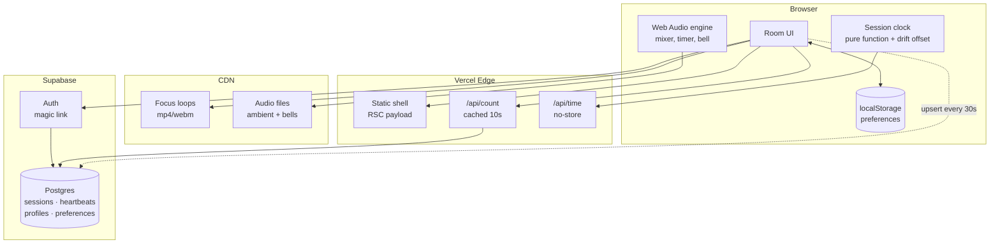

# Architecture — Meditate With Me v1

Internal document. Not for the client.

---

## 1. Constraints that drive everything

Every decision below falls out of these five. When something in this doc looks odd, check it against this list first.

| Constraint | Consequence |
|---|---|
| Budget is effectively £0 | Free tiers only. No always-on server, no queue, no cache layer we operate ourselves. |
| Global, 24/7, spiky | Traffic clusters hard at the top of each hour. Average load is meaningless; the peak is what breaks. |
| Solo dev, ~45 hours | Every moving part must justify itself. Anything we can avoid operating, we avoid. |
| Must extend to live video | The seams that matter are named in §9. Nothing else needs to be future-proofed. |
| "Same moment" is the product | Clock correctness is a feature, not an implementation detail. See §6.2. |

---

## 2. The shape of the problem

Worth stating plainly, because it determines the whole design:

**This application has almost no state.**

There is no feed, no user-generated content, no inbox, no ordering, no transactions. The only durable data in v1 is a preferences row per registered user — and most users won't register.

What looks like state is actually derived:

- The current session is a **pure function of the clock**. Nobody writes it.
- The timer is **client-local**. Nobody else needs to know about it.
- The audio mix is **client-local**. Same.
- The participant count is the one genuinely shared value, and it's approximate by nature — nobody can tell the difference between 43 and 45 people.

So this is a static site with three small dynamic edges. Design accordingly: push everything to the client and the CDN, and be suspicious of any component that implies a server holding something in memory.

---

## 3. System diagram



Note what is *absent*: no WebSocket server, no cron, no job queue, no Redis, no separate API service. If any of those appear later, something has gone wrong with the reasoning.

---

## 4. Subsystem 1 — Session resolution

### The rule

A session exists for every UTC hour whether or not a database row does. Rows are **overrides**, not the schedule.

```ts
// lib/session.ts — the entire scheduler
export function hourStart(atMs: number): Date {
  const d = new Date(atMs);
  d.setUTCMinutes(0, 0, 0);
  return d;
}

export function nextHour(atMs: number): Date {
  return new Date(hourStart(atMs).getTime() + 3_600_000);
}

export async function resolveSession(atMs: number) {
  const start = hourStart(atMs);
  const row = await db.sessions.findByHourStart(start);   // usually null
  return row ?? {
    hourStart: start,
    kind: 'ambient' as const,
    focusSlug: 'candle',
    streamUrl: null,
  };
}
```

### Why this matters

The client's "what's happening now" question is answered locally, instantly, offline, with one optional database read that is almost always a cache miss returning nothing. There is no scheduled job to fail at 3am, no backfill, no drift between what the scheduler thinks and what the clock says.

**The fallback is not a feature we build.** It is what happens when we find nothing. That is why the site cannot be empty — being empty would require code we haven't written.

---

## 5. Subsystem 2 — The participant count

This is the part I got wrong first, and it's the most interesting decision in the document.

### The obvious answer, and why it fails

Supabase Realtime has a presence API. Every client joins a channel, presence state syncs, count the keys. Elegant, and it is what the SDK is designed for.

It falls over here for a reason specific to this product. [Supabase's Realtime limits](https://supabase.com/docs/guides/realtime/limits) on the free tier:

- **200** concurrent connections
- **20** presence messages per second
- 100 messages per second overall

Presence sync is quadratic in message volume: when one client joins, every other client in the channel receives an update. With N people in the room, one join costs N messages.

Now consider the traffic shape. **Everyone arrives at the top of the hour, simultaneously.** That is not an edge case — it is the entire design of the product. Fifty people joining within the same few seconds costs on the order of fifty × fifty messages. We blow a 20/sec limit by two orders of magnitude, at precisely the moment the product is supposed to feel best.

Presence is built for small collaborative rooms — a shared document with eight cursors. Not for a global bell everyone answers at once.

### What we do instead

Treat the count as what it actually is: **a low-value, low-frequency number that is identical for every viewer.** That description is the definition of something that should be cached, not pushed.

```
client → upsert heartbeat every 30s   (write, cheap, one row)
client → GET /api/count every 15s     (read, edge-cached 10s)
```

```sql
create table heartbeats (
  anon_id    uuid        not null,
  hour_start timestamptz not null,
  last_seen  timestamptz not null default now(),
  primary key (anon_id, hour_start)
);

create index on heartbeats (hour_start, last_seen);
```

```sql
-- the count query
select count(*) from heartbeats
where hour_start = $1
  and last_seen > now() - interval '90 seconds';
```

Because the response is identical for every viewer, one edge cache entry with a 10-second TTL serves the entire world. **A thousand concurrent users generate roughly one origin query every ten seconds.** The same thousand users would have destroyed the presence approach.

Cleanup is a nightly `delete from heartbeats where hour_start < now() - interval '2 days'`. Rows are tiny and nobody cares about history.

### The general lesson

Realtime transport is for data that is **personalised, high-value, and latency-sensitive**. This number is none of those. Polling a cached endpoint is not the primitive solution here — it is the correct one, and it scales roughly a hundred times further on the same free tier.

---

## 6. Subsystem 3 — Time

Two independent clocks. Keeping them separate in the code is important; conflating them is the most likely source of confusing bugs.

### 6.1 The session clock (global, shared)

Derived from UTC. Rendered in the viewer's local timezone via `Intl.DateTimeFormat`. Everyone worldwide resolves to the same session.

This settles the open question in the client's brief: **one global session per hour**, not one per volunteer's local timezone. The alternative produces up to 24 concurrent sessions, a fragmented audience, and 24× the staffing.

### 6.2 Clock drift — the bug that would quietly ruin the product

`Date.now()` reads the user's device clock, which can be minutes wrong. If someone's laptop is three minutes fast, their candle lights three minutes early and the shared moment silently isn't shared. Nobody would ever report this as a bug; they would just find the site slightly off.

Fix: measure the offset once on load, apply it everywhere.

```ts
// GET /api/time -> { now: <server epoch ms> }, Cache-Control: no-store
let offsetMs = 0;

export async function syncClock() {
  const t0 = Date.now();
  const { now } = await fetch('/api/time').then(r => r.json());
  const t1 = Date.now();
  const rtt = t1 - t0;
  offsetMs = now + rtt / 2 - t1;    // assume symmetric latency
}

export const serverNow = () => Date.now() + offsetMs;
```

Every session calculation uses `serverNow()`. Never `Date.now()` directly. Re-sync on tab focus, since laptops sleep.

### 6.3 The personal timer (local, private)

Independent of the session. Someone can sit for 5 minutes inside a 45-minute session, or start at :37.

Never count with `setInterval` — browsers throttle background tabs to roughly one tick per minute, and meditating with the tab hidden is the normal case, not the exception. Store the target, derive the remainder:

```ts
const endsAt = performance.now() + minutes * 60_000;
const remaining = () => Math.max(0, endsAt - performance.now());
```

`performance.now()` is monotonic — immune to clock adjustments mid-session, unlike `Date.now()`.

**The bell must be scheduled on the audio clock, not a JS timer**, or it fires late in a background tab:

```ts
bellSource.start(ctx.currentTime + remaining() / 1000);
```

This is the single most important line in the timer. A meditation app whose bell arrives ninety seconds late has failed at its one job.

---

## 7. Subsystem 4 — Audio

One `AudioContext`. One gain node per track. Buffers decoded once and looped natively.

```
              ┌─ rain ──── gain ──┐
AudioContext ─┼─ wind ──── gain ──┼─ master gain ─→ destination
              ├─ waterfall  gain ──┤
              └─ bell ──── gain ──┘
```

```ts
function makeTrack(ctx: AudioContext, buffer: AudioBuffer, master: GainNode) {
  const src = ctx.createBufferSource();
  const gain = ctx.createGain();
  src.buffer = buffer;
  src.loop = true;
  gain.gain.value = 0;
  src.connect(gain).connect(master);
  src.start();                          // runs silently until faded up
  return (v: number) =>
    gain.gain.linearRampToValueAtTime(v, ctx.currentTime + 0.15);
}
```

All tracks start immediately at zero gain and stay running. Fading is cheaper and glitch-free compared to starting and stopping sources, and it keeps every loop phase-locked so the mix never drifts apart.

### Constraints worth knowing before you write it

- **An `AudioContext` cannot start without a user gesture.** Autoplay policy. Turn this into the design rather than fighting it: one deliberate **Begin** button that lights the candle and starts the audio together. The constraint becomes the ritual.
- **iOS suspends the context when the screen locks.** Not solvable in a web app. Accept it, and note it for whenever the mobile app conversation happens.
- **Decode all buffers up front**, behind the Begin button, so no track arrives late.
- Loops need to be **seamless at the sample level**. This is an asset-quality problem, not a code problem — a loop with a click at the seam will be audible on repeat and no amount of crossfading fully hides it.

---

## 8. Subsystem 5 — Identity and preferences

### localStorage is primary, the database is a sync target

```
guest         → preferences live in localStorage, full functionality
signs up      → localStorage pushed to Postgres on first login
returning     → DB row wins, hydrates localStorage
logged out    → falls back to localStorage, nothing breaks
```

This ordering is deliberate and it is what makes step 7 of the build genuinely cuttable. The account layer is a **sync mechanism bolted onto a working app**, not a foundation the app sits on. If week three disappears into coursework, we ship without it and nothing is missing except cross-device sync.

### Schema

```sql
create table profiles (
  id           uuid primary key references auth.users(id) on delete cascade,
  display_name text,
  created_at   timestamptz not null default now()
);

create table preferences (
  user_id       uuid primary key references profiles(id) on delete cascade,
  timer_minutes int  not null default 10 check (timer_minutes between 1 and 45),
  end_bell      text not null default 'singing-bowl',
  focus_slug    text not null default 'candle',
  sound_mix     jsonb not null default '{}'::jsonb,   -- {"rain":0.4,"wind":0.15}
  show_count    boolean not null default true,
  updated_at    timestamptz not null default now()
);

alter table preferences enable row level security;

create policy "own preferences" on preferences
  for all
  using      (auth.uid() = user_id)
  with check (auth.uid() = user_id);
```

**On that policy, since RLS is new to you:** `using` governs which rows a user can *see* and *delete*. `with check` governs what they're allowed to *write*. Omit the second and a user can update a row and set `user_id` to someone else's id, silently taking over their record. Write both, every time. Test it by logging in as one user and trying to read another's row — if it returns data, the policy is wrong.

`sessions` and `heartbeats` are readable by everyone and writable only by the service role. Heartbeat writes go through a route handler, not from the browser directly, so nobody can inflate the count from the console.

---

## 9. The v2 seam

The whole point of this design. Adding live video should touch three files.

| Component | v1 | v2 change |
|---|---|---|
| `resolveSession()` | always returns `ambient` | returns a `live` row when one exists — **no change to the function** |
| Room UI | renders `<FocusLoop>` | branches on `session.kind` to render `<LiveStream>` |
| Count endpoint | heartbeat query | unchanged |
| Clock | unchanged | unchanged |
| Audio | unchanged | mixes stream audio into the existing master gain |
| Scheduling | none | a booking table writing `sessions` rows — additive |

Nothing above requires touching the session logic, the clock, the count, or the audio graph. The `kind` column and the `stream_url`/`lighter_id` columns already exist in v1 and sit unused. That unused column is the seam, and it costs nothing now.

---

## 10. Failure modes

Everything degrades to "you can still meditate."

| Failure | Behaviour | Acceptable? |
|---|---|---|
| Supabase down | Session still resolves (pure function). Count hides. Timer, audio, candle all work. | Yes — core product survives |
| `/api/count` fails | Count hides silently. No error toast. | Yes |
| `/api/time` fails | Fall back to `Date.now()`, offset 0. Possible small drift. | Yes |
| Audio file 404s | That track is hidden from the mixer. Others play. | Yes |
| Focus loop 404s | Static fallback image. | Yes |
| Auth down | Guests unaffected. Sign-in shows a plain message. | Yes |

**Design rule: nothing in this app should ever show an error screen.** Every failure hides a control or silently degrades. Somebody sitting down to meditate should never be shown a stack trace or a red banner.

---

## 11. Where this breaks at scale

Worth knowing the cliffs before hitting them.

| Concurrent users | Status |
|---|---|
| < 200 | Comfortable on free tiers throughout. |
| 200 – 2,000 | Fine. Count endpoint is edge-cached so origin load is flat. Heartbeat writes become the load: 2,000 users ≈ 67 writes/sec. Supabase Pro at $25/mo handles it. |
| 2,000 – 20,000 | Heartbeat writes need batching — buffer client-side, or move the counter to Redis/Upstash with a periodic flush. Postgres row-per-user stops being the right shape. |
| 20,000+ | Count becomes a statistical estimate rather than an exact number. Nobody will notice, and by this point the live video bill is the actual problem, not this. |

The heartbeat table is the first thing to break, and it is a contained problem with obvious fixes. That is the right kind of scaling risk to accept.

---

## 12. Repo layout

```
meditatewithme/
├── app/
│   ├── page.tsx                 # the room — one page
│   ├── layout.tsx
│   └── api/
│       ├── time/route.ts        # server clock, no-store
│       ├── count/route.ts       # cached 10s
│       └── heartbeat/route.ts   # upsert, service role
├── components/
│   ├── Room.tsx                 # state machine host
│   ├── FocusLoop.tsx            # <- v2 branches here
│   ├── Timer.tsx
│   ├── SoundMixer.tsx
│   └── ParticipantCount.tsx
├── lib/
│   ├── session.ts               # hourStart, resolveSession
│   ├── clock.ts                 # syncClock, serverNow
│   ├── audio.ts                 # AudioContext graph
│   ├── prefs.ts                 # localStorage <-> DB
│   └── supabase.ts
├── supabase/migrations/
├── context/                     # standing project knowledge
├── plans/                       # active plans
└── docs/                        # finished writing
```

`lib/` holds no React and no I/O beyond explicit fetches — it should be testable with plain functions. `session.ts` and `clock.ts` in particular are pure enough to unit test properly, and they are the two places a bug would be least visible in manual testing.

---

## 13. Decision log

| # | Decision | Rejected alternative | Why |
|---|---|---|---|
| 1 | Sessions computed from the clock | Pre-generated rows via cron | Nothing to fail at 3am; no drift; missing row *is* the fallback |
| 2 | Polled, edge-cached count | Supabase Realtime presence | Presence is O(N) messages per join and everyone joins at once — see §5 |
| 3 | localStorage primary | Database primary, guest read-only | Makes the account layer cuttable; guests get full functionality |
| 4 | Web Audio graph | Multiple `<audio>` elements | Independent gain, smooth ramps, phase-locked loops |
| 5 | Server-time offset | Trust `Date.now()` | A wrong device clock silently destroys the shared moment |
| 6 | `performance.now()` for the timer | `Date.now()` deltas | Monotonic — unaffected by a clock adjustment mid-session |
| 7 | Bell on the audio clock | `setTimeout` | Background tabs throttle timers; a late bell is a product failure |
| 8 | Cached focus loops | Streamed video | Cache-once vs metered-per-viewer — the entire cost argument |
| 9 | One global session, UTC | Per-timezone sessions | 24 parallel sessions fragments the audience and multiplies staffing |

---

## 14. Open technical questions

1. **What happens when a personal timer ends mid-session?** Fade the audio and hold the candle, or return to the idle state? Product question, needs Jonny — but it changes the state machine, so decide before building the Room component.
2. **Should the count include people who haven't pressed Begin?** Arguably waiting is participating. Simpler: count only those who've begun. Needs a decision, not a discussion.
3. **Anonymous id lifetime.** A `localStorage` uuid per browser means one person on two devices counts twice. Acceptable, and the alternative is worse.
4. **Do we record any analytics at all?** If nothing third-party and nothing that identifies people, the cookie banner question largely disappears. Strong reason to keep it that way.

---

## 15. Deployment

| | |
|---|---|
| Host | Vercel, project `meditatewithme` under `10zinglunn-afks-projects` |
| URL | https://meditatewithme.vercel.app |
| Source | Auto-deploys on push to `main` (GitHub `10zinglunn-afk/meditatewithme`) |
| Custom domain | Not attached — Jonny owns it, DNS not yet pointed |

### Why Vercel specifically

Not a default. §5's whole argument is that the count survives a simultaneous
global join because one edge-cached response serves everyone — that mechanism
*is* the `s-maxage` / `stale-while-revalidate` pair set in `app/api/count/route.ts`,
and it only works on a CDN that honours them. Verified in production: repeat
requests return `x-vercel-cache: HIT`, and a fresh heartbeat surfaces one cache
generation later via `STALE`, exactly as designed.

Cloudflare Workers is the credible alternative — cheaper at real scale — but
Next.js App Router needs the OpenNext adapter there and the caching above would
need reworking. Not worth it at this traffic.

### Environment variables

Set in Vercel for Production and Development. **Preview is not set**: CLI v52
rejects `--yes` for preview-all-branches (it demands a git branch regardless of
the flag). Either upgrade the CLI or add the three by hand in the dashboard —
until then, preview deployments cannot reach Supabase.

`SUPABASE_SERVICE_ROLE_KEY` is server-only and must stay that way. Verified
against the live bundle: the key appears in none of the seven client chunks nor
in the HTML. Re-run that check if `serviceClient()` ever gains a new caller.

### Plan limits

The account is on Hobby (free), which is intended for non-commercial projects.
Donations would likely push this to Pro. Not a blocker now, but it lands on
Jonny's bill eventually — and per the payment message, hosting is meant to sit
in his name, not Tenzing's. Worth settling before the domain is attached, since
moving a project after DNS is pointed is the annoying order to do it in.
