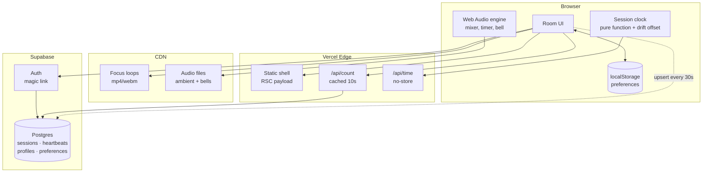

# Architecture — Meditate With Me v1

Internal document. Not for the client.

---

## 1. Constraints that drive everything

Every decision below falls out of these five. When something in this doc looks odd, check it against this list first.

| Constraint | Consequence |
|---|---|
| Budget is effectively £0 | Free tiers only. No always-on server, no queue, no cache layer we operate ourselves. |
| Global, 24/7, spiky | Traffic clusters hard at the top of each hour. Average load is meaningless; the peak is what breaks. |
| Solo dev, ~45 hours | Every moving part must justify itself. Anything we can avoid operating, we avoid. |
| Must extend to live video | The seams that matter are named in §9. Nothing else needs to be future-proofed. |
| "Same moment" is the product | Clock correctness is a feature, not an implementation detail. See §6.2. |

### Paper, then the room: dawn or dusk

One palette regardless of the visitor's system preference: the name and the
place are asked on warm paper, and everywhere else on the rail — the doors
the site opens on, and every question after the place — the ground is the room, which is dawn or dusk by the visitor's own clock
(`lib/room.ts`, 06:00–18:00 is dawn) or by the toggle beside the menu, whose
choice lapses at the next six o'clock. The room is a set of `room-*` colour
tokens with dusk values in `@theme` and paper values under
`[data-room="dawn"]`; `useRoom` (`useSyncExternalStore` over `mwm.room`,
re-read each minute) decides, and `Journey`, `EarthScene` and `Demo` set the
attribute. The document advertises only a light colour scheme, so a device's
scheduled light/dark rollover cannot change a screen mid-sitting, and the
room's own turn at six is read once a minute, not mid-transition. Until 14 September
2026 the site was always dark, because the candle was a photograph and its
glow was designed as light inside a dark room; the earth still needs that
dark, and gets it, but only once you are sitting in front of it (§16).

---

## 2. The shape of the problem

Worth stating plainly, because it determines the whole design:

**This application has almost no state.**

There is no feed, no user-generated content, no inbox, no ordering, no transactions. The only durable data in v1 is a preferences row per registered user — and most users won't register.

What looks like state is actually derived:

- The current session is a **pure function of the clock**. Nobody writes it.
- The timer is **client-local**. Nobody else needs to know about it.
- The audio mix is **client-local**. Same.
- The participant count is the one genuinely shared value, and it's approximate by nature — nobody can tell the difference between 43 and 45 people.

So this is a static site with three small dynamic edges. Design accordingly: push everything to the client and the CDN, and be suspicious of any component that implies a server holding something in memory.

---

## 3. System diagram



Note what is *absent*: no WebSocket server, no job queue, no Redis, no separate API service. If any of those appear later, something has gone wrong with the reasoning.

There is exactly one scheduled job, and it is the exception that proves the rule: a `pg_cron` entry that deletes old heartbeat rows (§5). Nothing on the diagram waits for it, nothing breaks if it stops — it exists because a retention promise has to be kept by something. It runs *inside* Postgres rather than as a cron in front of the app, which is why the diagram is unchanged: no new box, no new endpoint, no new secret.

---

## 4. Subsystem 1 — Session resolution

### The rule

A session exists for every UTC hour whether or not a database row does. Rows are **overrides**, not the schedule.

```ts
// lib/session.ts — the entire scheduler
export function hourStart(atMs: number): Date {
  const d = new Date(atMs);
  d.setUTCMinutes(0, 0, 0);
  return d;
}

export function nextHour(atMs: number): Date {
  return new Date(hourStart(atMs).getTime() + 3_600_000);
}

export async function resolveSession(atMs: number) {
  const start = hourStart(atMs);
  const row = await db.sessions.findByHourStart(start);   // usually null
  return row ?? {
    hourStart: start,
    kind: 'ambient' as const,
    focusSlug: 'candle',
    streamUrl: null,
  };
}
```

### Why this matters

The client's "what's happening now" question is answered locally, instantly, offline, with one optional database read that is almost always a cache miss returning nothing. There is no scheduled job to fail at 3am, no backfill, no drift between what the scheduler thinks and what the clock says.

**The fallback is not a feature we build.** It is what happens when we find nothing. That is why the site cannot be empty — being empty would require code we haven't written.

---

## 5. Subsystem 2 — The participant count

This is the part I got wrong first, and it's the most interesting decision in the document.

### The obvious answer, and why it fails

Supabase Realtime has a presence API. Every client joins a channel, presence state syncs, count the keys. Elegant, and it is what the SDK is designed for.

It falls over here for a reason specific to this product. [Supabase's Realtime limits](https://supabase.com/docs/guides/realtime/limits) on the free tier:

- **200** concurrent connections
- **20** presence messages per second
- 100 messages per second overall

Presence sync is quadratic in message volume: when one client joins, every other client in the channel receives an update. With N people in the room, one join costs N messages.

Now consider the traffic shape. **Everyone arrives at the top of the hour, simultaneously.** That is not an edge case — it is the entire design of the product. Fifty people joining within the same few seconds costs on the order of fifty × fifty messages. We blow a 20/sec limit by two orders of magnitude, at precisely the moment the product is supposed to feel best.

Presence is built for small collaborative rooms — a shared document with eight cursors. Not for a global bell everyone answers at once.

### What we do instead

Treat the count as what it actually is: **a low-value, low-frequency number that is identical for every viewer.** That description is the definition of something that should be cached, not pushed.

```
client → upsert heartbeat every 30s   (write, cheap, one row)
client → GET /api/count every 15s     (read, edge-cached 10s)
```

```sql
create table heartbeats (
  anon_id    uuid        not null,
  hour_start timestamptz not null,
  last_seen  timestamptz not null default now(),
  began_at   timestamptz,              -- server-stamped at Begin only
  cell_lat   double precision,         -- one-degree grid cell, never a reading
  cell_lon   double precision,         -- nullable: not every request is placed
  primary key (anon_id, hour_start)
);

create index on heartbeats (hour_start, last_seen);
```

```sql
-- the count query
select count(*) from heartbeats
where hour_start = $1
  and last_seen > now() - interval '90 seconds';
```

`began_at` is a second, nullable reading of the same row—not a start-event
log. On Begin the route stamps it and counts rows whose `began_at` is within
the preceding thirty seconds, returning one fixed “you began with N others”
sentence. The all-hour count is also returned with the live count, so the
first arrival can be framed truthfully as the first person to light the hour.

Because the response is identical for every viewer, one edge cache entry with a 10-second TTL serves the entire world. **A thousand concurrent users generate roughly one origin query every ten seconds.** The same thousand users would have destroyed the presence approach.

**`/api/world` inherits this argument rather than working around it.** The map
needs where the candles are, not just how many, and an aggregate of grid cells
is still one response identical for every viewer — so it gets the same
`s-maxage=10, stale-while-revalidate=20` pair and the cliffs in §11 do not move.
The property is fragile in one specific way worth naming: **the moment anybody
wants "highlight my own light", the response is personalised and the whole
endpoint becomes uncacheable.** Do it the way the room already does — the viewer
knows their own cell, so let the client mark it. Never the server.

Cleanup is `public.prune_heartbeats()` — `delete from heartbeats where hour_start < now() - interval '2 days'` — run by `pg_cron` at seven minutes past every hour (`20260903193000_schedule_prune_heartbeats.sql`). Rows are tiny and nobody cares about history, so the schedule is not about disk. It is about the two days being a real number: we tell people in the privacy copy that the location square goes after two days, and how often this runs is what decides whether that is true. Hourly makes it true to within an hour; nightly would have made it true to within a day, i.e. nearly three days for an unlucky row.

**It had never once run before 3 September 2026.** The function was written in `0001_init.sql` with a comment saying to schedule it, and nobody did; the table was holding eight days of rows, by then including grid cells. Worth remembering as a shape of bug: a scheduled job that was never scheduled looks exactly like a scheduled job that works, from inside the code.

The client renders these aggregate readings as dots around the sitting ring —
one per candle lit this hour, spread evenly, the ones still here at full
strength and the rest dimmed (§16). No heartbeat ids leave the route handler.
Which dot is yours is decided client-side (it is always the one at twelve), so
the only personalised part of the room does not make the shared response
uncacheable.

**Who counts, and the hidden tab.** Everyone with the page open, not only
those who pressed Begin (§14, item 2). The client stops heartbeating the
moment the tab is hidden, and the count query ignores rows older than 90
seconds, so a tab forgotten on the landing drops out about a minute and a
half after it stops being looked at. Since 22 September 2026 that rule
depends on whether a sitting is in progress: `usePresence` takes `sitting`,
and a hidden tab that is sitting keeps beating (the fetch has `keepalive`),
because a phone that locked with its owner's eyes shut is the normal posture
of meditation, not a forgotten tab. The wake lock in
`components/useWakeLock.ts` exists to stop that lock happening (§7); when it
happens anyway, the sitter stays in the count and their candle stays lit. A
sitting that ends while the tab is still hidden stops the beats then.

**A count that cannot be read goes quiet.** One missed poll keeps the last
number, since a blink of network is not worth a line vanishing; two in a row
(thirty seconds) and `usePresence` sets it null, `useCount` (Home's line)
does the same, and `useWorld` empties the earth on the same rule.
`companyLine` says nothing for a null count rather than something forty
minutes old, and no error is shown either way.

### The general lesson

Realtime transport is for data that is **personalised, high-value, and latency-sensitive**. This number is none of those. Polling a cached endpoint is not the primitive solution here — it is the correct one, and it scales roughly a hundred times further on the same free tier.

---

## 6. Subsystem 3 — Time

Two independent clocks. Keeping them separate in the code is important; conflating them is the most likely source of confusing bugs.

### 6.1 The session clock (global, shared)

Derived from UTC. Rendered in the viewer's local timezone via `Intl.DateTimeFormat`. Everyone worldwide resolves to the same session.

This settles the open question in the client's brief: **one global session per hour**, not one per volunteer's local timezone. The alternative produces up to 24 concurrent sessions, a fragmented audience, and 24× the staffing.

### 6.2 Clock drift — the bug that would quietly ruin the product

`Date.now()` reads the user's device clock, which can be minutes wrong. If someone's laptop is three minutes fast, their candle lights three minutes early and the shared moment silently isn't shared. Nobody would ever report this as a bug; they would just find the site slightly off.

Fix: measure the offset once on load, apply it everywhere.

```ts
// GET /api/time -> { now: <server epoch ms> }, Cache-Control: no-store
let offsetMs = 0;

export async function syncClock() {
  const t0 = Date.now();
  const { now } = await fetch('/api/time').then(r => r.json());
  const t1 = Date.now();
  const rtt = t1 - t0;
  offsetMs = now + rtt / 2 - t1;    // assume symmetric latency
}

export const serverNow = () => Date.now() + offsetMs;
```

Every session calculation uses `serverNow()`. Never `Date.now()` directly. Re-sync on tab focus, since laptops sleep.

### 6.3 The personal timer (local, private)

Independent of the session, and one minute to fifty-five. Someone can sit for five minutes starting at :37, or for fifty-five starting at :50 and carry straight through two candles.

**The ceiling is 55, not the hour** — the client's decision of 7 September 2026. The last five minutes of every hour are a handover window: when an hour is led by a person rather than by nobody, whoever lit this candle has to hand over to whoever lights the next one, and a handover with no gap lands on top of somebody's closing bell. `nextSharedBellAt` moved to :55 in the same change, so *until the bell* and the slider share one ceiling instead of the shared path running five minutes past anything the slider could offer.

That window gates nothing. The candle is untouched — `lib/session.ts` still lights one at :00 and burns it across the whole hour — and a personal timer starts at :57 exactly as it did before. This is not the old forty-five-plus-fifteen interlude returning: that one refused to let anyone begin for a quarter of every hour, which is why it went. This one refuses nobody; it only means the people who chose to finish *together* finish with room to spare.

One consequence worth knowing before it is reported as a bug: `SHARED_BELL_MIN_LEAD_MS` sends a late arrival to the bell after next, so a shared sit can still exceed 55 — arrive at :52 and the next bell worth offering is sixty-three minutes away. The overshoot is not new (before the move, arriving at :56 gave sixty-four) and it is not a hole in the cap. *Until the bell* is a promise about finishing with other people, not a duration; the alternative is handing someone a three-minute sit they did not ask for.

The session no longer occupies part of its hour — it fills the whole one, and nothing gates the start. See §16.

Never count with `setInterval` — browsers throttle background tabs to roughly one tick per minute, and meditating with the tab hidden is the normal case, not the exception. Store the target, derive the remainder:

```ts
const endsAt = performance.now() + minutes * 60_000;
const remaining = () => Math.max(0, endsAt - performance.now());
```

`performance.now()` is monotonic — immune to clock adjustments mid-session, unlike `Date.now()`.

**The bell must be scheduled on the audio clock, not a JS timer**, or it fires late in a background tab:

```ts
bellSource.start(ctx.currentTime + remaining() / 1000);
```

This is the single most important line in the timer. A meditation app whose bell arrives ninety seconds late has failed at its one job.

---

## 7. Subsystem 4 — Audio

One `AudioContext`. One gain node per track. Buffers decoded once and looped natively.

```
              ┌─ rain ──── gain ──┐
AudioContext ─┼─ wind ──── gain ──┼─ master gain ─→ destination
              ├─ waterfall  gain ──┤
              └─ bell ──── gain ──┘
```

```ts
function makeTrack(ctx: AudioContext, buffer: AudioBuffer, master: GainNode) {
  const src = ctx.createBufferSource();
  const gain = ctx.createGain();
  src.buffer = buffer;
  src.loop = true;
  gain.gain.value = 0;
  src.connect(gain).connect(master);
  src.start();                          // runs silently until faded up
  return (v: number) =>
    gain.gain.linearRampToValueAtTime(v, ctx.currentTime + 0.15);
}
```

All tracks start immediately at zero gain and stay running. Fading is cheaper and glitch-free compared to starting and stopping sources, and it keeps every loop phase-locked so the mix never drifts apart.

### Constraints worth knowing before you write it

- **An `AudioContext` cannot start without a user gesture.** Autoplay policy. Turn this into the design rather than fighting it: one deliberate **Begin** button that lights the candle and starts the audio together. The constraint becomes the ritual.
- **iOS suspends the context when the screen locks.** Not solvable in a web app: a lock that happens suspends the graph, and the bell is late until the screen wakes. Accept it, and note it for whenever the mobile app conversation happens. What *is* solvable is the lock itself: since 22 September 2026 `components/useWakeLock.ts` asks for a screen wake lock inside the click that strikes the bowl and holds it for the sitting, asking again each time the tab comes back, so where the browser grants it the screen stays on and the context never suspends. Unsupported is a silent no-op. Both statements stand side by side; the second is why the first is rarely met.
- **Decode all buffers up front**, behind the Begin button, so no track arrives late.
- Loops need to be **seamless at the sample level**. This is an asset-quality problem, not a code problem — a loop with a click at the seam will be audible on repeat and no amount of crossfading fully hides it.

### Three bells, not three settings of one

The bells are still synthesised, still stand-ins for recordings Jonny buys, and `strike()` is still the one function a real buffer replaces. But they used to run **one shared set of partials** — ratios 1, 2.76, 5.4, 8.9 — with only the pitch and the tail length changed between them. Those are *bowl* ratios, which is why the bowl was the convincing one and why the gong was a bowl pitched down.

Each bell now carries its own `modes` table, plus three things none of them had:

- **A mallet.** The tone was never what gave the synthesis away; the attack was. A band-passed noise burst of 22–90ms under the strike is the single biggest difference between "a bell" and "a bell sound". It does not scale with `decayScale` — a mallet is a mallet whether the tail after it is a four-second preview or a twenty-two second ending.
- **Beating twins.** Every prominent mode is two oscillators a fraction of a hertz apart, so it warbles the way real metal does. The `hum` bed in `mix.ts` already used this trick at 110 / 110.35 Hz; the bells did not.
- **Bloom, for the gong only.** Its upper modes arrive 0.2–2.2s *after* the beater, with an attack that lengthens with the delay. A tam-tam getting brighter before it dies is most of what makes it a gong rather than a large bowl. Clamped to a quarter of the available tail so a mode cannot arrive after a shortened bell has gone.

The bell's `fundamental` means **the note you hear**, which for a cast bell is its *nominal*, not its lowest mode — so `struck-bell`'s modes are fractions of the note (hum at 0.25, prime at 0.5, tierce at 0.6) rather than multiples of the hum. The tierce is a minor third above the prime and is why a bell sounds like a bell; the old shared ratios had nothing in that region at all. The three published pitches are unchanged, deliberately: this work changed what the bells sound like, not what they play.

Mode gains in the tables are **relative**. `strike()` normalises each set to `PEAK` (0.9, what the old four-partial set happened to sum to) because the three bells now have five, fourteen and twelve modes and every beating one is two oscillators — left raw, the gong would arrive at several times the struck bell's level, and adding a mode later would quietly make that bell louder.

What `PEAK` pins is the **peak, which is not the loudness**. Splitting a fixed peak across more partials, or across partials that die sooner, leaves less of it in the tail, and the tail is what a bell is heard as. Both rewrites below cost their bell one to two decibels through the body of the sound with the peak unmoved, and no amount of turning the table's gains up recovers it — the normalising line divides the rise straight back out. Small enough to leave; worth knowing before adding a fourth bell and wondering why it sits under the other three.

### Two of the three tables were rewritten again, on 8 September 2026

The first pass gave each bell its own modes and stopped there. What it did not check was what the ratios *were as intervals*, and two of the three came out as music.

- **The gong was a diminished seventh chord.** Its ten partials ran 1, 1.19, 1.41, 1.68, 2.13, 2.61, 3.24, 3.97, 4.81, 5.92 — every step between three and 3.7 semitones, which is a ladder of minor thirds two and a half octaves tall. The bloom then arpeggiated it upward. It did not sound like a gong because it was a chord being played. The set is now fourteen deliberately irregular partials: steps from 0.9 to 4.3 semitones, every pair at least sixteen cents off the nearest octave, fifth, fourth, third or sixth, and three of them clustered inside two semitones so the low mids beat against themselves. **Nudging one of these ratios is not free — move it and check what it lands on.**
- **The struck bell was a minor triad pad.** It had the five tuned partials and almost nothing above the nominal, at near-equal weight and with long tails, so a second after the strike you were holding C minor and holding it for seconds. Four of the five were also *exact* harmonics 1, 2, 3 and 4 of the hum, which fuse into a single organ-like tone. It now carries seven **clang** partials above the nominal — loud, inharmonic, gone inside a second, which is what a real casting leaves and what the strike is actually made of — a tierce whose decay is well under the prime's so the chord resolves into an octave, and a few cents of detuning on the tuned partials so nothing fuses.

The singing bowl was not touched. Its ratios were always the widely-spaced inharmonic ones and it was always the convincing one.

`strike()` is arithmetic over a static table, which means the bells can be **rendered and measured offline** rather than argued about — a short Node script that reads `BELLS` straight out of the file, sums the sines and writes a WAV is how both faults above were found and how the fix was checked before anyone listened. That beats opening the preview, and it is the only way to A/B a change against the version in git.

### The bell rings at both ends

`openingBell()` strikes the chosen bell at `Begin`, immediately — safe without ceremony, because it runs inside the click that unlocked the context. The closing bell is still scheduled ahead on the audio clock, unchanged.

Two things about it are load-bearing:

- **It is the same bell as the ending**, read from `endBell`. That preference name predates this and stays: it is a stored localStorage key, a jsonb field and a CHECK constraint on `preferences.end_bell`. A sitting that opened on a gong and closed on a bowl would be two different rooms.
- **Its tail is clamped to the sitting's own length**, at 60% of the closing bell's decay or the length of the sitting, whichever is shorter. `until the bell` pressed at :59:30 is a real thirty-second sitting, and an opening bell still ringing when the closing one strikes would muddy the one moment the whole design exists to protect. The handle is held on the `Sitting` so that ending early and unmounting can silence it; a sitting that runs to its own end never needs to, because the clamp has already seen to it.

---

## 8. Subsystem 5 — Identity and preferences

### localStorage is primary, the database is a sync target

```
guest         → preferences live in localStorage, full functionality
signs up      → localStorage pushed to Postgres on first login
returning     → DB row wins, hydrates localStorage
logged out    → falls back to localStorage, nothing breaks
```

This ordering is deliberate and it is what makes step 7 of the build genuinely cuttable. The account layer is a **sync mechanism bolted onto a working app**, not a foundation the app sits on. If week three disappears into coursework, we ship without it and nothing is missing except cross-device sync.

Cuttable is enforced, not just intended: `components/useAuth.ts`, `components/useSyncPreferences.ts`, `components/useProfile.ts`'s pull and push, `components/Account.tsx`, `components/Home.tsx` and the `home` branch in `Entry.tsx` are the entire feature. Delete them and the rail is unchanged. `usePreferences` has no idea accounts exist.

**`show_count` means the mode**, since 14 September 2026: `true` is *with others* (the earth, presence, the shared bell offered), `false` is *by yourself* (a private timer, nobody shown, no heartbeat). It was the switch that hid the room's count and it kept its name and column; no migration, and the sync is unchanged. `until_bell` is only ever true under with-others.

### The rule when local and server disagree

**The server wins if it has a row; local is pushed up only when it doesn't.**

The build spec says "on first login, push whatever's in localStorage up", which is right for the first device and wrong for the second. Signing in on a phone would otherwise push that phone's untouched defaults over the settings you actually chose on your laptop. The cost of the rule as implemented is that a guest tweak made on a device you *later* sign in on is discarded — a smaller harm than losing settings you deliberately saved, but a real one.

### Implicit flow, not PKCE

No passwords. No password means no reset flow, which is where most auth bugs live.

**Two ways to finish, one call to start.** `signInWithOtp` sends an email that can carry both a link and a six-digit code; the account panel asks for the code, because ending a meditation site's only signup flow in somebody's inbox and returning them to a page reloaded from nothing is a poor last step. `verifyOtp({ email, token, type: 'email' })` finishes it in place, and `onAuthStateChange` swaps the screen underneath the form.

**The code needs one hosted change this repository cannot make.** Supabase's stock Magic Link template contains only `{{ .ConfirmationURL }}`; the same email carries the code once `{{ .Token }}` is added to it in Authentication → Email Templates. Until that is done the code box has nothing to receive, which is why the panel keeps saying the link in that email works too, and why `emailRedirectTo` is still sent. `plans/launch-readiness.md` carries it beside the SMTP item it depends on.

**And that dependency is hard, not a matter of sequencing.** Tried on 7 September 2026 through the Management API (`PATCH /v1/projects/{ref}/config/auth`): the project is on the free tier with the default sender, and the API refuses any template change on that combination — *"Email template modification is not available for free tier projects using the default email provider. Please upgrade your plan or configure a custom SMTP provider."* So the sender is a precondition for the code, not a sibling item. What *could* be set was: `mailer_otp_length` went from 8 to 6 the same day, re-read from the API afterwards, and a throwaway user's `generate_link` returned a six-digit `email_otp` that verified with a 200. The UI's six-digit box is right; the email is what is missing.

### Signing in once is meant to be enough

`persistSession` and `autoRefreshToken` are both on, the session lives in
localStorage under `sb-<ref>-auth-token`, and no session on this project carries
a `not_after` — there is no timebox and no inactivity cutoff. So a session
survives closing the tab, quitting the browser and restarting the machine, and
renews itself indefinitely.

That is observed, not inferred. On 7 September 2026 the live `auth.sessions`
held a session created 3 September and last refreshed four days later, through
four rotations of its refresh token, with no re-authentication in between —
and another from the same day with ten rotations. Somebody who signs in stays
signed in.

**`signOut()` must always pass `scope: 'local'`, and the library default is
wrong for this product.** Bare `signOut()` is `scope: 'global'`: it revokes
every session the account holds, everywhere. Pressing `Sign out` on a laptop
therefore signed the same person out on their phone, where the next visit would
find them a stranger — no name in the masthead, no synced log, another email to
wait for. Proved rather than read off the documentation: two devices signed in,
the laptop signs out, and the phone's `refreshSession()` comes back *Invalid
Refresh Token: Refresh Token Not Found* under the default and succeeds under
`local`.

Signing out everywhere is a real thing to want — it is the answer to a lost
phone — but it is a deliberate security action and belongs behind a control
that says so, not silently attached to the ordinary one. There is no such
control yet, and there does not need to be one until somebody asks.

Note that `deleteAccount` passes `scope: 'local'` too, for an unrelated reason:
after the account is gone a global sign-out would POST `/logout` on behalf of a
user who no longer exists, fail, and leave the dead session sitting in
localStorage.

### A dead link is silent, and that had to be fixed

**The link flow works on localhost, and the auth log proves it**: a `/verify` at 2026-09-01 22:41:41 returned 303 with `login_method: implicit`, and `auth.users.last_sign_in_at` carries the same timestamp. Nothing about magic links is waiting on deployment.

What is not obvious is the failure. **A magic link is single-use, and issuing a new one invalidates the last.** Clicking a spent link gets `403 One-time token not found` inside Supabase — which it then returns as a **303 back to the site**, with the reason in the fragment:

```
http://localhost:3000/#error=access_denied&error_code=otp_expired&error_description=Email+link+is+invalid+or+has+expired
```

So the browser lands on the landing page, signed out, looking exactly like a cold arrival. `detectSessionInUrl` recognises the error fragment, abandons the sign-in and **keeps the reason to itself** — `onAuthStateChange` never fires, `getSession()` returns null, and there is no public API for what went wrong. The room rendered `Begin.` with the explanation sitting unread in its own address bar.

`readLinkError()` in `useAuth` reads the fragment first-hand, during the first render — not in an effect, because React runs child effects before the parent's and the children reach for the Supabase client. `linkError` goes to the landing's `Account`, which opens itself on the address step with the reason showing, and the fragment is stripped from the URL so a reload is a clean arrival.

**Only the landing gets it.** The flag lives for the session and the foot-of-frame instance mounts at the end of a sitting, minutes after the arrival it would be describing.

Two related facts worth keeping:

- **`options.data` is ignored for an address Supabase already knows.** An existing account can never gain a name by running the flow again, which is the property that stops anybody being renamed by retyping — and also means testing signup with your own address leaves `raw_user_meta_data` without a `name` and Home falling back to its own masthead.
- **The built-in hosted SMTP rate-limits hard.** `over_email_send_rate_limit` on a 429 is what `Send it again` will usually hit within a few minutes of the previous send. Real SMTP is the fix; it is already on the launch list.

PKCE keeps its verifier in the localStorage of the browser that requested the link, so requesting on a laptop and opening the mail on a phone fails. That is the normal case here, not an edge case. Implicit costs us server-side sessions, which this app does not use: the room is a client component and preferences are guarded by RLS against the user's own JWT. If a server component ever needs to know who is watching, this becomes `@supabase/ssr` and a callback route.

There is no callback route. The link returns to the site origin and `detectSessionInUrl` takes the token out of the fragment.

**`detectSessionInUrl` reads the URL once, when the client is built — which is on page load, and that is not the only way the token arrives.** The email is requested *from* the site, so the tab is already sitting on `/`; the link's `redirect_to` is that same `/`. A URL differing from the current one only by its fragment is a **same-document** navigation: the browser fires `hashchange` and does not reload. The client is never rebuilt, nothing re-reads the URL, and a valid access token sits in the address bar being ignored — the visitor sees `Let's begin.` and is told nothing, because there is nothing to tell them: Supabase verified the link and recorded the login. It looks exactly like "logging in is broken", and for one afternoon it was. It bites whenever the link opens into an already-open tab rather than a new one — pasting it into the address bar being the reliable way to reproduce it.

`onHashChange` in `useAuth` closes that hole: on a fragment carrying `access_token`, it hands the pair to `auth.setSession()` — public API, no reload, and it fires `onAuthStateChange` so the screen changes by the same path as every other sign-in. On a fragment carrying an error it sets `linkError` instead. Either way the fragment is stripped. Because a late `linkError` arrives as a *prop change* rather than at mount, `Account` also watches it in an effect — its `open`/`step`/`error` seeds only fire on mount and would otherwise tidy the URL and say nothing.

**`lib/supabase.ts` returns one browser client, not a new one per call.** Two clients share a localStorage key and race each other refreshing the same token.

### Schema

As migrated. `0001` created these tables and nothing wrote to them for three build steps, which hid three defects until `0003`:

```sql
create table profiles (
  id           uuid primary key references auth.users(id) on delete cascade,
  display_name text,
  created_at   timestamptz not null default now()
);

create table preferences (
  user_id       uuid primary key references profiles(id) on delete cascade,
  timer_minutes int  not null default 10
                check (timer_minutes between 5 and 60 and timer_minutes % 5 = 0),
  until_bell    boolean not null default false,
  end_bell      text not null default 'singing-bowl'
                check (end_bell in ('singing-bowl','gong','struck-bell')),
  focus_slug    text not null default 'candle',
  sound_mix     jsonb not null default '{}'::jsonb,   -- {"rain":0.4,"wind":0.15}
  show_count    boolean not null default true,
  updated_at    timestamptz not null default now()   -- maintained by trigger
);

alter table preferences enable row level security;

create policy "own preferences" on preferences
  for all
  using      (auth.uid() = user_id)
  with check (auth.uid() = user_id);

-- Signing up creates only the auth.users row. Without this, the first
-- preferences insert fails on the profiles foreign key — for every user.
create trigger on_auth_user_created
  after insert on auth.users
  for each row execute function public.handle_new_user();
```

What `0003` had to fix, all of it invisible while the tables were empty:

1. **`timer_minutes between 1 and 45`** was left over from the 45-minute session. The slider is 1–60, so picking the hour — the value the presets deliberately put on offer — would have been rejected by the database. (0003 replaced it with a 5–60 multiple-of-five check; `0005_timer_stops.sql` then replaced *that* with an explicit `in` list when the one-minute stop came back; `20260907140000_timer_ceiling_55.sql` dropped 60 from that list when the ceiling moved to 55. The constraint has now chased the slider three times, which is the argument for keeping it a literal list that can be compared to `TIMER_STOPS` by eye.)
2. **`end_bell` was unconstrained text.** `BellKind` is a union in TypeScript precisely so a bad value cannot reach the audio graph; that guarantee stopped at the database, which would have stored anything and synced it to every device.
3. **Nothing created a profile row,** so the foreign key above would have failed on every user's first sync.
4. `updated_at` never updated — it held the creation time forever, which is worse than not having the column.

`timer_minutes` and `end_bell` duplicate constraints that also live in TypeScript (`lib/timer.ts`, `lib/types.ts`). That duplication is intentional — the database is the last line and cannot import a type — but it means **changing the bells or the slider bounds is a two-file change**, and `0003` exists because somebody forgot that once already.

`until_bell` is deliberately separate from `timer_minutes`: it is a shared
absolute target converted once into a monotonic deadline at Begin, not a
sentinel duration. Arrivals inside five minutes of the hour are offered the
following bell, so no one is refused or quietly given a three-minute sit.

### The practice log

One row per sitting, in `sittings`. Same ordering as everything else: localStorage primary, database as sync target — **a guest gets their full history and their streak without an account**, and signing in is what carries it between devices. Requiring a login to answer "how consistent have I been" would put a toll on the one screen meant to encourage somebody.

Syncing is a **union, not a merge**. A sitting is a fact that happened, so there is no conflict to resolve and no last-write-wins rule to get wrong. Ids are generated on the client and are the primary key, which makes pushing idempotent: the same sitting sent twice collides and does nothing rather than doubling a streak. Verified — the same id posted twice leaves one row.

Three decisions worth not re-litigating:

- **Days are local, sessions are UTC.** The candle must be the same candle for everyone on earth at once. A streak is the opposite kind of fact: entirely yours, and "today" means where you are standing. Day arithmetic uses calendar fields, never `- 86400000` — subtracting a day in milliseconds lands on the same local day twice a year in DST countries, a bug that appears in October and cannot be reproduced in April. There is a test that walks back 400 days asserting it never repeats one.
- **An empty today does not break a streak.** If you sat yesterday and it is now nine in the morning, the streak stands; you have not used today yet. Otherwise every streak visibly collapses to zero overnight, every night, which punishes people for sleeping.
- **Minutes sat, not minutes intended.** Someone who set an hour and stopped at twenty sat for twenty. Recording the intention would make the totals a wish list. Under sixty seconds records nothing — that was a mis-tap.

The display is deliberately not a scoreboard: no goal, no target, nothing turns red, and the personal best is hidden until it is genuinely longer than the current run. A meditation practice whose progress screen makes you feel you are failing at meditation has been made worse by it.

`sittings` is the most sensitive table here. A preference reveals that you like a gong; this reveals when you were awake, how often, and for how long. Its RLS was tested the same way as `preferences` — all six attacks refused, including writing into another user's history and reassigning your own row to them.

### Deleting an account

`DELETE /api/account`, and it is the one operation in the product that
genuinely cannot happen in the browser. RLS governs `public`, not `auth`, and
the only API that removes a user — `auth.admin.deleteUser` — needs the service
role key. Hence a route handler.

**The id comes from `getUser(token)` and never from the request.** There is no
body to parse and no `userId` parameter to tamper with, so the only account the
endpoint can delete is the one whose token it just verified against the Auth
server. Taking an id from the caller here — however carefully checked — would
be a service-role endpoint that deletes arbitrary users on request. The token
is verified over the network rather than decoded locally, because a locally
parsed JWT still looks valid after its session has been revoked.

Everything else goes by cascade, which is why this needed no migration:

```
auth.users → profiles → preferences
                     → sittings
```

All three were already `ON DELETE CASCADE`. That was checked against
`pg_constraint` on the live database rather than read off the migration files,
and then checked again by doing it: a throwaway account with a profile, a
preferences row and two sittings, deleted through the real endpoint, left zero
rows in all three tables and did not touch a second account created alongside
it. The delete is hard, not soft — a soft delete would leave the row and the
email address on it, which is not what "delete my account" means and not what
App Store guideline 5.1.1(v) means either.

**`heartbeats` is not deleted, and that is the privacy property working.** It
is keyed by `anon_id` and has no `user_id` column, so a signed-in person's
heartbeats are not linked to their account at all — see §5, where that is the
whole point. There is nothing to find and nothing to delete, and the rows are
pruned on a schedule regardless. The practice log in localStorage is also left
alone: it is the visitor's own copy on their own device, they asked to close an
account rather than to destroy it, and the confirmation panel says so plainly.

### Validation happens in one place

`lib/preferences.ts` `normalize()` is the only thing that decides what a valid preference is. Both sources go through it: localStorage, which a user can hand-edit in devtools, and the `preferences` table, which syncs to every device someone owns. Validating in two places means one path drifts, and the failures are quiet — a bad bell does nothing at all until a sitting ends.

**On that policy, since RLS is new to you:** `using` governs which rows a user can *see* and *delete*. `with check` governs what they're allowed to *write*. Omit the second and a user can update a row and set `user_id` to someone else's id, silently taking over their record. Write both, every time. Test it by logging in as one user and trying to read another's row — if it returns data, the policy is wrong.

**That test has been run**, against two real users and a real JWT obtained through the actual magic-link flow, not against the types:

| Attack with user A's token | Result |
|---|---|
| `select *` from preferences | only A's row |
| update B's row | 0 rows |
| insert a row owned by B | `42501` RLS violation |
| **set A's own `user_id` to B** | `42501` — this is the one `with check` catches |
| delete B's row | 0 rows |
| read `heartbeats` | `[]` — RLS on, no policy at all |

Re-run it after any change to the policy. The fourth row is the one that passes when `with check` is missing.

`sessions` and `heartbeats` are readable by everyone and writable only by the service role. Heartbeat writes go through a route handler, not from the browser directly, so nobody can inflate the count from the console.

---

## 9. The v2 seam

The whole point of this design. Adding live video should touch three files.

| Component | v1 | v2 change |
|---|---|---|
| `resolveSession()` | always returns `ambient` | returns a `live` row when one exists — **no change to the function** |
| Room UI | renders `<FocusLoop>` | branches on `session.kind` to render `<LiveStream>` |
| Count endpoint | heartbeat query | unchanged |
| Clock | unchanged | unchanged |
| Audio | unchanged | mixes stream audio into the existing master gain |
| Scheduling | none | a booking table writing `sessions` rows — additive |

Nothing above requires touching the session logic, the clock, the count, or the audio graph. The `kind` column and the `stream_url`/`lighter_id` columns already exist in v1 and sit unused. That unused column is the seam, and it costs nothing now.

---

## 10. Failure modes

Everything degrades to "you can still meditate."

| Failure | Behaviour | Acceptable? |
|---|---|---|
| Supabase down | Session still resolves (pure function). Count hides. Timer, audio, candle all work. | Yes — core product survives |
| `/api/count` fails | Count hides silently. No error toast. | Yes |
| `/api/time` fails | Fall back to `Date.now()`, offset 0. Possible small drift. | Yes |
| Audio file 404s | That track is hidden from the mixer. Others play. | Yes |
| Focus loop 404s | Static fallback image. | Yes |
| Auth down | Guests unaffected. Sign-in shows a plain message. | Yes |
| Account deletion fails | Panel stays open saying nothing was changed. Never reports success it did not get. | Yes |

**Design rule: nothing in this app should ever show an error screen.** Every failure hides a control or silently degrades. Somebody sitting down to meditate should never be shown a stack trace or a red banner.

---

## 11. Where this breaks at scale

Worth knowing the cliffs before hitting them.

| Concurrent users | Status |
|---|---|
| < 200 | Comfortable on free tiers throughout. |
| 200 – 2,000 | Fine. Count endpoint is edge-cached so origin load is flat. Heartbeat writes become the load: 2,000 users ≈ 67 writes/sec. Supabase Pro at $25/mo handles it. |
| 2,000 – 20,000 | Heartbeat writes need batching — buffer client-side, or move the counter to Redis/Upstash with a periodic flush. Postgres row-per-user stops being the right shape. |
| 20,000+ | Count becomes a statistical estimate rather than an exact number. Nobody will notice, and by this point the live video bill is the actual problem, not this. |

The heartbeat table is the first thing to break, and it is a contained problem with obvious fixes. That is the right kind of scaling risk to accept.

---

## 12. Repo layout

```
meditatewithme/
├── app/
│   ├── page.tsx                 # renders <Entry> — the rail, or Home
│   ├── privacy/, terms/         # the documents (unlinked until filled)
│   ├── layout.tsx               # Comfortaa + Nunito, light colour scheme
│   └── api/
│       ├── time/route.ts        # server clock, no-store
│       ├── count/route.ts       # cached 10s
│       ├── world/route.ts       # cells, counts and shared labels, cached 10s
│       ├── origin/route.ts      # the edge's city/country, to suggest; no-store
│       ├── heartbeat/route.ts   # upsert, service role, stamps the cell, takes a label
│       └── account/route.ts     # delete
├── components/
│   ├── Entry.tsx                # auth branch; owns every shared hook
│   ├── Journey.tsx              # the stage machine: rail | sitting | finished
│   ├── Rail.tsx, Screen.tsx     # the track, and one screen's shape
│   ├── *Screen.tsx              # Name, Origin, Mode, Time, Bell, Sound, Bowl
│   ├── Bowl.tsx                 # the drawn bowl and its strike
│   ├── Sitting.tsx              # the dusk frame with the earth
│   ├── Afterwards.tsx           # the ending
│   ├── Home.tsx, SettingsDrawer.tsx # the signed-in page and its drawer
│   ├── WorldMap.tsx             # canvas earth; the sitting, Home and the mode question
│   ├── Sounds.tsx               # the six tiles and Volume; the rail, the
│   │                            #   drawer and the sitting all render this
│   ├── Account.tsx, Practice.tsx, Switch.tsx, Wordmark.tsx
│   ├── controls.ts              # the six control styles
│   ├── use*.ts                  # every hook: auth, prefs, practice, mix, presence,
│   │                            #   world, count, session, clock, profile, origin,
│   │                            #   usual, fullscreen, wake lock, reduced motion
│   └── Demo.tsx                 # dev-only: /?demo=sitting, /?demo=finished[&settled]
├── scripts/
│   └── contrast.mjs             # every palette pair against its threshold
├── lib/
│   ├── session.ts               # hourStart, resolveSession
│   ├── clock.ts                 # syncClock, serverNow
│   ├── timer.ts                 # TIMER_STOPS, clampMinutes, nextSharedBellAt
│   ├── journey.ts               # screensFor, step, usualFingerprint
│   ├── label.ts                 # cleanText, composeLabel, Profile
│   ├── company.ts               # "Ana from Lisbon is meditating with you"
│   ├── geo.ts                   # snapToCell, subsolarPoint
│   ├── projection.ts            # Equal Earth
│   ├── practice.ts              # the log and its summary
│   ├── authErrors.ts            # the three sentences said when Supabase says no
│   └── supabase.ts
├── public/earth/                # land.json + relief.jpg — 273KB
├── supabase/migrations/
├── context/                     # standing project knowledge
├── plans/                       # active plans
└── docs/                        # finished writing
```

`lib/` holds no React and no I/O beyond explicit fetches — it should be testable with plain functions. `session.ts` and `clock.ts` in particular are pure enough to unit test properly, and they are the two places a bug would be least visible in manual testing. `projection.ts` is there for the same reason and a sharper one: a projection with a flipped sign draws a perfectly convincing map with every light in the wrong place.

**That boundary is now enforced rather than described.** `tests/portability.test.ts` reads every file in `lib/`, strips comments and string literals, and fails on any browser-only global — `window`, `document`, `localStorage`, `AudioContext` and the rest. It was a sentence in a comment in `usePresence.ts` until 6 September 2026, which is the same condition `scripts/contrast.mjs` was written to fix: a claim nobody can re-measure stops being true without anybody noticing, because importing `localStorage` into `lib/` breaks nothing on the web.

It breaks something later. `lib/` is what an iOS port keeps — every file there is portable today, `clock.ts` included, because it takes `fetchImpl` as a parameter instead of reaching for `fetch`. `fetch` and `performance` are deliberately *not* banned: both exist in React Native, and a rule we do not have should not be enforced. Platform access belongs in `components/`, behind a hook.

---

## 13. Decision log

| # | Decision | Rejected alternative | Why |
|---|---|---|---|
| 1 | Sessions computed from the clock | Pre-generated rows via cron | Nothing to fail at 3am; no drift; missing row *is* the fallback |
| 2 | Polled, edge-cached count | Supabase Realtime presence | Presence is O(N) messages per join and everyone joins at once — see §5 |
| 3 | localStorage primary | Database primary, guest read-only | Makes the account layer cuttable; guests get full functionality |
| 4 | Web Audio graph | Multiple `<audio>` elements | Independent gain, smooth ramps, phase-locked loops |
| 5 | Server-time offset | Trust `Date.now()` | A wrong device clock silently destroys the shared moment |
| 6 | `performance.now()` for the timer | `Date.now()` deltas | Monotonic — unaffected by a clock adjustment mid-session |
| 7 | Bell on the audio clock | `setTimeout` | Background tabs throttle timers; a late bell is a product failure |
| 8 | Cached focus loops | Streamed video | Cache-once vs metered-per-viewer — the entire cost argument |
| 9 | One global session, UTC | Per-timezone sessions | 24 parallel sessions fragments the audience and multiplies staffing |
| 10 | Pruning on `pg_cron` | `vercel.json` cron hitting a route | A route means a secret-guarded endpoint that deletes rows — the exposure `0002` closed, rebuilt with a lock. Nothing leaves the database this way |

---

## 14. Open technical questions

Two of the four are closed. They were filed as "needs Jonny" and they did not —
they needed a decision, and holding them open was costing more than getting one
wrong would have.

1. **~~What happens when a personal timer ends mid-session?~~ Settled: the sound
   fades, the candle stays, and the room moves to a `finished` state.** Returning
   to idle punishes somebody for finishing — it clears the screen at the one
   moment they are least ready to be handed a fresh set of controls. `Afterwards`
   is what that state renders, and it offers going again rather than assuming it.
2. **~~Should the count include people who haven't pressed Begin?~~ Settled:
   everyone on the page counts.** Waiting is participating, and a number that
   only moved after Begin would be smaller than the room genuinely is at the top
   of the hour. It is honest because the wording is "here", not "meditating" —
   see `companyLine` in `lib/company.ts`. The forgotten-tab problem is
   handled by the visibility API rather than by narrowing who counts.
3. **Anonymous id lifetime.** A `localStorage` uuid per browser means one person
   on two devices counts twice. Acceptable, and the alternative is worse.
4. **~~Do we record any analytics at all?~~ Settled, and the answer is no longer
   "none".** No third-party analytics, and nothing that identifies anybody — that
   part holds, and the cookie banner question stays closed. But the earth
   needs to know roughly where a candle was lit, so `heartbeats` now
   carries `cell_lat` / `cell_lon`.

   What was chosen, and why each part of it:

   - **The server derives it**, from the edge's own geo headers. The browser is
     never asked for permission and `navigator.geolocation` is never called —
     a permission prompt on a meditation site is the wrong manner entirely, and
     most people decline one, which would have made the map both intrusive
     and wrong.
   - **It is snapped to a one-degree grid before it is stored**, by
     `snapToCell` in `lib/geo.ts`. The row holds the cell centre, not the
     reading. Nothing more precise than about 111km exists in the database at
     any point, so there is no finer value to leak or to be asked for.
   - **It rides on `heartbeats`**, which is already anonymous and already keyed
     to one UTC hour. No new table, no new identifier, nothing durable.

     **The two-day pruning is now actually happening**, since
     3 September 2026. It was not before: `prune_heartbeats()` had existed
     since `0001_init.sql` with nothing invoking it — no `pg_cron`, no
     `vercel.json` — and the table was holding rows from 26 August, eight
     days, by then carrying cells. It is scheduled hourly in
     `20260903193000_schedule_prune_heartbeats.sql`; §5 has the reasoning for
     `pg_cron` over a Vercel cron and for hourly over nightly.
   - **The city and country headers are read to suggest, and never stored.**
     Since 14 September 2026 `/api/origin` returns them to the browser that
     asked, uncached, so the origin question can be answered with a nod; only
     what the person types and confirms is kept, and only shown to others
     with the switch on (§16). A city name is a far stronger identifier than
     a cell for anyone living in a small one, which is why it is the person's
     to confirm and not the server's to record.

   The bar this was designed against is an ordinary server access log, which
   holds a full IP address. This is considerably coarser than that.

   **Localhost can never place a heartbeat, so this cannot be tested here.**
   The geo headers are added by Vercel's edge and simply do not exist in
   `next dev`; `snapToCell` correctly returns null and the row is written
   without a cell. Every one of the 65 real heartbeats written between 26
   August and 3 September has `cell_lat = null` for exactly this reason, and
   for a while the only placed rows in the table were a hand-seeded set of
   demo cities. A map that looks empty locally is a map working as
   designed.

   **Proved on the preview on 3 September 2026**, which is the only place it
   can be. One POST to `/api/heartbeat` on the `dev` deployment wrote
   `cell_lat = 40.5, cell_lon = -73.5` — a real request, through the real
   edge, coarsened and stored as a cell. The row was deleted immediately
   afterwards; it was a test, and the count it would have inflated is read by
   the live room. **If this ever needs re-testing, do it the same way** — one
   request, then delete it — rather than by seeding the current hour, which
   tells whoever is sitting at that moment that they have company.

   **The privacy copy for it is written**, in
   `plans/privacy-data-inventory.md` — the complete inventory of everything the
   site stores, with drafted plain-language copy for each category. It is not
   the notice, because the notice needs a named controller and that is still
   with Jonny; it is everything about the notice that does not. Until 22
   September 2026 `/world` also said the substance of it under the map, on the
   page; that route went with the rebuild's earth on Home and in the sitting,
   so the notice is now the one place the precision is stated. **Keep it in
   agreement with `GRID_DEGREES`.**

---

## 15. Deployment

| | |
|---|---|
| Host | Vercel, project `meditatewithme` under `10zinglunn-afks-projects` |
| URL | https://meditatewithme.vercel.app |
| Source | GitHub `10zinglunn-afk/meditatewithme`, auto-deploying on push |
| Custom domain | Not attached — Jonny owns it, DNS not yet pointed |

### Branches

`main` is production and deploys on push; `dev` is where work happens and
deploys to a preview URL. The split exists because a commit on `main` is a
release whether or not anyone intended one.

The two branches differ at `app/page.tsx` on purpose: `main` serves the holding
page, `dev` serves the room. Merging `dev` into `main` is therefore the launch,
and should never be a side effect of some other change.

### Why Vercel specifically

Not a default. §5's whole argument is that the count survives a simultaneous
global join because one edge-cached response serves everyone — that mechanism
*is* the `s-maxage` / `stale-while-revalidate` pair set in `app/api/count/route.ts`,
and it only works on a CDN that honours them. Verified in production: repeat
requests return `x-vercel-cache: HIT`, and a fresh heartbeat surfaces one cache
generation later via `STALE`, exactly as designed.

Cloudflare Workers is the credible alternative — cheaper at real scale — but
Next.js App Router needs the OpenNext adapter there and the caching above would
need reworking. Not worth it at this traffic.

### Environment variables

Set in Vercel for Production, Development, and Preview **scoped to the `dev`
branch**.

That scoping is a workaround, not a preference. CLI v52 advertises `--yes` for
preview-all-branches and then demands a git branch anyway, so the all-branches
form is unusable until the CLI is upgraded. Naming `dev` explicitly is accepted
and covers the branch we actually deploy.

The consequence to remember: **a new branch with a different name will not reach
Supabase.** Its preview will build and then fail at every database call. Either
add the three variables for that branch too, or upgrade the CLI and set them for
all preview branches at once.

`SUPABASE_SERVICE_ROLE_KEY` is server-only and must stay that way. Verified
against the live bundle: the key appears in none of the seven client chunks nor
in the HTML. Re-run that check if `serviceClient()` ever gains a new caller.

Re-verified after `lib/supabase.ts` gained the auth configuration. The check is
only meaningful if you also confirm the search *would* have found something —
grep for the publishable key in the same pass; it must be present in
`.next/static`. A negative result from a broken grep looks identical to a pass.

### Auth redirect URLs — a launch trap

**Supabase must be told which URLs a magic link may return to**
(Dashboard → Authentication → URL Configuration). This is not in the repo and no
migration can set it.

The failure is silent and therefore nasty: if `emailRedirectTo` is not on the
allow list, Supabase does not error — it redirects to the project's **Site URL**
instead. A new project's Site URL is `http://localhost:3000`, so unless this is
changed, **every magic link sent from production will land the user on their own
machine's localhost** and appear to do nothing.

Needed before accounts work anywhere but a dev machine:

- Site URL → the canonical production origin. Use
  `https://meditatewithme.vercel.app` until the custom domain is attached, then
  change it to the custom-domain origin.
- Redirect URLs → `http://localhost:3000/**`,
  `https://meditatewithme.vercel.app/**`, and the Vercel team-scoped preview
  wildcard `https://*-10zinglunn-afks-projects.vercel.app/**`. Add the exact
  custom-domain origin (with `/**`) when DNS is live.

Worth checking this the same day the custom domain is pointed, since the Site URL
has to change again then.

### Auth email delivery — a second launch trap

The hosted default SMTP service is suitable only for testing: it delivers Auth
mail to pre-authorized team addresses, not ordinary visitors. Before publicly
offering accounts, configure and verify a custom SMTP sender in Supabase
Dashboard → Authentication → SMTP. Do not customise email templates unless the
project's plan supports it; if a custom template is used with `emailRedirectTo`,
its link must use `{{ .RedirectTo }}` rather than ignoring the requested return
origin.

The app deliberately asks `signInWithOtp` to return to `window.location.origin`.
That makes local, preview, and production links land back on the exact page the
person requested from; the security boundary is the allow-list above, not a
hard-coded deployment URL. Test with a real non-team inbox on the preview and
again after production DNS is attached.

### Plan limits

The account is on Hobby (free), which is intended for non-commercial projects.
Donations would likely push this to Pro. Not a blocker now, but it lands on
Jonny's bill eventually — and per the payment message, hosting is meant to sit
in his name, not Tenzing's. Worth settling before the domain is attached, since
moving a project after DNS is pointed is the annoying order to do it in.

### The migration history is not the migrations

Schema changes do **not** deploy with the app. Vercel pushes code; the database
is changed by hand, before or alongside the commit that needs it. Nothing
automates that and nothing checks it, so a deploy can reach production expecting
a column that is not there.

Worse, the usual safety net is missing. Supabase tracks applied migrations in
`supabase_migrations.schema_migrations`, and here that table has never matched
this repo: seven rows on the remote against nine files in
`supabase/migrations/`, with no row in common. The files and the table describe
the same schema under different names, because the migrations were applied
through a route that never wrote these filenames back.

The consequence is the whole reason this is written down: **`supabase db push`
is not usable on this project.** It compares those two lists, concludes that
every local file is unapplied, and replays the schema from `0001` against a
database that already has it. Use `supabase db query --linked -f <file>` for one
migration at a time and check the result with a follow-up query — see CLAUDE.md.

`supabase migration repair --status applied <version>` would reconcile the two
and restore `db push`. It is the right fix and it has not been done, because it
writes to production metadata and that is a decision, not a side effect.

---

## 16. The screens

**Rewritten 14 September 2026.** Until then this section was the photographic
room: a picture of a candle with one word on it, a ring for the sitting, a
camera that racked between phases, and a page of measurements for setting
type over lit wax. That room is deleted (`docs/ui-rebuild.md`; the last
commit that carried it is `86454e6` on `dev`). What stands from it is the
premise — a candle is lit at the top of every hour, nothing is gated, you sit
whenever you like — and the reasoning below is kept where it still applies.

### The candle, and why nothing is gated

The original model ran a 45-minute session with a 15-minute interlude, and
withheld Begin during the interlude. Two things were wrong with it. The first
is arithmetic: for a quarter of every hour, a meditation site told people who
had arrived wanting to meditate to come back later. The second is that it made
the hour mean the wrong thing: a countdown only carries meaning if something
happens at :00 that cannot happen at :23, and the only thing that happened was
a button unlocking. That is friction wearing the costume of ritual.

**A candle is lit at the top of every hour and burns down across it.** Nothing
is gated; you sit whenever you like. The shared thing is the hour's *state*:
`hourStart(now)` is a pure function of the clock, so two people in different
timezones opening the site in the same second are in the same hour, on the
same earth, counting the same candles. That is real synchrony and it costs no
coordination. A sitting may run through :00; a new hour simply begins under
it, which needs no code because nothing is stored.

- `SESSION_MS === HOUR_MS`. There is no interlude.
- The personal timer is 1–55 minutes over twelve explicit stops (`TIMER_STOPS`),
  and the slider's value is an index into that list with an `aria-valuetext`.
  `clampMinutes` snaps to the nearest stop with ties going longer. The
  one-minute stop is the sit somebody takes when they are not sure they want
  to sit at all. §6.3 has the five clear minutes at the end of the hour.
- The candle is no longer drawn burning down. The earth's candles are the
  hour's evidence now: bright for those still here, dim for those who lit one
  and left.

### The rail: one question, one screen

`lib/journey.ts` is pure and tested. `screensFor()` decides which screens a
visitor sees from four facts — signed in, usual on, has sat (a completed
sitting in the practice log, `entries.some(e => e.completed)` in `Journey`;
`Entry` waits for the log to load before mounting anything, as it does for
the account and the preferences), origin asked — and `step()` walks the
list:

```
guest, first time:        mode time bell sound bowl
guest, has sat, not asked: mode name origin time bell sound bowl
guest, usual on:          mode bowl                  (plus name origin, the once)
signed in, first:         time bell sound bowl       (after a door on Home)
signed in, has sat:       origin time bell sound bowl
signed in, usual:         bowl
```

Nothing personal is asked on a first visit (22 September 2026; until then a
first-time guest met the name and the place before any question about the
sit). The visit after a first completed sitting asks once — a guest the name
then the place, a member the place — and `originAsked` (`profile.share !==
null`, which a skip also sets) is what stops it being asked twice.

`components/Journey.tsx` owns the stage machine — `rail | sitting | finished`
— and the sitting's timing (`begin`, `endEarly`, the finishing effect, the
bells), all carried over from the room unchanged. The list of screens is
decided **once, at mount**, so a switch flipped mid-rail does not reorder the
panels under somebody's feet; the next journey reads the new facts.

`Rail.tsx` stacks every panel in one frame (`absolute inset-0`) — since
14 September 2026, replacing a sideways track that slid the whole page. The
current panel carries `rail-enter` and the one just left carries `rail-leave`:
a 1.5rem lift and fade out, a 1.5rem rise into place, 300ms, with
`--rail-dir` (the stage's `dir`) running both downward on Back. The leaving
index is derived during render from the previous one, so it never has a frame
in which it has already gone. Every screen in the list stays mounted, so Back
is instant and typed answers survive; non-current panels are `inert`,
`aria-hidden`, and `visibility: hidden` once the leaving one has faded
(`animationend`, with an 800ms fallback for the hidden-tab case where the
event never fires). Focus moves to the arriving panel's `[data-autofocus]`
if it has one — the name's field, so typing needs no click — and otherwise to
its `h2`. The arrival
uses `backwards` fill, not `both`: a transform left filling would make every
panel a containing block. The frame is still `overflow-clip`.

A guest's menu is rendered by `Journey`, pinned top right over the rail
while the stage is `rail`, so it does not move with the panels and is gone at
the strike.

`Screen.tsx` is the bar (`RailBar.tsx`: Back left, the marks centred, level
with the toggle and menu `Journey` pins top right), the title, one line, the
control, and Skip and Next under the control at its right edge. The block hangs from a
fixed baseline (`clamp(1rem, 7vh, 5rem)`) rather than being centred, so the
heading is at the same height on every step and only the answer grows
downward; before 17 September 2026 it was centred with the foot pinned to the
bottom inset, which moved the heading with the length of the lede and left
the buttons stranded below the control. `Steps.tsx` draws the marks from
`step`/`steps`, which `Journey` computes from the screens this visitor is
actually being shown; its words count the questions without the bowl —
*Question 2 of 5* — and read the last mark as *The bowl*, since `screensFor`
always ends there and the bowl is not a question. Nothing inside it animates; the rail does the arrival. `NameScreen` and `OriginScreen` pass only `onBack`, which goes to the
bar; their Skip and Next are `LineActions`, under the line. `ModeScreen`
is not a `Screen` at all: it is the earth scene below, with its question and
doors at the bottom and the same `RailBar` at the top. `Screen`'s `split`, from `md` up, turns
the column into a two-column grid — question left, control right — so a
laptop window is not half empty; the time, bell and sound screens use it. `TimeScreen` is two components
behind one name: `CandleTime`
for by-yourself on the rail — a sentence, `usePresence`'s count less one as
company, and `Candle`, a vertical `role="slider"` over minutes whose wax
height is `waxHeight` in `lib/candle.ts` (proportional to the minutes above a
stub; `minutesAtHeight` reads a dragged height back onto the stops, tested).
The candle has no frame loop at all: held, the rim follows the finger
relative to where it was grabbed and the height transition is off; let go,
it is the stop's height with a CSS `height` transition on the rail's ease.
The flame, glow, drips and far lights are CSS animations in `globals.css`,
all off under reduced motion. The lights are a count and nothing more —
placed from their index, not from anybody's location. And
`JoinTime` when `showCount` is on — a sentence
built from `usePresence`'s count less one and `nextSharedBellAt`, turned by
`TimerDial`. The dial's stops come from `joinStops` in `lib/dial.ts`, which
places the bell among the lengths where it falls in time, and which stop an
angle means is `stopAt` there too, tested, including the gap at twelve
o'clock that holds the hand at the nearer end instead of flinging it round.
`Screen`'s `split` takes a class string here, for a narrow dial column.
The knob is drawn where a critically damped spring has reached, not at the
stop: its state lives in refs and a `requestAnimationFrame` loop steps it at
a fixed 240Hz and stops when it is at rest, and only the reached angle is
React state. Held, there is no spring: every pointer move sets the drawn angle to the
finger's (`clampToArc`, tested) directly, so a drag never waits on a frame;
released, the spring carries it to the nearest stop. Each `aim`
cancels any running loop and starts a fresh one rather than checking whether
one is running: the request id once kept to answer that went stale when React
remounted the effects (twice in development, and across Fast Refresh, which
keeps refs), and the knob stopped following the drag. They are separate
components rather than a branch inside one because the mode can change while
the screen stays mounted, and the slider's hooks must not appear and vanish. The mode question and Home share `EarthScene`, `LiveLine` and `Doors` from
`ModeScreen.tsx`. `EarthScene` mounts the same `WorldMap` the sitting uses,
through `next/dynamic`, only while `earth` is true (the mode screen is
current; Home with no panel open), with `fit="cover"` and `waiting`. Cover is
`coverFit` in `lib/earthView.ts`, tested: the larger of the full width and 72%
of the height, slid so `you` is centred and clamped so no dusk shows beside
the map. Until `useOrigin` has a cell — and on localhost, where it never
does — the centre is `longitudeFromOffset(getTimezoneOffset())`, computed in
the browser and sent nowhere; a cell arriving re-lays the earth, since it
moves the crop. `waiting` draws your cell as a dashed ring and *You* rather
than a candle. `LiveLine` takes `others`, never including the reader:
`usePresence`'s count less one on the rail, where you beat, and `useCount`'s
as it is on Home, which only reads. `Doors` no longer takes the mode — nothing
is drawn as chosen. `Journey` enables `useWorld` while the rail is at `mode` as well as
while sitting with others, and Home enables it while no panel is open; both
only read, and `/api/world` is the same edge-cached response for everyone.

**The column is anchored left, and that is the whole layout** (since
14 September 2026, the same day as the welcome below). The measure is still
28rem — widening a name field does not make it easier to read — but the
column and the foot row sit at a gutter that grows with the window, from
1.5rem on a phone to 6rem past 1280. Centred, the rail was a phone's screen
floating in the middle of a large warm page and each question read as its own
small panel; against a margin the rail reads as one page whose content moves.
The bowl passes `align="center"` and is the exception: it is not a question
but the thing you strike, and the camera lifts from the middle of the frame.

There is no welcome screen. A guest's rail opens on `mode`, and
`ModeScreen` takes `landing` for it: the wordmark in place of the question,
no step marks, and the returning guest's usual and the skip switch in the
foot where Back would be. `Journey` leaves `mode` out of a guest's step count
for the same reason. Until 19 September 2026 `WelcomeScreen.tsx` was a paper
title page before the doors, with the earth pale beside the wordmark; it was
retired because it was a second front door in front of the better one.

### Where the audio unlocks

Autoplay policy only lets an `AudioContext` start inside a gesture, and the
Bell and Sound screens need one to exist. So:

- A door on a guest's first screen, and a door on Home, call `unlockAudio()` and
  `mix.ensure({ silent: true })`: the graph exists with the master at zero.
- The Bell screen's chips call `previewBell`, which never goes through the
  master. The Sound screen's switch calls `mix.unmute()` when turned on, and
  writes zeros to the beds when turned off.
- The bowl strike calls `mix.ensure(); mix.restore()` and the opening bell.
  A first-timer has an empty mix and hears only the bell.

**The auto-start is deleted.** Until this rebuild a signed-in visitor's
sitting began on arrival, off the same gate as the room's reveal. Every
sitting now begins from the strike — a gesture, which is also what
`requestFullscreen()` needs, so the full-screen switch's promise is kept
inside the same click.

### The strike and the lift

`Bowl.tsx` is an SVG. `struck` is a counter; incrementing it remounts the
animated group, so a second strike plays the wobble and the three ripple rings
from the start rather than from wherever the first left off. The lift is two
layers in `Journey`: the rail keeps rendering under `.lift-out` (scale to
0.55, down 28vh, fade) while `Sitting` mounts under `.lift-in`, and the
frame's background, already the room, transitions on `--lift-ms` if the room
itself changed; stepping into the room on the rail transitions it over half that. `lifting` state
holds both mounted for the duration (1400ms, 400ms under reduced motion) and
then the rail unmounts. First-party CSS throughout — no `motion` package and
no `<ViewTransition>`, which only fires inside `startTransition` and differs
in Safari. Reduced motion is honoured in one `@media` block that zeroes the
rail and settle and shortens the lift, plus `useReducedMotion()` for the
earth's breath.

### The sitting

`Sitting.tsx` takes a `Sit` — id, `startedAt` on the monotonic clock,
`startedAtWall`, `endsAt`, `together`, `withOthers` — plus the `room` and the
toggle, and renders the frame in the room. Sound, End, the toggle and the clock rest
(opacity 0, no pointer events) after 4s without a pointer-down or key on the
frame, and not while the sound sheet is open or focus is inside them. The
sheet is absolute against the Sound/End row, `bottom-full`, over the foot of
the earth: opening it changes nothing in the layout, and `WorldMap` holds
its last frame (`paused`) while it is open. It focuses its first tile on
open; Escape closes it and returns focus to *Sound*; a pointer-down outside
the row closes it and leaves focus where the tap put it. The audition levels
the tiles remember (`remembered`) live in a ref in `Sitting`, not in
`Sounds`, because the sheet unmounts on close. **With others:** `WorldMap` with a `you` prop, the viewer's own cell
from `useOrigin()`, drawn at 1.5× with a ring. The client marks itself; the
server never does (`app/api/world/route.ts`). Under the earth, one line from
`companyLine()` in `lib/company.ts`, built from the labels `/api/world` hands
back and the count from `/api/count`:

- *Ana from Lisbon is meditating with you* — own label excluded client-side
- *Ana from Lisbon and 3 others are meditating with you* — `others = max(0,
  count − 1 − shown)`, and the whole clause omitted when the count is null
- *4 others are meditating with you*
- *You are the first here this hour* — `litCount === 1`
- *3 others sat here earlier this hour* — lit but nobody live
- nothing when the count is unavailable. Never invented.

The two come from two caches up to thirty seconds apart, so the line omits
rather than contradicts. Labels rotate every `LABEL_TURN_MS` (20s) when
several, picked from the wall clock so two devices agree. The line is not a
live region: it turns every 20s for the whole sitting. The clock is small,
top right, `tabular-nums`, `role="timer"`, and rests with the controls; a tap
shows it. **By yourself:** same ground, no
earth, no line, the bowl faintly centred.

`usePresence({ label })` sends the label on every beat while the person sits
with others with the switch on, beats immediately when it changes, and sends
`null` on End so the name leaves the earth with the person.

### The ending

The `finished` stage keeps its `sit`. For `COOLDOWN_MS` (ten seconds, in
`Afterwards.tsx`) after `endedAt`, `Journey` goes on drawing `Sitting` in the
same frame with `ended` set — no clock, the controls rested and `inert`, the
sound sheet closed, the company line held, *Come back.* over the earth — so
the earth and its candles do not leave at the bell; `useWorld` and
`usePresence` stay on through the beat. Then `Afterwards.tsx`: the minutes at
3.5rem, *With you this hour* only for a with-others sitting and only when
`withOthers !== null`, and the two ways on. *Done* (home) or *Finish* (back
to the doors) is the primary; *Sit again* is quiet and calls `begin()` inside
the click. No streak or total: `currentStreak` and `summarise` are Home's
(`Practice.tsx`). Fullscreen is exited on the way out.

### The doors are a preference

`prefs.showCount` is reused as the mode: `true` is with others, `false` is by
yourself. No migration and no new column, and §8 says so. The Time screen
under with-others offers the bell as its default stop and allows a private
length, and a door proposes the bell again only when the mode is changing —
otherwise a chosen length survives, which is what keeps *Your usual* honest.
That rule is `doorPatch` in `lib/journey.ts`, and the line under *Sit with
everyone* is `togetherLine` beside it, tested together: it names the bell
when the door will propose it and says *Your own length, with everyone* when
a private length will survive, so the door never promises a bell that will
not ring for that person. The drawer's *How long* always ends at the bell
stop, and choosing it writes `showCount: true` with `untilBell`, since the
bell is with everyone.

### "Your usual"

`useUsual.ts`, `mwm.usual`: `{ enabled, fingerprint }`, the fingerprint being
`usualFingerprint(prefs)` at the moment the switch was turned on. Honoured
only while the fingerprint matches, so any change to a preference — an
answer changed on the rail, a sync from another device — turns the skip off,
which is what "when nothing changed" means. The one exception is Home's
settings drawer (`SettingsDrawer.tsx`): its changes go through Home's
`change`, which re-fingerprints with `setUsual(true, nextPrefs)` when the
switch is on, since the drawer is where the answers are being chosen. A door
is the other: `Journey`'s door handler, and Home's before `Entry` applies the
patch, re-fingerprint with `doorPatch` applied, because choosing how to sit
is not a changed answer and the skip used to turn itself off on it. Guests
get the same. Whether a device has sat is the practice log's to say, not
this hook's: `mwm.flow.answeredAt`, written on the first strike until 22
September 2026 to decide whether a guest was asked their name, is no longer
written or read.

**The switch turns itself on once.** `afterFirstSitting`, called by `Journey`
when the stage reaches `finished` — which only the finishing effect sets, so
it means completed, never End — writes `{ enabled: true, fingerprint }` with
the preferences just sat, and only if `mwm.usual` has never been written. A
stored `false` is a choice and is never flipped back. A first-timer has no
usual to skip to; after one sitting they do, and the second visit is one
press. The drawer no longer carries the switch (22 September 2026); Home's
bar does.

### The origin, and who sees a name

`/api/origin` reads `x-vercel-ip-city` (percent-encoded; decoded) and
`x-vercel-ip-country` (ISO-2, turned into a name client-side with
`Intl.DisplayNames`), snaps the coordinates with `snapToCell`, and returns
all three `private, no-store`. Nothing is stored. Null on localhost and behind
VPNs, in which case there is simply no suggestion. `useOrigin()` fetches once
per page, memory only. §14 point 4 used to say the city header was deliberately
not read; it is read to suggest, and never stored until confirmed.

**The answer is typed, then chosen** (14 September 2026). `public/places.txt`
is GeoNames' `cities15000` cut down by `scripts/places.mjs` to a name and a
country code per line, largest first, one per name within a country: 33,090
lines, 445KB, about 230KB gzipped. `usePlaces` fetches it the first time the
origin question is on screen — a signed-in person who has answered never
downloads it — and reports `loading` until it is here or the fetch has
failed, which the list shows as a first row, *Looking up places…*, that
cannot be chosen; `lib/places.ts` folds it once (accents off, lower case,
punctuation to spaces) and searches it on each key: whole name, then start of
name, then start of a later word, a country before a town at the same rank,
the larger place otherwise, and anything after a comma narrowing the country.
**The search runs in the browser, not in a route**, so the letters a person
types reach no server and no request log; that is the reason it is not
`/api/places`. The kept value is `placeLabel()` — *Lisbon, Portugal*, or just
the town when both would pass `ORIGIN_MAX` — and a place not in the list is
kept as typed. Escape with the list open closes the list and is not Back:
the combobox calls `preventDefault`, and Journey's document listener skips a
prevented Escape — `stopPropagation` cannot do it, because the App Router's
React listens on the document too. The connection's guess is no longer put in the field: focusing the empty
line opens the list with the guess as its one option, so nobody's origin is a
guess they did not look at. The share switch renders only once something is
typed, as `LineActions`' child, under the Skip and Next row. To rebuild the list, download `cities15000.zip` from
download.geonames.org and run `node scripts/places.mjs cities15000.txt`; the
licence is CC BY 4.0 and the credit is on the privacy page and in the file's
first line.

The rail's typed answers are `LineField`: a 2px line (`LINE_RULE` in
`controls.ts`, ink-3 at 80%, gated at 3:1 as a control boundary — its own
span under the input, coloured through `peer`, because an input's border
cannot be drawn out; `.line-draw` scales it in from the left over
`typingMs(prompt)`, starting with the typing) with the
prompt drawn over the empty input by `useTypedOut`, not set as its
`placeholder`, because a placeholder cannot be animated. The prompt is ink-3
at 60%, 2.4:1 — under AA for text, deliberately, so it cannot be mistaken
for a typed answer; it is a hint gone on the first key, the input's label
names the field, and the contrast script holds the floor. The origin screen
passes `bare` to `Screen`: the question and its line become `sr-only`, still
the `h2` the rail focuses, and the line is all a sighted person sees. The
name screen did too until 22 September 2026; now its question and one line —
*Your first name, if you'd like to be seen.* — are visible, because a name
asked for no visible reason is a toll. It types once per
arrival, 55ms a character after 200ms, and its drawn caret stands in for the
real one while the field is empty, focused or not: the input is
`caret-transparent` until the first key. The foot under every question is `PRIMARY_SM`,
`QUIET_SM` and `WORD_SM`: 38px to look at, 44px to hit. On the name and
origin screens the foot is Back alone, and `LineActions` puts the rest in the
same places on both: the skip under the line's left end, settling in last — delayed by
`START_MS + typingMs(prompt)` so it follows the typing — and
Next under its right end once something is typed, out of the flow so the line
does not move. Next is a submit button, so it and Enter are one path, and an
empty line submits nothing. The name's draft starts empty rather than from `mwm.profile`, so the prompt is what is
seen; Skip still clears the stored name.

`useProfile` holds the name, the origin and the switch in `mwm.profile` for
everybody, and for a signed-in person pulls the origin and the switch from
`profiles` once and pushes on change, shaped like `useSyncPreferences`; the
account's name overrides the local one. `lib/label.ts` cleans both (NFC,
controls and bidi stripped, whitespace collapsed, capped by code points) and
composes *Ana from Lisbon*; the heartbeat route cleans again. `/api/world`
returns labels for live cells only, at most three per cell and sixty in all,
busiest cells first — still identical for every caller, so still cacheable.

### The page is one frame, and Home is not

The rail and the sitting are `h-dvh` and never scroll; each panel scrolls
itself if it must. Home, the account and practice panels, and the documents
scroll, because a person deciding is not a person sitting. `app/page.tsx`
sets no frame of its own for exactly this reason.

### Contrast

Two flat grounds, so the gate is `scripts/contrast.mjs` alone: it reads
`@theme`, checks every pair in `DESIGN.md` against 4.5 for text and 3.0 for
the decorative and composite ones, and fails the build otherwise. The bright
orange (`glow`, and the `#b5491a` that was tried first) fails as text on
paper, which is why the action colour is the deeper ember and the orange is
decoration. `contrast-room.js`, which measured type over the photograph, is
gone with it.

### A dev-only preview of the sitting

`/?demo=sitting`, `/?demo=sitting&alone`, `/?demo=finished` (the held beat,
*Come back.* over the ended sitting) and `/?demo=finished&settled` (the
minutes and the ways on) mount the sitting and the ending with fixture
points from `worldDemo.ts`, a frozen
clock, no presence and no audio graph (`components/Demo.tsx`, dynamically
imported only under `NODE_ENV === 'development'`, so it is not in the
production bundle). It is how the dusk screens are checked without striking
the bowl, which starts a real sitting.

---

## 17. The account side

Which screen you get at `/` is decided by one fact: whether you are signed in.

| | Signed out | Signed in |
|---|---|---|
| `/` | The rail: the doors, the questions, the bowl, the sitting, the ending, the account offer. | Home: the two doors. |
| `/` after a door | — | The rail from the first unanswered question, or the bowl; the ending returns to Home. |
| `/`, *Settings* | — | In the menu drawer over Home: length, bell, sound, the skip. |

### `Entry` owns every shared hook, and that is not tidiness

`usePreferences`, `usePractice`, `useMix`, `useAuth` and `useSyncPreferences`
are called in `components/Entry.tsx` and passed down. Calling them in both
Home and Journey breaks in ways that are quiet rather than loud: two
`usePreferences` would be two pieces of React state over one localStorage
key, so a door pressed on Home would mount a rail still holding the value it
read at its own mount. Two `usePractice` would each run the sync loop against
the same table.

**`usePresence` deliberately did not lift.** It writes heartbeats, and a
heartbeat is a claim to be in the room. §14 settled that the count means
"here", and somebody reading their own streak is not here. Home reads the
number through `useCount`, which polls and never writes.
`Journey` beats for as long as it is mounted — the doors, the questions,
the sitting, the ending — which is §14's rule that everyone on the page
counts; only the *name* is gated, sent while sitting with others with the
switch on and cleared otherwise.

### Journey takes two props that carry the whole difference

`home?: () => void` present means signed in: the ending says *Done* and
comes back here, Back on the first screen comes back here, and the menu
with the account offer is not pinned over the rail. `afterMode` means the rail begins just
past the mode screen, because a door on Home already answered it. (Until 19
September 2026 a third, `settings`, walked time, bell and sound and ended at
Home; Settings is now a drawer on Home, `SettingsDrawer.tsx`.)

The rail's list is fixed at mount, which is what makes those safe: a
prop cannot reorder the panels once somebody is standing on one.

### Home is the one screen that shows several things

It scrolls and it has a header, which the rail forbids. The rail is one
question at a time for somebody on their way to sit; Home is somebody
deciding whether to. The order of the page is the order of what they came
for: the greeting, the two doors, then one bar with the next sitting's
answers (which open the settings drawer) and the switch that skips the
questions. Everything else — the account, the settings, the practice log,
the way out — is behind the three lines, which open the same drawer on its
menu, with Settings a disclosure in it, so the page is the doors. The drawer renders inside the earth scene so it inherits
`data-room` and follows dawn or dusk; Escape, the scrim and the close button
shut it, Tab is kept inside it, and focus goes back where it came from.

The account panel and the practice panel replace the body of the column and
keep the header, and the three lines there open the same drawer. `useAuth.updateName` writes `user_metadata.name` through
`auth.updateUser`; `onAuthStateChange` fires `USER_UPDATED` and the greeting
follows without a reload.

### Controls have to look like controls — `components/controls.ts`

**Type can be quiet. A control cannot.** A control whose only affordance is
being a word is not a quiet control, it is an invisible one. That was found
twice on the old room, on two screens, and both times the control passed its
contrast check; contrast was never what was wrong.

The answer lives in one file, and **the ground picks which applies**:

| | Where | What it is |
|---|---|---|
| `PRIMARY` | One per screen, on paper | Ember fill, white type. Next, Save. |
| `QUIET` | Paper | A `rule` outline, `ink-2`, ember on hover. Back, Delete account. |

| `*_ROOM` | The room, dawn or dusk | The same shapes in the `room-*` tokens: ember and white at dawn, flame and dusk at dusk. Doors, Next and Back from the mode question on, Sound, End, Done or Finish (primary) and Sit again (quiet), the menu trigger and the toggle. |
| `WORD` | Paper, beside a Next | Underlined in `rule`, ember on hover. Skip, Change. |
| `CHIP` / `CHIP_ON` | Paper | Surface on `rule`; chosen is `ember-soft` with an ember edge. |
| `ICON` | Paper | A 44px round surface. The two menus. |

`rule` rather than `ember` for a quiet outline is deliberate: **ember is the
colour of going forward**, and it is worth more while it stays scarce. Ember
comes back on hover, where it means "this one, now" rather than "this one,
always". A seventh style needs a reason that is not "this one felt
different".

### The map

`WorldMap` is drawn in three places, all under `/` as state: the sitting's own
view under with-others, with the viewer's cell marked by a flame ring at 85%
(ember at dawn); and, covering the frame, the ground of Home and of the mode
question, with the viewer's place as a dashed ring marked *You*. It had a
route of its own, `/world`, a dusk panel on the paper page with the count
under it, from 6 September 2026 until 22 September 2026, when it was deleted:
nothing linked to it once the earth was Home's background and the sitting's
view, and a third copy was a surface to maintain. `useWorld` stays; the
sitting stays under `/` because the lift from the bowl to the earth is one
frame changing, and a route change would remount it.

**It was a three.js globe until 6 September 2026**, when Jonny asked for a flat
map. The trade goes both ways and is worth having written down: a sphere shows
half a planet and has to be turned to see the rest, and turning it was the only
thing on this page anybody touched. A map shows everybody at once. On a page
whose whole subject is how many people there are and where, that is the better
answer — and it cost the drag, the coasting and the slow drift under the sun,
which are gone rather than reimplemented. `WorldMap.tsx` is canvas 2D;
`Globe.tsx`, `three` and `@types/three` were deleted with it, taking about
600KB off the route.

- **The projection is Equal Earth** (Šavrič, Patterson & Jenny, 2018), not the
  plain longitude/latitude rectangle that `land.json` and the sun maths would
  both have handed us for free. The rectangle inflates everything away from the
  equator — Greenland the size of Africa, Antarctica a bar across the bottom —
  and on a page that counts people, giving the northern hemisphere more room
  per person is a claim laid over a picture whose only job is to say where
  people actually are. Equal Earth is equal-area, and its curve keeps this an
  object rather than a chart. `project()` is the paper's formula; `unproject()`
  is four turns of Newton, and it is what makes per-pixel shading possible.
- **The earth is two layers, and each does what the other cannot.**
  `land.json` is 53KB of Natural Earth 1:110m coastline, now projected and
  drawn as a `Path2D` at the size it is seen — vector edges at device
  resolution, which is the one thing the flat map gets for free over a texture
  stretched across a sphere. `relief.jpg` is 220KB — the Blue Marble
  desaturated and downscaled — never displayed, only used to *modulate* what
  the vector already decided. Together 273KB, against 1.5MB of NASA day and
  night imagery before 5 September 2026. See "Why the earth lost its colour"
  below.
- **The terminator is real**, from `subsolarPoint(serverNow())`. It uses the
  corrected clock for the reason §6.2 gives: a device three minutes fast must
  not draw a different world.
- **A light is a grid cell with a heartbeat in it**, and `lit` vs `live` is the
  same distinction the ring draws — somebody who sat the first ten minutes and
  closed the tab still lit a candle here.
- **Nothing is invented.** When the endpoint is unreachable the earth is simply
  dark and the caption says the count is unavailable. §10's rule holds: "nobody
  is meditating anywhere on earth" is a much worse thing to say wrongly than
  "we cannot see".

Three things about the rendering, all of them recorded in `WorldMap.tsx` where
they can be seen next to the code:

1. **Two passes, on two clocks.** The ground — ocean, land, terrain, coast — is
   built once per resize, because nothing in it changes with time. The
   terminator is its own layer, rebuilt on the minute (the sun moves a quarter
   of a degree a minute, which is under a pixel), at a two-hundredth of the
   map's width and scaled up: it is the softest gradient on the page and there
   is nothing there for the resolution to lose. Scaled up it would draw a
   stepped rim, so it is bled past the earth's edge and clipped to the vector
   outline — once, when it is baked over the ground into a single
   device-resolution image. The frame loop is one `drawImage` and the lights,
   capped at 30fps (the breath is five seconds long; a display's sixty shows
   nothing the eye can use), and it stops altogether (`paused`) while Home's
   settings drawer or the sitting's Sound sheet covers the earth. Under
   reduced motion there is no loop: one frame, and a redraw on the minute so
   the terminator keeps moving.
2. **The terrain pass is per-pixel and runs at half resolution**, which is
   invisible because the terrain has no edges of its own — every edge on this
   earth belongs to the coastline, and that is stroked over the top at full
   resolution.
3. **A light's footprint is a fraction of the map's width, with a floor.** The
   fraction is what keeps a candle the same size relative to the earth on every
   screen; the floor is for the phone, where the whole world is 375px wide and
   the fraction alone comes out at four pixels — a sub-pixel core, which is a
   dead grey dot. There a light is deliberately oversized against the
   geography: this page is a count of people before it is a map.

**The map has an aspect of its own, and the page had to make room for it.** A
sphere filled whatever frame it was given; a map is a shade over 2:1, so on a
phone it is a band about 190px tall and a caption pinned to the foot of the
screen ended up stranded 400px below the earth it described. `World` centres the
two together instead, and caps the map's box at `48.7vw` — the height it can
actually use — so a short window cannot hand it space it does not want and push
the caption off a frame that does not scroll.

### Why the earth lost its colour

The earth was NASA's Blue Marble and its night-lights companion until 5
September 2026. Dropping them was Tenzing's call and it paid for itself three
times:

- **It deleted a lie.** Additive blending can only brighten what is already
  bright, so a candle drawn over a sunlit ocean was invisible unless its
  brightness was overstated — and it was, by ×2.2, with a comment admitting it
  was "the one place the page overstates something". There is no sunlit ocean
  now; on the flat map a light is drawn with `lighter` at an alpha that is its
  own honest brightness, and nothing is covering for the ground.
- **1.5MB → 273KB**, on the heaviest route in a project whose §1 is a page of
  reasons to be suspicious of weight.
- **It stopped competing.** A photograph of the earth was the only
  photorealism on the site apart from the room that was then behind it, and
  now that nothing on the site is a photograph, a drawn earth is the only
  earth that would fit.

**The risk it was drawn against was looking like a dashboard**, which is the
same failure the ending is closest to (§16). Four rules hold it off, and a change
that breaks one of them will bring it straight back: land is **filled**, a hair
above the ocean, so the eye reads masses and not wireframe; there are **no
political borders, no graticule and no labels** — the only line on the earth is
where water meets land; **nothing is pure black or pure white**; and the
**brightness ranking is fixed** — candles first, coastlines second, the edge of
the world last.

**The terrain came back, monochrome, once the flat version was on screen.**
Coastlines alone made continents read as cut-out shapes. `relief.jpg` restores
the surface, and one thing about it is easy to get wrong: **its distribution is
nothing like uniform.** Measured on the shipped file: mean 0.29 but median
0.149, because most of the earth is ocean near 0.03 while ice and desert run to
0.94. Centring the modulation on the mean — the obvious first guess, and the one
tried — puts nearly all land *below* centre, so it darkened the continents
instead of texturing them and spent its range on the ice caps. The band
0.06–0.61 is taken explicitly instead, clamped at both ends. (On the globe there
was a second trap: the texture had to be uploaded `NoColorSpace` or the GPU
decoded it to linear and crushed the useful range. Canvas reads the file's own
bytes through `getImageData`, so that one is gone with the sphere.)

**The slope shading went with the globe, and it is not missed.** It lit the
gradient of the relief map from the real sun, so ranges picked out as the
terminator crossed them — and it was the one thing on that page that was not a
fact, because albedo is not elevation: pale desert shaded as though raised, dark
forest as though sunken. A flat map is read rather than orbited and does not
want the drama. Anyone tempted to put it back should know it was deleted on
purpose, not lost in the port.

**The lights are pinpricks that ping.** Small enough to stay countable —
twenty lights must read as twenty places rather than merging into one glow —
over the shared breath, which is retained: everybody swells together and each
candle flickers inside it.

They are meant to read as people, and four things do that work. **A glint**:
four soft spikes on the sprite, which is what makes the eye read something as
*emitting* rather than as a painted disc, and is most of the difference
between a light and a yellow sticker. **Its own colour**, warm to pale, within
the ember family — so no two neighbours are the same and a cluster reads as
several people rather than one symbol stamped repeatedly, and on a canvas that
means five pre-tinted sprites rather than a colour handed to a shader per
light. **Its own rate**,
not merely its own offset: equal rates at scattered phases produce an even
shimmer, and evenness is the tell that gives away a dataset with an animation
on it. **A flare**, from a second much slower wave at an unrelated frequency,
so the two drift in and out and a light occasionally pings harder before
settling — unscheduled, never repeating.

Two traps here, both paid for once:

- **The sprite's core is 30% of its footprint.** Filling the sprite with core
  and putting the glints near its edge is correct in the texture and invisible
  on screen, because the whole sprite is drawn about twenty pixels across and
  the spikes land sub-pixel. Growing the light would trade the pinprick for the
  star. Instead the footprint is large and the core small inside it, so the
  visible point stays small and the spikes reach four times further. `sizes[i]`
  and that fraction have to move together.
- **Phase and rate come from the cell's coordinates, not `Math.random()`.**
  The points are rebuilt on every poll, so random values would be reassigned
  every fifteen seconds — which does not look like twinkling, it looks like the
  whole earth flinching in unison on a timer.
