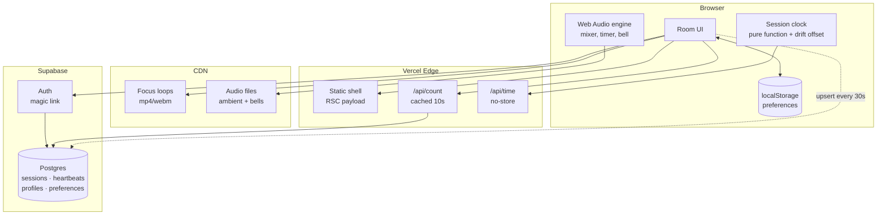

# Architecture — Meditate With Me v1

Internal document. Not for the client.

---

## 1. Constraints that drive everything

Every decision below falls out of these five. When something in this doc looks odd, check it against this list first.

| Constraint | Consequence |
|---|---|
| Budget is effectively £0 | Free tiers only. No always-on server, no queue, no cache layer we operate ourselves. |
| Global, 24/7, spiky | Traffic clusters hard at the top of each hour. Average load is meaningless; the peak is what breaks. |
| Solo dev, ~45 hours | Every moving part must justify itself. Anything we can avoid operating, we avoid. |
| Must extend to live video | The seams that matter are named in §9. Nothing else needs to be future-proofed. |
| "Same moment" is the product | Clock correctness is a feature, not an implementation detail. See §6.2. |

### The room is always dark

The room uses its dark palette regardless of the visitor's system preference.
The candle is the shared focus and its glow, wax shading and surrounding field
were designed as light inside a dark room; switching the page to a light canvas
changes that relationship rather than merely changing a theme. Keeping one
runtime palette also avoids a mid-sitting appearance change when a device's
scheduled light/dark setting rolls over. The light values remain in `@theme` as
build-time colour definitions, but `:root` deliberately overrides them at
runtime and the document advertises only a dark browser colour scheme.

---

## 2. The shape of the problem

Worth stating plainly, because it determines the whole design:

**This application has almost no state.**

There is no feed, no user-generated content, no inbox, no ordering, no transactions. The only durable data in v1 is a preferences row per registered user — and most users won't register.

What looks like state is actually derived:

- The current session is a **pure function of the clock**. Nobody writes it.
- The timer is **client-local**. Nobody else needs to know about it.
- The audio mix is **client-local**. Same.
- The participant count is the one genuinely shared value, and it's approximate by nature — nobody can tell the difference between 43 and 45 people.

So this is a static site with three small dynamic edges. Design accordingly: push everything to the client and the CDN, and be suspicious of any component that implies a server holding something in memory.

---

## 3. System diagram



Note what is *absent*: no WebSocket server, no job queue, no Redis, no separate API service. If any of those appear later, something has gone wrong with the reasoning.

There is exactly one scheduled job, and it is the exception that proves the rule: a `pg_cron` entry that deletes old heartbeat rows (§5). Nothing on the diagram waits for it, nothing breaks if it stops — it exists because a retention promise has to be kept by something. It runs *inside* Postgres rather than as a cron in front of the app, which is why the diagram is unchanged: no new box, no new endpoint, no new secret.

---

## 4. Subsystem 1 — Session resolution

### The rule

A session exists for every UTC hour whether or not a database row does. Rows are **overrides**, not the schedule.

```ts
// lib/session.ts — the entire scheduler
export function hourStart(atMs: number): Date {
  const d = new Date(atMs);
  d.setUTCMinutes(0, 0, 0);
  return d;
}

export function nextHour(atMs: number): Date {
  return new Date(hourStart(atMs).getTime() + 3_600_000);
}

export async function resolveSession(atMs: number) {
  const start = hourStart(atMs);
  const row = await db.sessions.findByHourStart(start);   // usually null
  return row ?? {
    hourStart: start,
    kind: 'ambient' as const,
    focusSlug: 'candle',
    streamUrl: null,
  };
}
```

### Why this matters

The client's "what's happening now" question is answered locally, instantly, offline, with one optional database read that is almost always a cache miss returning nothing. There is no scheduled job to fail at 3am, no backfill, no drift between what the scheduler thinks and what the clock says.

**The fallback is not a feature we build.** It is what happens when we find nothing. That is why the site cannot be empty — being empty would require code we haven't written.

---

## 5. Subsystem 2 — The participant count

This is the part I got wrong first, and it's the most interesting decision in the document.

### The obvious answer, and why it fails

Supabase Realtime has a presence API. Every client joins a channel, presence state syncs, count the keys. Elegant, and it is what the SDK is designed for.

It falls over here for a reason specific to this product. [Supabase's Realtime limits](https://supabase.com/docs/guides/realtime/limits) on the free tier:

- **200** concurrent connections
- **20** presence messages per second
- 100 messages per second overall

Presence sync is quadratic in message volume: when one client joins, every other client in the channel receives an update. With N people in the room, one join costs N messages.

Now consider the traffic shape. **Everyone arrives at the top of the hour, simultaneously.** That is not an edge case — it is the entire design of the product. Fifty people joining within the same few seconds costs on the order of fifty × fifty messages. We blow a 20/sec limit by two orders of magnitude, at precisely the moment the product is supposed to feel best.

Presence is built for small collaborative rooms — a shared document with eight cursors. Not for a global bell everyone answers at once.

### What we do instead

Treat the count as what it actually is: **a low-value, low-frequency number that is identical for every viewer.** That description is the definition of something that should be cached, not pushed.

```
client → upsert heartbeat every 30s   (write, cheap, one row)
client → GET /api/count every 15s     (read, edge-cached 10s)
```

```sql
create table heartbeats (
  anon_id    uuid        not null,
  hour_start timestamptz not null,
  last_seen  timestamptz not null default now(),
  began_at   timestamptz,              -- server-stamped at Begin only
  cell_lat   double precision,         -- one-degree grid cell, never a reading
  cell_lon   double precision,         -- nullable: not every request is placed
  primary key (anon_id, hour_start)
);

create index on heartbeats (hour_start, last_seen);
```

```sql
-- the count query
select count(*) from heartbeats
where hour_start = $1
  and last_seen > now() - interval '90 seconds';
```

`began_at` is a second, nullable reading of the same row—not a start-event
log. On Begin the route stamps it and counts rows whose `began_at` is within
the preceding thirty seconds, returning one fixed “you began with N others”
sentence. The all-hour count is also returned with the live count, so the
first arrival can be framed truthfully as the first person to light the hour.

Because the response is identical for every viewer, one edge cache entry with a 10-second TTL serves the entire world. **A thousand concurrent users generate roughly one origin query every ten seconds.** The same thousand users would have destroyed the presence approach.

**`/api/world` inherits this argument rather than working around it.** The map
needs where the candles are, not just how many, and an aggregate of grid cells
is still one response identical for every viewer — so it gets the same
`s-maxage=10, stale-while-revalidate=20` pair and the cliffs in §11 do not move.
The property is fragile in one specific way worth naming: **the moment anybody
wants "highlight my own light", the response is personalised and the whole
endpoint becomes uncacheable.** Do it the way the room already does — the viewer
knows their own cell, so let the client mark it. Never the server.

Cleanup is `public.prune_heartbeats()` — `delete from heartbeats where hour_start < now() - interval '2 days'` — run by `pg_cron` at seven minutes past every hour (`20260903193000_schedule_prune_heartbeats.sql`). Rows are tiny and nobody cares about history, so the schedule is not about disk. It is about the two days being a real number: we tell people in the privacy copy that the location square goes after two days, and how often this runs is what decides whether that is true. Hourly makes it true to within an hour; nightly would have made it true to within a day, i.e. nearly three days for an unlucky row.

**It had never once run before 3 September 2026.** The function was written in `0001_init.sql` with a comment saying to schedule it, and nobody did; the table was holding eight days of rows, by then including grid cells. Worth remembering as a shape of bug: a scheduled job that was never scheduled looks exactly like a scheduled job that works, from inside the code.

The client renders these aggregate readings as dots around the sitting ring —
one per candle lit this hour, spread evenly, the ones still here at full
strength and the rest dimmed (§16). No heartbeat ids leave the route handler.
Which dot is yours is decided client-side (it is always the one at twelve), so
the only personalised part of the room does not make the shared response
uncacheable.

### The general lesson

Realtime transport is for data that is **personalised, high-value, and latency-sensitive**. This number is none of those. Polling a cached endpoint is not the primitive solution here — it is the correct one, and it scales roughly a hundred times further on the same free tier.

---

## 6. Subsystem 3 — Time

Two independent clocks. Keeping them separate in the code is important; conflating them is the most likely source of confusing bugs.

### 6.1 The session clock (global, shared)

Derived from UTC. Rendered in the viewer's local timezone via `Intl.DateTimeFormat`. Everyone worldwide resolves to the same session.

This settles the open question in the client's brief: **one global session per hour**, not one per volunteer's local timezone. The alternative produces up to 24 concurrent sessions, a fragmented audience, and 24× the staffing.

### 6.2 Clock drift — the bug that would quietly ruin the product

`Date.now()` reads the user's device clock, which can be minutes wrong. If someone's laptop is three minutes fast, their candle lights three minutes early and the shared moment silently isn't shared. Nobody would ever report this as a bug; they would just find the site slightly off.

Fix: measure the offset once on load, apply it everywhere.

```ts
// GET /api/time -> { now: <server epoch ms> }, Cache-Control: no-store
let offsetMs = 0;

export async function syncClock() {
  const t0 = Date.now();
  const { now } = await fetch('/api/time').then(r => r.json());
  const t1 = Date.now();
  const rtt = t1 - t0;
  offsetMs = now + rtt / 2 - t1;    // assume symmetric latency
}

export const serverNow = () => Date.now() + offsetMs;
```

Every session calculation uses `serverNow()`. Never `Date.now()` directly. Re-sync on tab focus, since laptops sleep.

### 6.3 The personal timer (local, private)

Independent of the session, and one minute to fifty-five. Someone can sit for five minutes starting at :37, or for fifty-five starting at :50 and carry straight through two candles.

**The ceiling is 55, not the hour** — the client's decision of 7 September 2026. The last five minutes of every hour are a handover window: when an hour is led by a person rather than by nobody, whoever lit this candle has to hand over to whoever lights the next one, and a handover with no gap lands on top of somebody's closing bell. `nextSharedBellAt` moved to :55 in the same change, so *until the bell* and the slider share one ceiling instead of the shared path running five minutes past anything the slider could offer.

That window gates nothing. The candle is untouched — `lib/session.ts` still lights one at :00 and burns it across the whole hour — and a personal timer starts at :57 exactly as it did before. This is not the old forty-five-plus-fifteen interlude returning: that one refused to let anyone begin for a quarter of every hour, which is why it went. This one refuses nobody; it only means the people who chose to finish *together* finish with room to spare.

One consequence worth knowing before it is reported as a bug: `SHARED_BELL_MIN_LEAD_MS` sends a late arrival to the bell after next, so a shared sit can still exceed 55 — arrive at :52 and the next bell worth offering is sixty-three minutes away. The overshoot is not new (before the move, arriving at :56 gave sixty-four) and it is not a hole in the cap. *Until the bell* is a promise about finishing with other people, not a duration; the alternative is handing someone a three-minute sit they did not ask for.

The session no longer occupies part of its hour — it fills the whole one, and nothing gates the start. See §16.

Never count with `setInterval` — browsers throttle background tabs to roughly one tick per minute, and meditating with the tab hidden is the normal case, not the exception. Store the target, derive the remainder:

```ts
const endsAt = performance.now() + minutes * 60_000;
const remaining = () => Math.max(0, endsAt - performance.now());
```

`performance.now()` is monotonic — immune to clock adjustments mid-session, unlike `Date.now()`.

**The bell must be scheduled on the audio clock, not a JS timer**, or it fires late in a background tab:

```ts
bellSource.start(ctx.currentTime + remaining() / 1000);
```

This is the single most important line in the timer. A meditation app whose bell arrives ninety seconds late has failed at its one job.

---

## 7. Subsystem 4 — Audio

One `AudioContext`. One gain node per track. Buffers decoded once and looped natively.

```
              ┌─ rain ──── gain ──┐
AudioContext ─┼─ wind ──── gain ──┼─ master gain ─→ destination
              ├─ waterfall  gain ──┤
              └─ bell ──── gain ──┘
```

```ts
function makeTrack(ctx: AudioContext, buffer: AudioBuffer, master: GainNode) {
  const src = ctx.createBufferSource();
  const gain = ctx.createGain();
  src.buffer = buffer;
  src.loop = true;
  gain.gain.value = 0;
  src.connect(gain).connect(master);
  src.start();                          // runs silently until faded up
  return (v: number) =>
    gain.gain.linearRampToValueAtTime(v, ctx.currentTime + 0.15);
}
```

All tracks start immediately at zero gain and stay running. Fading is cheaper and glitch-free compared to starting and stopping sources, and it keeps every loop phase-locked so the mix never drifts apart.

### Constraints worth knowing before you write it

- **An `AudioContext` cannot start without a user gesture.** Autoplay policy. Turn this into the design rather than fighting it: one deliberate **Begin** button that lights the candle and starts the audio together. The constraint becomes the ritual.
- **iOS suspends the context when the screen locks.** Not solvable in a web app. Accept it, and note it for whenever the mobile app conversation happens.
- **Decode all buffers up front**, behind the Begin button, so no track arrives late.
- Loops need to be **seamless at the sample level**. This is an asset-quality problem, not a code problem — a loop with a click at the seam will be audible on repeat and no amount of crossfading fully hides it.

### Three bells, not three settings of one

The bells are still synthesised, still stand-ins for recordings Jonny buys, and `strike()` is still the one function a real buffer replaces. But they used to run **one shared set of partials** — ratios 1, 2.76, 5.4, 8.9 — with only the pitch and the tail length changed between them. Those are *bowl* ratios, which is why the bowl was the convincing one and why the gong was a bowl pitched down.

Each bell now carries its own `modes` table, plus three things none of them had:

- **A mallet.** The tone was never what gave the synthesis away; the attack was. A band-passed noise burst of 22–90ms under the strike is the single biggest difference between "a bell" and "a bell sound". It does not scale with `decayScale` — a mallet is a mallet whether the tail after it is a four-second preview or a twenty-two second ending.
- **Beating twins.** Every prominent mode is two oscillators a fraction of a hertz apart, so it warbles the way real metal does. The `hum` bed in `mix.ts` already used this trick at 110 / 110.35 Hz; the bells did not.
- **Bloom, for the gong only.** Its upper modes arrive 0.35–1.8s *after* the beater, with an attack that lengthens with the delay. A tam-tam getting brighter before it dies is most of what makes it a gong rather than a large bowl. Clamped to a quarter of the available tail so a mode cannot arrive after a shortened bell has gone.

The bell's `fundamental` means **the note you hear**, which for a cast bell is its *nominal*, not its lowest mode — so `struck-bell`'s modes are fractions of the note (hum at 0.25, prime at 0.5, tierce at 0.6) rather than multiples of the hum. The tierce is a minor third above the prime and is why a bell sounds like a bell; the old shared ratios had nothing in that region at all. The three published pitches are unchanged, deliberately: this work changed what the bells sound like, not what they play.

Mode gains in the tables are **relative**. `strike()` normalises each set to `PEAK` (0.9, what the old four-partial set happened to sum to) because the three bells now have five, ten and eight modes and every beating one is two oscillators — left raw, the gong would arrive at roughly two and a half times the struck bell's level, and adding a mode later would quietly make that bell louder.

### The bell rings at both ends

`openingBell()` strikes the chosen bell at `Begin`, immediately — safe without ceremony, because it runs inside the click that unlocked the context. The closing bell is still scheduled ahead on the audio clock, unchanged.

Two things about it are load-bearing:

- **It is the same bell as the ending**, read from `endBell`. That preference name predates this and stays: it is a stored localStorage key, a jsonb field and a CHECK constraint on `preferences.end_bell`. A sitting that opened on a gong and closed on a bowl would be two different rooms.
- **Its tail is clamped to the sitting's own length**, at 60% of the closing bell's decay or the length of the sitting, whichever is shorter. `until the bell` pressed at :59:30 is a real thirty-second sitting, and an opening bell still ringing when the closing one strikes would muddy the one moment the whole design exists to protect. The handle is held on the `Sitting` so that ending early and unmounting can silence it; a sitting that runs to its own end never needs to, because the clamp has already seen to it.

---

## 8. Subsystem 5 — Identity and preferences

### localStorage is primary, the database is a sync target

```
guest         → preferences live in localStorage, full functionality
signs up      → localStorage pushed to Postgres on first login
returning     → DB row wins, hydrates localStorage
logged out    → falls back to localStorage, nothing breaks
```

This ordering is deliberate and it is what makes step 7 of the build genuinely cuttable. The account layer is a **sync mechanism bolted onto a working app**, not a foundation the app sits on. If week three disappears into coursework, we ship without it and nothing is missing except cross-device sync.

Cuttable is enforced, not just intended: `components/useAuth.ts`, `components/useSyncPreferences.ts` and `components/Account.tsx` plus two blocks in `Room.tsx` are the entire feature. Delete them and the room is unchanged. `usePreferences` has no idea accounts exist.

### The rule when local and server disagree

**The server wins if it has a row; local is pushed up only when it doesn't.**

The build spec says "on first login, push whatever's in localStorage up", which is right for the first device and wrong for the second. Signing in on a phone would otherwise push that phone's untouched defaults over the settings you actually chose on your laptop. The cost of the rule as implemented is that a guest tweak made on a device you *later* sign in on is discarded — a smaller harm than losing settings you deliberately saved, but a real one.

### Implicit flow, not PKCE

No passwords. No password means no reset flow, which is where most auth bugs live.

**Two ways to finish, one call to start.** `signInWithOtp` sends an email that can carry both a link and a six-digit code; the account panel asks for the code, because ending a meditation site's only signup flow in somebody's inbox and returning them to a page reloaded from nothing is a poor last step. `verifyOtp({ email, token, type: 'email' })` finishes it in place, and `onAuthStateChange` swaps the screen underneath the form.

**The code needs one hosted change this repository cannot make.** Supabase's stock Magic Link template contains only `{{ .ConfirmationURL }}`; the same email carries the code once `{{ .Token }}` is added to it in Authentication → Email Templates. Until that is done the code box has nothing to receive, which is why the panel keeps saying the link in that email works too, and why `emailRedirectTo` is still sent. `plans/launch-readiness.md` carries it beside the SMTP item it depends on.

### Signing in once is meant to be enough

`persistSession` and `autoRefreshToken` are both on, the session lives in
localStorage under `sb-<ref>-auth-token`, and no session on this project carries
a `not_after` — there is no timebox and no inactivity cutoff. So a session
survives closing the tab, quitting the browser and restarting the machine, and
renews itself indefinitely.

That is observed, not inferred. On 7 September 2026 the live `auth.sessions`
held a session created 3 September and last refreshed four days later, through
four rotations of its refresh token, with no re-authentication in between —
and another from the same day with ten rotations. Somebody who signs in stays
signed in.

**`signOut()` must always pass `scope: 'local'`, and the library default is
wrong for this product.** Bare `signOut()` is `scope: 'global'`: it revokes
every session the account holds, everywhere. Pressing `Sign out` on a laptop
therefore signed the same person out on their phone, where the next visit would
find them a stranger — no name in the masthead, no synced log, another email to
wait for. Proved rather than read off the documentation: two devices signed in,
the laptop signs out, and the phone's `refreshSession()` comes back *Invalid
Refresh Token: Refresh Token Not Found* under the default and succeeds under
`local`.

Signing out everywhere is a real thing to want — it is the answer to a lost
phone — but it is a deliberate security action and belongs behind a control
that says so, not silently attached to the ordinary one. There is no such
control yet, and there does not need to be one until somebody asks.

Note that `deleteAccount` passes `scope: 'local'` too, for an unrelated reason:
after the account is gone a global sign-out would POST `/logout` on behalf of a
user who no longer exists, fail, and leave the dead session sitting in
localStorage.

### A dead link is silent, and that had to be fixed

**The link flow works on localhost, and the auth log proves it**: a `/verify` at 2026-09-01 22:41:41 returned 303 with `login_method: implicit`, and `auth.users.last_sign_in_at` carries the same timestamp. Nothing about magic links is waiting on deployment.

What is not obvious is the failure. **A magic link is single-use, and issuing a new one invalidates the last.** Clicking a spent link gets `403 One-time token not found` inside Supabase — which it then returns as a **303 back to the site**, with the reason in the fragment:

```
http://localhost:3000/#error=access_denied&error_code=otp_expired&error_description=Email+link+is+invalid+or+has+expired
```

So the browser lands on the landing page, signed out, looking exactly like a cold arrival. `detectSessionInUrl` recognises the error fragment, abandons the sign-in and **keeps the reason to itself** — `onAuthStateChange` never fires, `getSession()` returns null, and there is no public API for what went wrong. The room rendered `Begin.` with the explanation sitting unread in its own address bar.

`readLinkError()` in `useAuth` reads the fragment first-hand, during the first render — not in an effect, because React runs child effects before the parent's and the children reach for the Supabase client. `linkError` goes to the landing's `Account`, which opens itself on the address step with the reason showing, and the fragment is stripped from the URL so a reload is a clean arrival.

**Only the landing gets it.** The flag lives for the session and the foot-of-frame instance mounts at the end of a sitting, minutes after the arrival it would be describing.

Two related facts worth keeping:

- **`options.data` is ignored for an address Supabase already knows.** An existing account can never gain a name by running the flow again, which is the property that stops anybody being renamed by retyping — and also means testing signup with your own address leaves `raw_user_meta_data` without a `name` and Home falling back to its own masthead.
- **The built-in hosted SMTP rate-limits hard.** `over_email_send_rate_limit` on a 429 is what `Send it again` will usually hit within a few minutes of the previous send. Real SMTP is the fix; it is already on the launch list.

PKCE keeps its verifier in the localStorage of the browser that requested the link, so requesting on a laptop and opening the mail on a phone fails. That is the normal case here, not an edge case. Implicit costs us server-side sessions, which this app does not use: the room is a client component and preferences are guarded by RLS against the user's own JWT. If a server component ever needs to know who is watching, this becomes `@supabase/ssr` and a callback route.

There is no callback route. The link returns to the site origin and `detectSessionInUrl` takes the token out of the fragment.

**`detectSessionInUrl` reads the URL once, when the client is built — which is on page load, and that is not the only way the token arrives.** The email is requested *from* the site, so the tab is already sitting on `/`; the link's `redirect_to` is that same `/`. A URL differing from the current one only by its fragment is a **same-document** navigation: the browser fires `hashchange` and does not reload. The client is never rebuilt, nothing re-reads the URL, and a valid access token sits in the address bar being ignored — the visitor sees `Let's begin.` and is told nothing, because there is nothing to tell them: Supabase verified the link and recorded the login. It looks exactly like "logging in is broken", and for one afternoon it was. It bites whenever the link opens into an already-open tab rather than a new one — pasting it into the address bar being the reliable way to reproduce it.

`onHashChange` in `useAuth` closes that hole: on a fragment carrying `access_token`, it hands the pair to `auth.setSession()` — public API, no reload, and it fires `onAuthStateChange` so the screen changes by the same path as every other sign-in. On a fragment carrying an error it sets `linkError` instead. Either way the fragment is stripped. Because a late `linkError` arrives as a *prop change* rather than at mount, `Account` also watches it in an effect — its `open`/`step`/`error` seeds only fire on mount and would otherwise tidy the URL and say nothing.

**`lib/supabase.ts` returns one browser client, not a new one per call.** Two clients share a localStorage key and race each other refreshing the same token.

### Schema

As migrated. `0001` created these tables and nothing wrote to them for three build steps, which hid three defects until `0003`:

```sql
create table profiles (
  id           uuid primary key references auth.users(id) on delete cascade,
  display_name text,
  created_at   timestamptz not null default now()
);

create table preferences (
  user_id       uuid primary key references profiles(id) on delete cascade,
  timer_minutes int  not null default 10
                check (timer_minutes between 5 and 60 and timer_minutes % 5 = 0),
  until_bell    boolean not null default false,
  end_bell      text not null default 'singing-bowl'
                check (end_bell in ('singing-bowl','gong','struck-bell')),
  focus_slug    text not null default 'candle',
  sound_mix     jsonb not null default '{}'::jsonb,   -- {"rain":0.4,"wind":0.15}
  show_count    boolean not null default true,
  updated_at    timestamptz not null default now()   -- maintained by trigger
);

alter table preferences enable row level security;

create policy "own preferences" on preferences
  for all
  using      (auth.uid() = user_id)
  with check (auth.uid() = user_id);

-- Signing up creates only the auth.users row. Without this, the first
-- preferences insert fails on the profiles foreign key — for every user.
create trigger on_auth_user_created
  after insert on auth.users
  for each row execute function public.handle_new_user();
```

What `0003` had to fix, all of it invisible while the tables were empty:

1. **`timer_minutes between 1 and 45`** was left over from the 45-minute session. The slider is 1–60, so picking the hour — the value the presets deliberately put on offer — would have been rejected by the database. (0003 replaced it with a 5–60 multiple-of-five check; `0005_timer_stops.sql` then replaced *that* with an explicit `in` list when the one-minute stop came back; `20260907140000_timer_ceiling_55.sql` dropped 60 from that list when the ceiling moved to 55. The constraint has now chased the slider three times, which is the argument for keeping it a literal list that can be compared to `TIMER_STOPS` by eye.)
2. **`end_bell` was unconstrained text.** `BellKind` is a union in TypeScript precisely so a bad value cannot reach the audio graph; that guarantee stopped at the database, which would have stored anything and synced it to every device.
3. **Nothing created a profile row,** so the foreign key above would have failed on every user's first sync.
4. `updated_at` never updated — it held the creation time forever, which is worse than not having the column.

`timer_minutes` and `end_bell` duplicate constraints that also live in TypeScript (`lib/timer.ts`, `lib/types.ts`). That duplication is intentional — the database is the last line and cannot import a type — but it means **changing the bells or the slider bounds is a two-file change**, and `0003` exists because somebody forgot that once already.

`until_bell` is deliberately separate from `timer_minutes`: it is a shared
absolute target converted once into a monotonic deadline at Begin, not a
sentinel duration. Arrivals inside five minutes of the hour are offered the
following bell, so no one is refused or quietly given a three-minute sit.

### The practice log

One row per sitting, in `sittings`. Same ordering as everything else: localStorage primary, database as sync target — **a guest gets their full history and their streak without an account**, and signing in is what carries it between devices. Requiring a login to answer "how consistent have I been" would put a toll on the one screen meant to encourage somebody.

Syncing is a **union, not a merge**. A sitting is a fact that happened, so there is no conflict to resolve and no last-write-wins rule to get wrong. Ids are generated on the client and are the primary key, which makes pushing idempotent: the same sitting sent twice collides and does nothing rather than doubling a streak. Verified — the same id posted twice leaves one row.

Three decisions worth not re-litigating:

- **Days are local, sessions are UTC.** The candle must be the same candle for everyone on earth at once. A streak is the opposite kind of fact: entirely yours, and "today" means where you are standing. Day arithmetic uses calendar fields, never `- 86400000` — subtracting a day in milliseconds lands on the same local day twice a year in DST countries, a bug that appears in October and cannot be reproduced in April. There is a test that walks back 400 days asserting it never repeats one.
- **An empty today does not break a streak.** If you sat yesterday and it is now nine in the morning, the streak stands; you have not used today yet. Otherwise every streak visibly collapses to zero overnight, every night, which punishes people for sleeping.
- **Minutes sat, not minutes intended.** Someone who set an hour and stopped at twenty sat for twenty. Recording the intention would make the totals a wish list. Under sixty seconds records nothing — that was a mis-tap.

The display is deliberately not a scoreboard: no goal, no target, nothing turns red, and the personal best is hidden until it is genuinely longer than the current run. A meditation practice whose progress screen makes you feel you are failing at meditation has been made worse by it.

`sittings` is the most sensitive table here. A preference reveals that you like a gong; this reveals when you were awake, how often, and for how long. Its RLS was tested the same way as `preferences` — all six attacks refused, including writing into another user's history and reassigning your own row to them.

### Deleting an account

`DELETE /api/account`, and it is the one operation in the product that
genuinely cannot happen in the browser. RLS governs `public`, not `auth`, and
the only API that removes a user — `auth.admin.deleteUser` — needs the service
role key. Hence a route handler.

**The id comes from `getUser(token)` and never from the request.** There is no
body to parse and no `userId` parameter to tamper with, so the only account the
endpoint can delete is the one whose token it just verified against the Auth
server. Taking an id from the caller here — however carefully checked — would
be a service-role endpoint that deletes arbitrary users on request. The token
is verified over the network rather than decoded locally, because a locally
parsed JWT still looks valid after its session has been revoked.

Everything else goes by cascade, which is why this needed no migration:

```
auth.users → profiles → preferences
                     → sittings
```

All three were already `ON DELETE CASCADE`. That was checked against
`pg_constraint` on the live database rather than read off the migration files,
and then checked again by doing it: a throwaway account with a profile, a
preferences row and two sittings, deleted through the real endpoint, left zero
rows in all three tables and did not touch a second account created alongside
it. The delete is hard, not soft — a soft delete would leave the row and the
email address on it, which is not what "delete my account" means and not what
App Store guideline 5.1.1(v) means either.

**`heartbeats` is not deleted, and that is the privacy property working.** It
is keyed by `anon_id` and has no `user_id` column, so a signed-in person's
heartbeats are not linked to their account at all — see §5, where that is the
whole point. There is nothing to find and nothing to delete, and the rows are
pruned on a schedule regardless. The practice log in localStorage is also left
alone: it is the visitor's own copy on their own device, they asked to close an
account rather than to destroy it, and the confirmation panel says so plainly.

### Validation happens in one place

`lib/preferences.ts` `normalize()` is the only thing that decides what a valid preference is. Both sources go through it: localStorage, which a user can hand-edit in devtools, and the `preferences` table, which syncs to every device someone owns. Validating in two places means one path drifts, and the failures are quiet — a bad bell does nothing at all until a sitting ends.

**On that policy, since RLS is new to you:** `using` governs which rows a user can *see* and *delete*. `with check` governs what they're allowed to *write*. Omit the second and a user can update a row and set `user_id` to someone else's id, silently taking over their record. Write both, every time. Test it by logging in as one user and trying to read another's row — if it returns data, the policy is wrong.

**That test has been run**, against two real users and a real JWT obtained through the actual magic-link flow, not against the types:

| Attack with user A's token | Result |
|---|---|
| `select *` from preferences | only A's row |
| update B's row | 0 rows |
| insert a row owned by B | `42501` RLS violation |
| **set A's own `user_id` to B** | `42501` — this is the one `with check` catches |
| delete B's row | 0 rows |
| read `heartbeats` | `[]` — RLS on, no policy at all |

Re-run it after any change to the policy. The fourth row is the one that passes when `with check` is missing.

`sessions` and `heartbeats` are readable by everyone and writable only by the service role. Heartbeat writes go through a route handler, not from the browser directly, so nobody can inflate the count from the console.

---

## 9. The v2 seam

The whole point of this design. Adding live video should touch three files.

| Component | v1 | v2 change |
|---|---|---|
| `resolveSession()` | always returns `ambient` | returns a `live` row when one exists — **no change to the function** |
| Room UI | renders `<FocusLoop>` | branches on `session.kind` to render `<LiveStream>` |
| Count endpoint | heartbeat query | unchanged |
| Clock | unchanged | unchanged |
| Audio | unchanged | mixes stream audio into the existing master gain |
| Scheduling | none | a booking table writing `sessions` rows — additive |

Nothing above requires touching the session logic, the clock, the count, or the audio graph. The `kind` column and the `stream_url`/`lighter_id` columns already exist in v1 and sit unused. That unused column is the seam, and it costs nothing now.

---

## 10. Failure modes

Everything degrades to "you can still meditate."

| Failure | Behaviour | Acceptable? |
|---|---|---|
| Supabase down | Session still resolves (pure function). Count hides. Timer, audio, candle all work. | Yes — core product survives |
| `/api/count` fails | Count hides silently. No error toast. | Yes |
| `/api/time` fails | Fall back to `Date.now()`, offset 0. Possible small drift. | Yes |
| Audio file 404s | That track is hidden from the mixer. Others play. | Yes |
| Focus loop 404s | Static fallback image. | Yes |
| Auth down | Guests unaffected. Sign-in shows a plain message. | Yes |
| Account deletion fails | Panel stays open saying nothing was changed. Never reports success it did not get. | Yes |

**Design rule: nothing in this app should ever show an error screen.** Every failure hides a control or silently degrades. Somebody sitting down to meditate should never be shown a stack trace or a red banner.

---

## 11. Where this breaks at scale

Worth knowing the cliffs before hitting them.

| Concurrent users | Status |
|---|---|
| < 200 | Comfortable on free tiers throughout. |
| 200 – 2,000 | Fine. Count endpoint is edge-cached so origin load is flat. Heartbeat writes become the load: 2,000 users ≈ 67 writes/sec. Supabase Pro at $25/mo handles it. |
| 2,000 – 20,000 | Heartbeat writes need batching — buffer client-side, or move the counter to Redis/Upstash with a periodic flush. Postgres row-per-user stops being the right shape. |
| 20,000+ | Count becomes a statistical estimate rather than an exact number. Nobody will notice, and by this point the live video bill is the actual problem, not this. |

The heartbeat table is the first thing to break, and it is a contained problem with obvious fixes. That is the right kind of scaling risk to accept.

---

## 12. Repo layout

```
meditatewithme/
├── app/
│   ├── page.tsx                 # renders <Entry> — the room OR Home
│   ├── world/page.tsx           # the map, its own route
│   ├── layout.tsx
│   └── api/
│       ├── time/route.ts        # server clock, no-store
│       ├── count/route.ts       # cached 10s
│       ├── world/route.ts       # cells + counts, cached 10s
│       └── heartbeat/route.ts   # upsert, service role, stamps the cell
├── components/
│   ├── Entry.tsx                # auth branch; owns every shared hook
│   ├── Room.tsx                 # state machine host — takes props now
│   ├── Home.tsx                 # the signed-in page (scrolls; see §17)
│   ├── WorldMap.tsx             # canvas earth, loaded only by /world
│   ├── World.tsx                # the map's page chrome
│   ├── FocusLoop.tsx            # <- v2 branches here
│   ├── Timer.tsx
│   ├── SoundMixer.tsx
│   └── ParticipantCount.tsx
├── scripts/
│   ├── contrast.mjs             # palette pairs, flat colours (npm run contrast)
│   └── contrast-room.js         # the same question against the photograph
├── lib/
│   ├── session.ts               # hourStart, resolveSession
│   ├── clock.ts                 # syncClock, serverNow
│   ├── geo.ts                   # snapToCell, subsolarPoint
│   ├── projection.ts            # Equal Earth, for the map at /world
│   ├── audio.ts                 # AudioContext graph
│   ├── prefs.ts                 # localStorage <-> DB
│   └── supabase.ts
├── public/earth/                # land.json + relief.jpg — 273KB (/world only)
├── supabase/migrations/
├── context/                     # standing project knowledge
├── plans/                       # active plans
└── docs/                        # finished writing
```

`lib/` holds no React and no I/O beyond explicit fetches — it should be testable with plain functions. `session.ts` and `clock.ts` in particular are pure enough to unit test properly, and they are the two places a bug would be least visible in manual testing. `projection.ts` is there for the same reason and a sharper one: a projection with a flipped sign draws a perfectly convincing map with every light in the wrong place.

**That boundary is now enforced rather than described.** `tests/portability.test.ts` reads every file in `lib/`, strips comments and string literals, and fails on any browser-only global — `window`, `document`, `localStorage`, `AudioContext` and the rest. It was a sentence in a comment in `usePresence.ts` until 6 September 2026, which is the same condition `scripts/contrast.mjs` was written to fix: a claim nobody can re-measure stops being true without anybody noticing, because importing `localStorage` into `lib/` breaks nothing on the web.

It breaks something later. `lib/` is what an iOS port keeps — all ten files are portable today, `clock.ts` included, because it takes `fetchImpl` as a parameter instead of reaching for `fetch`. `fetch` and `performance` are deliberately *not* banned: both exist in React Native, and a rule we do not have should not be enforced. Platform access belongs in `components/`, behind a hook.

---

## 13. Decision log

| # | Decision | Rejected alternative | Why |
|---|---|---|---|
| 1 | Sessions computed from the clock | Pre-generated rows via cron | Nothing to fail at 3am; no drift; missing row *is* the fallback |
| 2 | Polled, edge-cached count | Supabase Realtime presence | Presence is O(N) messages per join and everyone joins at once — see §5 |
| 3 | localStorage primary | Database primary, guest read-only | Makes the account layer cuttable; guests get full functionality |
| 4 | Web Audio graph | Multiple `<audio>` elements | Independent gain, smooth ramps, phase-locked loops |
| 5 | Server-time offset | Trust `Date.now()` | A wrong device clock silently destroys the shared moment |
| 6 | `performance.now()` for the timer | `Date.now()` deltas | Monotonic — unaffected by a clock adjustment mid-session |
| 7 | Bell on the audio clock | `setTimeout` | Background tabs throttle timers; a late bell is a product failure |
| 8 | Cached focus loops | Streamed video | Cache-once vs metered-per-viewer — the entire cost argument |
| 9 | One global session, UTC | Per-timezone sessions | 24 parallel sessions fragments the audience and multiplies staffing |
| 10 | Pruning on `pg_cron` | `vercel.json` cron hitting a route | A route means a secret-guarded endpoint that deletes rows — the exposure `0002` closed, rebuilt with a lock. Nothing leaves the database this way |

---

## 14. Open technical questions

Two of the four are closed. They were filed as "needs Jonny" and they did not —
they needed a decision, and holding them open was costing more than getting one
wrong would have.

1. **~~What happens when a personal timer ends mid-session?~~ Settled: the sound
   fades, the candle stays, and the room moves to a `finished` state.** Returning
   to idle punishes somebody for finishing — it clears the screen at the one
   moment they are least ready to be handed a fresh set of controls. `Afterwards`
   is what that state renders, and it offers going again rather than assuming it.
2. **~~Should the count include people who haven't pressed Begin?~~ Settled:
   everyone on the page counts.** Waiting is participating, and a number that
   only moved after Begin would be smaller than the room genuinely is at the top
   of the hour. It is honest because the wording is "here", not "meditating" —
   see the note above `PresenceLine` in `Room.tsx`. The forgotten-tab problem is
   handled by the visibility API rather than by narrowing who counts.
3. **Anonymous id lifetime.** A `localStorage` uuid per browser means one person
   on two devices counts twice. Acceptable, and the alternative is worse.
4. **~~Do we record any analytics at all?~~ Settled, and the answer is no longer
   "none".** No third-party analytics, and nothing that identifies anybody — that
   part holds, and the cookie banner question stays closed. But the map at
   `/world` needs to know roughly where a candle was lit, so `heartbeats` now
   carries `cell_lat` / `cell_lon`.

   What was chosen, and why each part of it:

   - **The server derives it**, from the edge's own geo headers. The browser is
     never asked for permission and `navigator.geolocation` is never called —
     a permission prompt on a meditation site is the wrong manner entirely, and
     most people decline one, which would have made the map both intrusive
     and wrong.
   - **It is snapped to a one-degree grid before it is stored**, by
     `snapToCell` in `lib/geo.ts`. The row holds the cell centre, not the
     reading. Nothing more precise than about 111km exists in the database at
     any point, so there is no finer value to leak or to be asked for.
   - **It rides on `heartbeats`**, which is already anonymous and already keyed
     to one UTC hour. No new table, no new identifier, nothing durable.

     **The two-day pruning is now actually happening**, since
     3 September 2026. It was not before: `prune_heartbeats()` had existed
     since `0001_init.sql` with nothing invoking it — no `pg_cron`, no
     `vercel.json` — and the table was holding rows from 26 August, eight
     days, by then carrying cells. It is scheduled hourly in
     `20260903193000_schedule_prune_heartbeats.sql`; §5 has the reasoning for
     `pg_cron` over a Vercel cron and for hourly over nightly.
   - **The city and country headers are deliberately not stored.** Both are
     available. A city name is a far stronger identifier than a cell for anyone
     living in a small one, and the map has no use for a label.

   The bar this was designed against is an ordinary server access log, which
   holds a full IP address. This is considerably coarser than that.

   **Localhost can never place a heartbeat, so this cannot be tested here.**
   The geo headers are added by Vercel's edge and simply do not exist in
   `next dev`; `snapToCell` correctly returns null and the row is written
   without a cell. Every one of the 65 real heartbeats written between 26
   August and 3 September has `cell_lat = null` for exactly this reason, and
   for a while the only placed rows in the table were a hand-seeded set of
   demo cities. A map that looks empty locally is a map working as
   designed.

   **Proved on the preview on 3 September 2026**, which is the only place it
   can be. One POST to `/api/heartbeat` on the `dev` deployment wrote
   `cell_lat = 40.5, cell_lon = -73.5` — a real request, through the real
   edge, coarsened and stored as a cell. The row was deleted immediately
   afterwards; it was a test, and the count it would have inflated is read by
   the live room. **If this ever needs re-testing, do it the same way** — one
   request, then delete it — rather than by seeding the current hour, which
   tells whoever is sitting at that moment that they have company.

   **The privacy copy for it is written**, in
   `plans/privacy-data-inventory.md` — the complete inventory of everything the
   site stores, with drafted plain-language copy for each category. It is not
   the notice, because the notice needs a named controller and that is still
   with Jonny; it is everything about the notice that does not. `/world` also
   says the substance of it under the map, on the page, because somebody
   looking at a map of where people are should not have to open a legal document
   to find out how precisely they are on it. **Keep those two in agreement**, and
   keep both in agreement with `GRID_DEGREES`.

---

## 15. Deployment

| | |
|---|---|
| Host | Vercel, project `meditatewithme` under `10zinglunn-afks-projects` |
| URL | https://meditatewithme.vercel.app |
| Source | GitHub `10zinglunn-afk/meditatewithme`, auto-deploying on push |
| Custom domain | Not attached — Jonny owns it, DNS not yet pointed |

### Branches

`main` is production and deploys on push; `dev` is where work happens and
deploys to a preview URL. The split exists because a commit on `main` is a
release whether or not anyone intended one.

The two branches differ at `app/page.tsx` on purpose: `main` serves the holding
page, `dev` serves the room. Merging `dev` into `main` is therefore the launch,
and should never be a side effect of some other change.

### Why Vercel specifically

Not a default. §5's whole argument is that the count survives a simultaneous
global join because one edge-cached response serves everyone — that mechanism
*is* the `s-maxage` / `stale-while-revalidate` pair set in `app/api/count/route.ts`,
and it only works on a CDN that honours them. Verified in production: repeat
requests return `x-vercel-cache: HIT`, and a fresh heartbeat surfaces one cache
generation later via `STALE`, exactly as designed.

Cloudflare Workers is the credible alternative — cheaper at real scale — but
Next.js App Router needs the OpenNext adapter there and the caching above would
need reworking. Not worth it at this traffic.

### Environment variables

Set in Vercel for Production, Development, and Preview **scoped to the `dev`
branch**.

That scoping is a workaround, not a preference. CLI v52 advertises `--yes` for
preview-all-branches and then demands a git branch anyway, so the all-branches
form is unusable until the CLI is upgraded. Naming `dev` explicitly is accepted
and covers the branch we actually deploy.

The consequence to remember: **a new branch with a different name will not reach
Supabase.** Its preview will build and then fail at every database call. Either
add the three variables for that branch too, or upgrade the CLI and set them for
all preview branches at once.

`SUPABASE_SERVICE_ROLE_KEY` is server-only and must stay that way. Verified
against the live bundle: the key appears in none of the seven client chunks nor
in the HTML. Re-run that check if `serviceClient()` ever gains a new caller.

Re-verified after `lib/supabase.ts` gained the auth configuration. The check is
only meaningful if you also confirm the search *would* have found something —
grep for the publishable key in the same pass; it must be present in
`.next/static`. A negative result from a broken grep looks identical to a pass.

### Auth redirect URLs — a launch trap

**Supabase must be told which URLs a magic link may return to**
(Dashboard → Authentication → URL Configuration). This is not in the repo and no
migration can set it.

The failure is silent and therefore nasty: if `emailRedirectTo` is not on the
allow list, Supabase does not error — it redirects to the project's **Site URL**
instead. A new project's Site URL is `http://localhost:3000`, so unless this is
changed, **every magic link sent from production will land the user on their own
machine's localhost** and appear to do nothing.

Needed before accounts work anywhere but a dev machine:

- Site URL → the canonical production origin. Use
  `https://meditatewithme.vercel.app` until the custom domain is attached, then
  change it to the custom-domain origin.
- Redirect URLs → `http://localhost:3000/**`,
  `https://meditatewithme.vercel.app/**`, and the Vercel team-scoped preview
  wildcard `https://*-10zinglunn-afks-projects.vercel.app/**`. Add the exact
  custom-domain origin (with `/**`) when DNS is live.

Worth checking this the same day the custom domain is pointed, since the Site URL
has to change again then.

### Auth email delivery — a second launch trap

The hosted default SMTP service is suitable only for testing: it delivers Auth
mail to pre-authorized team addresses, not ordinary visitors. Before publicly
offering accounts, configure and verify a custom SMTP sender in Supabase
Dashboard → Authentication → SMTP. Do not customise email templates unless the
project's plan supports it; if a custom template is used with `emailRedirectTo`,
its link must use `{{ .RedirectTo }}` rather than ignoring the requested return
origin.

The app deliberately asks `signInWithOtp` to return to `window.location.origin`.
That makes local, preview, and production links land back on the exact page the
person requested from; the security boundary is the allow-list above, not a
hard-coded deployment URL. Test with a real non-team inbox on the preview and
again after production DNS is attached.

### Plan limits

The account is on Hobby (free), which is intended for non-commercial projects.
Donations would likely push this to Pro. Not a blocker now, but it lands on
Jonny's bill eventually — and per the payment message, hosting is meant to sit
in his name, not Tenzing's. Worth settling before the domain is attached, since
moving a project after DNS is pointed is the annoying order to do it in.

### The migration history is not the migrations

Schema changes do **not** deploy with the app. Vercel pushes code; the database
is changed by hand, before or alongside the commit that needs it. Nothing
automates that and nothing checks it, so a deploy can reach production expecting
a column that is not there.

Worse, the usual safety net is missing. Supabase tracks applied migrations in
`supabase_migrations.schema_migrations`, and here that table has never matched
this repo: seven rows on the remote against nine files in
`supabase/migrations/`, with no row in common. The files and the table describe
the same schema under different names, because the migrations were applied
through a route that never wrote these filenames back.

The consequence is the whole reason this is written down: **`supabase db push`
is not usable on this project.** It compares those two lists, concludes that
every local file is unapplied, and replays the schema from `0001` against a
database that already has it. Use `supabase db query --linked -f <file>` for one
migration at a time and check the result with a follow-up query — see CLAUDE.md.

`supabase migration repair --status applied <version>` would reconcile the two
and restore `db push`. It is the right fix and it has not been done, because it
writes to production metadata and that is a decision, not a side effect.

---

## 16. The candle, and why nothing is gated

The original model ran a 45-minute session with a 15-minute interlude, and the
room withheld Begin during the interlude. Two things were wrong with it.

The first is arithmetic: for a quarter of every hour, a meditation site told
people who had arrived wanting to meditate to come back later.

The second is that it made the hour mean the wrong thing. A countdown only
carries meaning if something happens at :00 that cannot happen at :23 — and the
only thing that happened was a button unlocking. That is friction wearing the
costume of ritual. Worse, the session and the personal timer quietly undercut
each other: if you may join at :23 and sit for seven minutes, you are not
synchronised with anybody, so the countdown was measuring nothing.

### What replaced it

**A candle is lit at the top of every hour and burns down across it.** Nothing
is gated; you sit whenever you like.

The shared thing is the candle's *state*. `candleBurn(now)` is a pure function
of the clock, so two people in different timezones opening the site in the same
second see the same candle at the same point in its hour. That is real
synchrony, and it costs no coordination — no cron, no socket, no event to miss.

It also communicates lateness honestly. Arrive at :50 and you find a candle
visibly further through its hour — a smaller, dimmer flame now that the room is
a photograph (see *The candle is a photograph*, below), a stub of wax when it
was CSS. You can see you came late, which is a far gentler thing than a locked
button, and it preserves the reason to show up at the top of the hour without
punishing anyone who cannot.

A sitting may run through :00. It is not interrupted — a new candle is simply
lit under it, which needs no code at all, because the burn is derived rather
than stored.

### Consequences in the code

- `SESSION_MS === HOUR_MS`. There is no interlude.
- `sessionPhase` and the `SessionPhase` type are gone. They encoded a design
  that no longer exists, and a phase that always returns `'active'` is worse
  than no phase at all.
- The personal timer is 1–55 minutes over twelve explicit stops — 1, then
  every five minutes to fifty-five. Nobody sitting down to meditate has an
  opinion about seventeen minutes versus eighteen. The hour itself is not a stop:
  see §6.3 for the five minutes at the end of every hour and what they are for.
- The stops are a list (`TIMER_STOPS`), not a min/max/step, because the jump
  from one minute to five is not a uniform step and no `step` value can describe
  it. The slider's value is an index into that list, which is why it carries an
  `aria-valuetext` — the raw number means nothing to a screen reader.
- `clampMinutes` snaps to the nearest stop, with ties going to the longer sit.
  Three minutes is equidistant from one and five; rounding down would cut the
  sit by two thirds to save two minutes.
- The one-minute stop is deliberate. It is the sit somebody takes when they are
  not sure they want to sit at all, which describes most first visits — and it
  is what the proposal the client holds actually promises.

### The candle is a photograph

It was CSS — gradients shaped into a flame, with `candleBurn` spent on the
height of the wax. It is now `components/CandleScene.tsx`: a photograph of a
room in `public/room-base.png`, with a sprite flame warped on a canvas above
it, and a camera that racks between six `phase`s as the page changes.

A photograph cannot shorten, so the burn is spent on the flame instead — it
loses scale and glow across the hour rather than height. Somebody arriving at
:50 still gets a visibly older candle; they no longer get a stub. `candleBurn`
itself is unchanged and still linear, and the note it always carried still
stands: a real candle does not burn linearly, so the mapping from `candleBurn`
to what is on screen may want a curve rather than a straight line.

### The landing is a photograph with a line of type on it

`Let’s begin.` is the only thing on the room. Not the only interactive thing —
the only thing.

**It read `Begin.` until it didn't.** An instruction, from the room to you.
`Let’s` makes it an invitation from somebody sitting down with you, which is the
premise of the entire site and was being spent nowhere else on this screen — and
this is the only copy a first-time visitor reads before deciding whether to stay.
Two extra words is a cheap place to say what the site is. Measured after the
change: 258px of 1280 on a laptop, 213px of 375 on a phone, no wrap and no
scroll in either. The typographic apostrophe matches the rest of the visible
copy; straight quotes in this project are a code-comment habit, not a copy one.

Everything below still calls the control "the begin word", and the timing beats
are still named `Begin` — the moment did not change, only what it says. The title, the tagline, the hour and the three quiet links have all
gone, either behind that word or after the sitting, because a picture with
anything else on it stops being a picture. It fades in over 2.6s as the opening
camera move settles, rather than being there when the lights come up.

**The room fades in with it, on the same gate.** The photograph is a CSS
background, which has no load event, so it used to appear the instant its file
finished downloading while the word faded up on a timer beside it — two
arrivals, and on a cold connection the word came first, over black. `CandleScene`
now fetches the same URL through an `Image` purely for the event (a cache hit,
not a second download) and reports it as `onReady`; `Room` holds `booted` until
**both** the clock has answered and that has fired, then releases the photograph,
its glow, the flame, `Begin.` and the account control together. There is no
"Finding the hour…" label any more — the frame it covered lasts a few
milliseconds and is the room's own dark ground either way.

`REVEAL_MS` and `REVEAL_EASE` are exported from `CandleScene` and imported by
`Room` rather than written twice, and the reason is specific: Tailwind's
`ease-out` is `cubic-bezier(0, 0, 0.2, 1)` while CSS's `ease-out` keyword is
`cubic-bezier(0.25, 0.1, 0.25, 1)`. Writing the keyword in one place and the
class in the other gave two fades that started together, ended together, and
disagreed in the middle about how fast the room was arriving. One constant, one
curve.

The account offer, the practice log and the room toggle now live in the
**ending**, which is where they mean something: you have just added to your
practice, so that is when to offer to show it to you and to keep it. The
trade-off was real and it was named here: **a first-time visitor could not sign
in before their first sitting.** That was judged the right price for a landing
with one word on it, with the remedy recorded in case it stopped being — "one
quiet line, not the row of three that used to be there."

**It stopped being, and the remedy is exactly the one written down.** There is
now a single control at the top right of the landing, fading in on the same
`REVEAL_MS` as `Begin.` and the photograph. It is not joined by a second, and it is absent for anybody already
signed in, who never sees this screen at all.

**It says `Create account`, not `Sign in`.** `signInWithOtp` creates the user
on first use — that has always been the signup path — so the old label described
the API call rather than the act, and asked a first-time visitor for credentials
they did not have. The flow behind it carries `I already have one`, which skips
the name and goes straight to the address.

**It is a dropdown, and it used to be a question. That was the mistake.** The
form once took the band the way `How long?` does: camera to `open`, band to full
height, back arrow. The reasoning was that sign-in is the room asking you
something. Watching it said otherwise. Three things animate on that press — the
band's height over 700ms, the copy's transform over 600ms, and the camera — and
the second **chases** the first: `useFitToBand` measures `outer.clientHeight`
through a `ResizeObserver`, that height is mid-animation, so the transform's
target moves every frame and its ease-out restarts every frame against it. The
form did not arrive, it drifted, overshot and settled a second and a half later.
A repeatedly-restarted ease-out looks exactly like a bounce, and that is what
Tenzing called it.

The setup questions are worth that expense because they *are* the room. An
account is the one thing on the landing that is about the product rather than
the practice, and it now gets the object everybody already knows: a panel under
the button that opened it, opacity and a 6px slide over 150ms, nothing measured
and nothing to chase.

**Moving the account out did not fix the band, and `Begin.` still bounced.**
Predictably, in hindsight: the panel had dodged the bug rather than removed it,
and the setup questions cannot dodge it — taking the frame is what they are. So
the measurement itself was fixed.

**`useFitToBand` now fits against the height the band is going to be, not the
height it currently is.** Both targets are known without waiting for anything:
open is the frame's own height, because the band is `height: 100%` of it, and
shut is `--flame-top`, which `CandleScene` already publishes in px
(`restingBandHeight()` reads it, falling back to the CSS's own 39%). The
observers are unchanged — they still fire every frame of the 700ms travel — but
every one of those callbacks now computes the same numbers, so the equality
check drops them and the transform is written exactly once.

Measured on the first question at 1280×720, counting writes to the inline
transform through a `MutationObserver` (timing-independent, unlike sampling
frames):

| | first transform written | rewrites during the open |
|---|---|---|
| Before | `scale(0.574) · lift 0` | 1 here, ~40 in a browser that keeps painting |
| After | `scale(1) · lift −80px` | 1 |

**`0.574` is the whole bug in one number.** It is 279/486 — the question's copy
fitted to the band's height *at the instant of the click*, before any of the
700ms of travel had happened. The copy was painted at 57%, then inflated back to
full size as the band grew under it, with a 600ms ease-out restarting against a
target that moved every frame. Appearing small and swelling is exactly what
"goes in and out and back in" describes.

Backing out of a question is the same story in reverse and measures the same:
one write, straight to the resting value. `signInOpen` is gone from `Room` entirely — from `phase`,
from the band, and from the `useFitToBand` key — and `components/Account.tsx`
owns whether it is open. It takes a `drop` of `down` (top right of the landing)
or `up` (the foot of the frame after a sitting), which is the only difference
between the two places it appears.

**It asks for a name, and then uses it.** One question per step, the way the
room asks anything: name, then address, then the six digits. The name goes to
`user_metadata` on the request that creates the user — Supabase ignores it for
an address it already knows, so nobody can be renamed by retyping the flow — and
`displayName()` in `useAuth` is what Home's masthead greets. Asking for
something and never showing it is what makes a signup feel like collection.

Every step reserves the height of the tallest, so the panel does not move as the
flow advances. Fixing the entrance and leaving it jumping between steps would
have missed the point.

Pressing `Begin.` does not start a sitting. It opens the questions: the camera
settles back (`open`), and `SessionSetup` asks one thing per screen with a
`Next` under it and the answers so far folded into a line above. The last screen
carries the start.

**A guest gets all three screens. Somebody signed in gets none of them**, and
that reverses what this section used to say. The argument against a skip was
that the three screens are the only moment the product has to ask a returning
visitor whether today is a ten-minute day. That is right, and it is answered
rather than dropped: **Home prints the settings the sitting will use directly
under the button that starts it, with `Change` beside them.** The question is
still put every time — it is read instead of walked. A guest has no home to have
read it on, so a guest still walks it.

The consequence to remember is in the audio, not the UI. `Begin.` unlocks the
`AudioContext`, and autoplay policy only allows that inside a gesture. Home's
sitting starts from an effect on mount, which is not one — so the unlock happens
in Home's `Sit` click, in `Entry.startSitting`. **If a sitting is ever silent or
the closing bell never rings, that is the line that has moved.**

**The word and the button are different objects, and that is the point.**
`Let’s begin.` is display type set into a photograph — the room inviting you in,
and a border round it would make it a sticker on a picture. What starts a sitting is
`Start`, a bordered control at the foot of the last question, sitting exactly
where `Next` sat on the two screens before it. It used to be `Begin.` in both
places, which read as the flow having failed to go anywhere, and set as display
type at the end of a form it read as a heading that happened to be clickable —
people went looking for the real button underneath it.

Two things there are easy to get wrong:

- **The audio unlock happens on the landing's `Begin.`, not at the end.**
  Autoplay policy only starts an AudioContext inside a gesture, and the sound
  screen offers to play five beds so somebody can hear what they are choosing.
  Unlocking at the end would make every one of those play buttons the first
  gesture on a context that was never unlocked.
- **Every screen has a way out, in the same place.** A back arrow at the top
  left: from the first question it leaves the flow, from any other it steps back
  one. It used to be a `Not now` link on the first screen only, which meant the
  way out moved depending on how far in you were — and a flow you can enter but
  not leave is a trap.

### The sitting is a ring, and the ring is the room

The personal timer is a circle (`SittingRing`). The arc is your time draining
clockwise from twelve; the dots around it are the candles lit this hour, one
each, yours at twelve with a faint halo round it. They are on the same object
because they are the same fact: this is the hour, and this is who is in it.

That is what the circle is for. A number counting down says how long is left and
nothing else, so everything about sitting *together* had to be said somewhere
else — a line of text, or a scatter of flames in a corner nobody looks at with
their eyes shut. Both are a second thing on a screen that should have one thing
on it.

**`PresenceField` is gone, and it is not coming back.** It was a 6x10 grid of
identical teardrops in the bottom-left corner, half of them dimmed, and on a
photograph it read as a sprite sheet that had failed to load rather than as
people. `room-polish.md` §4A said exactly that from a rendered audit and flagged
it as needing Tenzing's decision before anyone touched it; Tenzing gave that
decision looking at it on the live site. The last of it was on the landing, kept
on the reasoning that the landing has no ring — but the landing's whole argument
is that it is a photograph with one word on it, and a scatter of flames in the
corner is precisely what that argument exists to keep off.

Nothing replaces it because the ring already had: the same fact, in the middle
of the frame, where somebody is looking. The component and its `.presence-*`
rules in `globals.css` are deleted; `usePresence` is untouched and still feeds
the dots, the caption during a sitting, and the count carried into the ending.

Four decisions in there are worth not undoing:

- **The dots are spread evenly, not dropped into fixed slots.** Fixed slots are
  cheaper and completely wrong at the counts this will see: three people in
  sixty slots is not a quiet room, it is a broken one. Spread evenly, one person
  is a mark at the top, two are opposite, three are a triangle — every count is
  composed, because every count is the only arrangement of itself. The cost is
  that arrivals move everybody, paid for with a 2s ease on each dot's angle, so
  the ring opens up to make room rather than snapping.
- **They sit just outside the arc, not on it.** On it they are invisible for
  most of a sitting — the arc is ember, the dots are ember, and the arc covers
  the whole ring until the time starts running out. You would see the room
  appear only as your sitting ended, which is exactly backwards. The clearance
  is 8 viewBox units and no more: it is dead space on every screen where nobody
  else is in the room, and it comes straight off the diameter of the circle.
- **Lit, not live.** `litCount` behind how many dots there are, `count` behind
  which of them are at full strength; the rest sit at 0.38. Somebody who sat the
  first ten minutes and closed the tab still lit a candle, and it does not go out
  because they left. That distinction came from the field this replaced, and it
  is the one thing of the field's worth keeping.
- **The arc drains rather than fills.** Everything else in this room does: the
  candle burns down, the hour runs out. A filling arc would be the only thing on
  screen measuring what has been spent.

**The ring is sized against the band, not in pixels**, and that is what keeps
`useFitToBand` out of it:

```
width: clamp(150px, calc(var(--flame-top, 39vh) - 96px), 230px)
```

96px is what the presence caption and the margins underneath need. A fixed pixel
ring is either too small on a tall window or too tall for a short one, and the
scaler can only fix the second case — by shrinking the whole screen, timer and
all. Asking for what is left instead means the measured scale is 1.00 on both a
1280×800 laptop and a phone: the ring is as big as the room allows, and the type
under it is at its real size.

Everything inside the ring, the numerals included, is in viewBox units — the
`mm:ss` is SVG `<text>`, not an absolutely-positioned `<p>` over the top. A
fixed `text-3xl` in a box that grows with the band would be the one thing that
did not grow with it, which reads as a large circle with a small clock in it.

**`Sound` and `End this sitting` are at the foot of the frame, not in the band.**
They were under the ring, and before that stacked under it costing 152px of a
272px band — which is how the sitting screen once ended up scaled to 0.6, with a
timer the size of a caption. Out of the band entirely they cost the ring
nothing, they are where a hand already is on a phone, and the strip above the
flame is left to the clock and the room. That reserve of 96 rather than 132 is
what they gave back.

They can live down there because they are `LIFTED` — see **The page is one
frame** below for why a button may sit on the photograph when a sentence may
not.

The mixer still unfolds in the band, and when it does the camera goes to `open`
and the band becomes the whole frame. The one case where the band is full-frame
*and* the foot row is on screen, so the measured box takes `pb-24` to clear it.

Measured band heights, which all of the above is sized against (`--flame-top`,
from cover-fitting a 3:2 photo — note it is *taller* on a phone than on a 720p
laptop, because the crop is different):

| Viewport | Band | Ring | Sitting scale | Ending scale |
|---|---|---|---|---|
| 1280×720 | 272 | 176 | 1.00 | 0.79 |
| 1280×800 | 309 | 213 | 1.00 | 0.93 |
| 375×812 | 317 | 221 | 1.00 | 0.91 |
| 414×896 | 350 | 230 | 1.00 | 1.00 |

The long-term intent for presence, recorded here so the dots are understood as a
first step rather than the destination: floating lanterns, or the bank of small
candles in a church, one lit as each person arrives.

### The ending is thirty seconds long

The bell is not the end of a sitting, it is the start of coming back from one.
For thirty seconds after it: the bowl is still ringing (`decay` is 18–22s, up
from 6–12), the ambient mix is still receding (`fadeOut(14)`), and the camera is
still travelling — `returning` is identical to `finished` in every value except
`ms`, which is 30000. Because the targets match, the changeover at the end moves
nothing.

**Ten seconds of coming back, then a thing to read, then a thing to choose.**
`reveal` in `Room` counts 0–2 and `ending(n)` keys each block to a stage:

| At | Stage | What is on screen |
|---|---|---|
| 0–10s | 0 | `Come back.` and a number going down |
| 10.0s | 1 | `12 minutes.` at display size, and the stat table |
| 13.5s | 2 | every control, and the account offer at the foot |

**The ten seconds are the point, not a delay.** A meditation has no OK button,
and landing straight on a stat block and two choices is being handed a receipt
while the bowl is still sounding. The chosen bell rings across all of it — decay
is 18–22s — and the ambient mix is still receding underneath (`fadeOut(14)`).
The countdown is shown so it reads as a held beat rather than as a page that has
failed to load; it is small and quiet for the opposite reason, because a large
ticking digit is the one thing here that could feel like being timed. It is
`role="status"` announced once, not a live region — a screen reader counting out
loud at somebody with their eyes shut is the wrong end of the same idea.

**Then reading, then selections, and the shape of the screen says which.** The
facts are a table with no lines in it — label left, value right, one per row, in
a column of fixed width — and every control is underneath it and every control
is bordered. Before this the ending was four sentences of prose stacked down the
middle, each a different length, none aligned to anything, with two buttons in
among them; nothing about it distinguished what you were being told from what
you were being offered.

Rows appear only when they say something: a streak of one is "you sat today",
which the display line above already said, and one sitting altogether is that
same sitting counted twice. The minutes stay out of the table and above it,
because a row labelled "Sat for" is not the same as being told.

Two things about it are load-bearing. The minutes are `text-5xl`: the band is
272px on a 1280×720 laptop and `useFitToBand` scales the block to about 0.79, so
at `text-3xl` the one number anybody came back for landed at body size. And the
company count is read **once, at the bell**, and carried on the `finished`
activity — `litCount` polls every fifteen seconds and "10 others" is not allowed
to become "9" while somebody is reading it. Null means the count was
unavailable, and then the row is absent: a meditation site does not invent
company.

**The account offer is at the foot of the frame, on its own.** Separated from
the ending by the whole height of the photograph, which is the point —
everything in the band is about the sitting you just did, and this is the one
thing on screen that is about the product. Mixed in among the stats it read as
another line of the receipt. It is one `LIFTED` button saying `Sign in`; what an
account is *for* is on the form that opens, next to the field asking for the
address, rather than in front of somebody who has not decided to look yet.

The masthead is gone from the ending. The name of the place and the line
explaining the candle cost 74px of that 272px band — about a sixth of the scale
everything else is read at — to introduce the site to somebody who has just
finished using it. The one part that was load-bearing, when the next candle is
lit, is a quiet line under the buttons.

Everything is mounted from the first frame of its stage and only opacity moves,
so nothing reflows mid-fade. `reveal` is in the `useFitToBand` key because stage
0 and stage 1 are genuinely different heights.

Bell previews are struck at a third of the real tail. Auditioning three bells
should not leave three bowls ringing over each other for a minute.

Sound is auditioned, not guessed at. Each bed has its own play/pause, and that
is the same number as its fader — a track you can hear is a track that is up —
so there is no second piece of state to disagree with what you are hearing.
Pausing remembers where the fader was so play puts it back.

### The page is one frame, and it does not scroll

`app/page.tsx` is `h-dvh overflow-hidden`. That is the whole composition
decision and everything below follows from it.

The room is a photograph, and a photograph you have to scroll is a different
object. It is also unbuildable: the picture is `fixed` and the copy is not, so
the moment the page scrolls the two come apart and nothing can be composed
against anything. So the frame is exactly one viewport and everything has to
fit inside it.

**Text goes in the band above the flame, and nowhere else.** `CandleScene`
measures where the flame lands when it cover-fits the photograph and publishes
it as `--flame-top`; `Room` sizes the band from that. The band is roughly 39% of
the viewport height, because that is where the flame sits in a 3:2 image — a
number with no relationship at all to the height type is sized against, which
is why it is measured rather than guessed at in CSS.

Below the band is a lit wax cylinder in a dish. There is no reliable dark
region down there: at 1280×800 a strip in the bottom-left corner measures
5.15:1, but widen it 80px and it is 4.46, raise it 44px and it is 2.66, and at
375 wide the photograph is cropped to the candle so the strip does not exist at
all. Two links measured 3.98 and 2.19 there.

**One kind of thing may live down there anyway, and it is not a sentence.**

- A **`LIFTED` button** — `Sound` and `End this sitting` during a sitting, the
  account offer after one. The rule above is about *type*: a sentence you have
  to scrim in order to read is a panel pasted onto a picture, which is what the
  veil was and why it went. A button is a different object. It is allowed a
  surface, because a surface is what tells you it is a button, and once it has
  one its contrast is measured against that surface rather than against whatever
  the photograph is doing behind it.

  The fill is `#1c1410` at **65%**, and both halves of that are load-bearing.
  Warm, because at a neutral near-black it read as a chip of something else laid
  on a warm brown photograph — the button announced that it did not belong to
  the picture. Not opaque, so the room's own colour comes through it and it
  reads as a shadow in the scene with a word in it. Measured, white text on it:

  | Behind the button | On the bare photo | On the button |
  |---|---|---|
  | sitting, wall | 15.9 | 17.4 |
  | sitting, lit wax | 2.2 | 8.6 |
  | finished, wax | 1.8 | 7.8 |
  | finished, brightest the photo goes | 1.3 | 6.6 |

  65% is therefore bounded by the last row and not by taste — lightening it
  further is what starts failing on the dish.

  The discipline that keeps this from becoming the veil again: it applies to
  controls only, it is a button-sized surface and never a block-sized one, and
  nothing that is merely *read* is ever allowed one.

**The copy is scaled to fit the band** (`useFitToBand`). Not a preference —
nothing else survives every viewport and every combination of what happens to
be on screen. Four things about it are load-bearing and easy to undo by
accident:

- The measured element is **absolutely centred**, not flex-centred: a scale on a
  negatively-offset flex child does not land where its transform-origin says it
  should, and the masthead was measured cut in half.
- Its **padding is inside the measured box**, because a transform does not
  participate in layout and would otherwise overflow straight through padding
  set on the band.
- It measures in **`useLayoutEffect`**, not `useEffect`. With `useEffect` the
  browser paints once at the previous screen's scale and corrects a frame later,
  which is a visible snap on every screen change — the "glitch" on opening a
  question or the mixer was exactly this.
- It re-measures on an explicit **`screen` key**, not only on `ResizeObserver`.
  RO callbacks are delivered during the browser's rendering step, which does not
  run for a hidden page; leaving the screen change to the observer alone let the
  sound question render with the bell question's offset — 127px of lift where it
  needed 70.

While a question is open the copy is **lifted off centre** by a third of the
measured slack, so the question sits near the top of the frame and is read
first. A fraction of the slack rather than a fixed percentage: when the copy was
tall enough to need scaling there is no slack, so there is nothing to lift and
nothing can be pushed off the top.

**A question being asked is the one time the copy may leave the band.** `open`
racks the camera to blur 4.8, dims it, and — this is the part a vignette cannot
do — stops the whole frame down flat, middle included. A vignette is
transparent at its centre by construction, so the one thing it can never darken
is the flame, which is exactly what a question asked in the middle of the frame
is read against. The mixer and the practice log use the same phase for the same
reason.

### Contrast, once the background is a photograph

**AA is still not optional, and `scripts/contrast.mjs` no longer proves it.**
That script checks palette pairs against flat colours; the room is not a flat
colour. Every pair it knows about passed while `Begin` was being read against
lit wax at 1.6:1.

Checking it means compositing the real stack — photograph, camera transform and
filters, glow, the live flame canvas screen-blended, vignette, top gradient,
stop — into an offscreen canvas and sampling under each element's box. Two
traps in doing that: Tailwind's opacity modifiers compile to `color-mix`, which
`getComputedStyle` returns as `oklab(...)` or `color(srgb ...)` and not
`rgba()`; and in a hidden tab CSS transitions do not advance and `rAF` never
fires, so anything measured mid-move is a measurement artefact and not a bug.

The current build clears 4.5:1 on every element in all six phases and on all
three setup screens, measured at 375×812, 1280×640, 1280×800, 1440×900 and
1280×860.

**That check is now a script rather than a description of one.**
`scripts/contrast-room.js` is pasted into the console on a running page and
rebuilds the real stack — base fill, camera transform, cover-fit photograph with
its blur and brightness, glow and flame both screen-blended, vignette, top
gradient, stop — into an offscreen canvas, then samples underneath every
readable element on screen. It reads the layer values off the live DOM rather
than copying `CAM`, because a checker holding last month's camera passes against
a room nobody is looking at.

Three things it has to get right, all of which it got wrong first:

- **Wait for transitions, not for the page to be visible.** Transitions are
  driven by time and reach their targets in a hidden tab whether or not anything
  is painted, so "is it visible" is the wrong question in both directions. It
  waits for the camera's own computed values to stop changing instead.
- **Do not wait on animations.** `room-drift` is a 23s infinite loop and the
  glow's opacity is rewritten by `rAF` every frame. A settle check that includes
  either waits forever. It fingerprints four named nodes — camera transform,
  photograph filter, vignette and stop opacity — and nothing else.
- **The drift never stops, so one reading is one phase of it.** It composites
  six times about four seconds apart and keeps the worst ratio per element.

Validated by drawing its composite over the live page and comparing: it comes
out very slightly lighter than the real render, which means every figure it
reports is conservative for light type on a dark room.

Measured with it at 1280×720, worst pixel in each element's box:

| Screen | Tightest element | Ratio | Needs |
|---|---|---|---|
| Landing | `Create account`, top right | now `LIFTED` — see below | 4.5 |
| Landing | `Begin.` | 6.87 | 3.0 |
| ~~Sign-in question~~ | ~~**`Send me a link`**~~ | ~~**4.57**~~ | — |
| ~~Sign-in question~~ | ~~the explanation under it~~ | ~~7.38~~ | — |
| Home | `Next candle at…` | 5.57 | 4.5 |
| Home | `Change` / `Done changing` | 8.41 | 4.5 |
| Home | `Sign out` | 8.07 | 4.5 |
| `/world` | the note under the map | 6.28 | 4.5 |

The Home figures were re-measured after the controls were bounded. **The room's
rows have not been**, because the audit cannot run while the Browser pane is
hidden: `settle()` waits on the camera arriving, that is driven by
`requestAnimationFrame`, and a hidden pane suspends rAF entirely — spoofing
`document.visibilityState` fools the page's own JS but not the compositor, so
the script waits forever rather than reporting. Front the pane before running
it. The landing's `Sign in` moved from grey type to `LIFTED`, whose own
measurement is recorded with it, so it did not get worse; it has simply not been
re-measured in place.

**The two struck-through rows are gone with the screen they were measured on.**
`Send me a link` at 4.57 was the thinnest margin in the product, and it was thin
for a specific reason: it was an ember control sitting in the band over the
brightest thing the `open` camera leaves lit. The account flow no longer takes
the band — it is a panel with a `#1c1410`/95 fill of its own (see §16), so its
`Send me a code` is measured against that fill rather than against the flame,
and the worst case that produced 4.57 cannot occur there. **The panel has not
been run through `contrast-room.js` in place**; the arithmetic on the fill puts
its 60% hint type near 6.9:1 over the brightest wax, but that is a calculation,
not a measurement, and it belongs on the real-device QA pass.

`Next` and `Start` in `SessionSetup` are the same `border-ember text-ember`
control in the same place in the frame, so **they now carry the thinnest margin
instead** — and they are still the reason `open` carries `flame: 0.3` at all.
They are the first thing to re-measure if the flame, the stop or the ember value
is ever touched.

**Dim the flame before you dim the room.** The flame is drawn separately and
screen-blended over the photograph, so nothing done to the picture touches it —
it stays a hard white core exactly where a question gets asked. With it at full
brightness the frame had to be stopped down 0.75 to make `Gong` legible, which
threw the room away; `flame: 0.3` on the `open` camera fixes the same pixel at
`stop: 0.65` and leaves the photograph visible. Softening the blur costs no
contrast at all — `stop` and `flame` carry it, not the focus.

`--color-ink-3` was raised for this (`#87847f` → `#9a9792`) because it is used
in about twenty places and the fix belonged in the palette, not at the call
sites. It is close to the point where the third text tier stops being
distinguishable from `ink-2`; if the photograph is ever re-graded brighter,
retiring the tier for the room is the honest move rather than raising it again.
`opacity-*` on quiet text is now avoided outright — over a photograph it
composites toward whatever is behind it rather than away from it.

**The open trade-off.** The landing needs about 389px of copy and the band is
309px at 1280×800, 235px at 1280×640. The fit scale is therefore 0.79 and 0.60
respectively: legible, and small. Two knobs, both design decisions rather than
bugs — `PHOTO_FOCUS_Y` (0 would anchor the crop to the top of the photograph
and buy about 100px of band on short windows, at the cost of the dish), or
carrying less on the landing.

---

## 17. The account side

Three surfaces exist now, not one, and which you get is decided by a single
fact: whether you are signed in.

| | Signed out | Signed in |
|---|---|---|
| `/` | The room. Landing, three questions, sitting, ending, account offer. | Home. |
| `/` after `Sit` | — | The room, starting on arrival, returning to Home. |
| `/world` | The map. | The map. |

### `Entry` owns every shared hook, and that is not tidiness

`usePreferences`, `usePractice`, `useMix`, `useAuth` and `useSyncPreferences`
are called in `components/Entry.tsx` and passed down. They used to be called
inside `Room`, which was right while the room was the whole product.

It is not any more, and calling them in both places breaks in ways that are
quiet rather than loud. Two `usePreferences` would be two pieces of React state
over one localStorage key: change the duration on Home, press `Sit`, and the
room — mounted from that same click — is still holding the value it read when it
mounted. Two `usePractice` would each run the sync loop against the same table.

**`usePresence` deliberately did not lift.** It writes heartbeats, and a
heartbeat is a claim to be in the room. §14 settled that the count means "here",
and somebody reading their own streak on a dashboard is not here. Home reads the
number through `useCount`, which polls and never writes. Duplicating the *read*
is free — `/api/count` is one edge-cached response for the whole world, which is
§5 — where duplicating the *write* would have been a second row per person.

### The room takes one prop that carries the whole difference

`home?: () => void`. Present means signed in: the sitting starts on arrival, the
ending says `Done` and comes back here, and the account offer at the foot is not
rendered at all. Absent means a guest: the landing, the questions, `Finish`, and
the offer.

One prop rather than two booleans, because the difference genuinely is "is there
a home to come back to", and two booleans would allow a state that must not
exist — a sitting that starts on arrival and then strands somebody on a
photograph with no way off it.

**That bug was real and was found by walking the flow**, not by reading it:
`End this sitting` set the activity to `idle`, and `idle` for a signed-in
visitor renders nothing, because the landing is guarded by `!home`. It now calls
`home()` after recording the sitting. Anything else that returns the room to
`idle` has to do the same.

### Home is the one screen allowed not to be the room

It scrolls, it has a masthead, and it shows several things at once — all three
of which §16 forbids. §16 is a set of rules about *the room*, which is a
photograph somebody is about to meditate inside. Home is a person deciding
whether to, looking at what they have done. Nothing here licenses type on the
photograph or a scrolling sitting, and the room imports nothing from `Home.tsx`.

The order of the page is the order of what somebody came for: `Sit` first and
largest, the settings it will use printed under it, then the practice, then the
recent sittings the room has never had space for, then the world.

**That order has two shapes.** Below `lg` it is one column, which is what a
phone can hold. From `lg` up the same order is laid out as a masthead over two
panes that together are exactly one viewport tall: the sitting on the left, the
practice and the recent sittings on the right, and the world at the foot of the
left pane. Reading order on a wide screen is left-then-right, so nothing has
been reordered — but the practice log is now visible without scrolling, which in
the column it never was.

Each pane scrolls itself and the page does not, so the circle stays put while a
long log moves beside it. Three things this depends on, all of which have
already been got wrong once:

- The row holding the panes needs `min-h-0`. A flex child will not shrink below
  its content by default, so without it the panes' `overflow-y-auto` never
  engages and the whole page scrolls instead.
- The sitting is centred with `m-auto`, not `justify-center`. Centring a scroll
  container's content clips the overflow off the *start* edge, where it cannot
  be scrolled back to — which is what happens when the settings panel opens on
  a short laptop.
- Only one pair of auto margins. The world link at the foot is pinned by the
  sitting block's own bottom auto margin; giving it `mt-auto` as well splits the
  slack three ways and lifts the circle off centre.

The world link is one component (`WorldLink`) rendered in one of two places,
never both.

### Controls have to look like controls — `components/controls.ts`

**Type can be quiet. A control cannot.** A control whose only affordance is
being a word is not a quiet control, it is an invisible one.

This was found twice by Tenzing, on two different screens, and both times the
control passed its contrast check. Contrast was never what was wrong: `Change`
on Home cleared 5.14 and `Sign in` on the landing cleared 5.95, and neither
looked pressable. They were dim words set directly beneath or beside dim
sentences of almost the same weight — `Change` read as a second line of the
caption above it, and `Sign in` read as a watermark in the darkest corner of a
photograph.

Five controls had been written that way independently, each reasonable alone:
`Change`, `Sign out`, `Sign in`, `Hide your practice` and `Back`. That is one
mistake made five times, because there was nowhere for the answer to live. There
is now, and **the background picks which of the two applies**:

| | Where | What it is |
|---|---|---|
| `QUIET` | `controls.ts` | Flat dark ground — Home, `/world`, the room's band. A `rule` outline, `ink-2`, ember on hover. |
| `LIFTED` | `Room.tsx` | Over the photograph. Its own warm surface and white type, measured against lit wax. |

A new control on the photograph takes `LIFTED`; anywhere else it takes `QUIET`.
A third style needs a reason that is not "this one felt different".

`rule` rather than `ember` for the outline is deliberate: **`ember` is the colour
of the primary action** — `Begin.`, `Sit`, `Send me a code` — and it is worth
more while it stays scarce. Ember comes back on hover, where it means "this one,
now" rather than "this one, always".

**One bare chevron is left, and it is left on purpose**: the back arrow in
`SessionSetup`. What failed above was words that read as labels, and an icon has
no adjacent prose to be mistaken for. Bounding a back arrow on a one-question
screen would add a box to the quietest thing in the product to solve a problem
it does not have.

The account flow's own back arrow went with the band takeover. Inside a 320px
panel the quiet words at the foot — `I already have one`, `Back`, `Send it
again` — are underlined rather than bare, which is the third of the three
affordances this section allows and the only one that fits at that size.

### The map

`/world` is its own route because it is somewhere else, with its own subject,
that should be linkable. Sitting is not — it stays under `/` as state, because
the room's opening move depends on `CandleScene` staying mounted while the
camera travels off `load`, and a route change would remount it.

**It was a three.js globe until 6 September 2026**, when Jonny asked for a flat
map. The trade goes both ways and is worth having written down: a sphere shows
half a planet and has to be turned to see the rest, and turning it was the only
thing on this page anybody touched. A map shows everybody at once. On a page
whose whole subject is how many people there are and where, that is the better
answer — and it cost the drag, the coasting and the slow drift under the sun,
which are gone rather than reimplemented. `WorldMap.tsx` is canvas 2D, like
`CandleScene`; `Globe.tsx`, `three` and `@types/three` were deleted with it,
taking about 600KB off the route.

- **The projection is Equal Earth** (Šavrič, Patterson & Jenny, 2018), not the
  plain longitude/latitude rectangle that `land.json` and the sun maths would
  both have handed us for free. The rectangle inflates everything away from the
  equator — Greenland the size of Africa, Antarctica a bar across the bottom —
  and on a page that counts people, giving the northern hemisphere more room
  per person is a claim laid over a picture whose only job is to say where
  people actually are. Equal Earth is equal-area, and its curve keeps this an
  object rather than a chart. `project()` is the paper's formula; `unproject()`
  is four turns of Newton, and it is what makes per-pixel shading possible.
- **The earth is two layers, and each does what the other cannot.**
  `land.json` is 53KB of Natural Earth 1:110m coastline, now projected and
  drawn as a `Path2D` at the size it is seen — vector edges at device
  resolution, which is the one thing the flat map gets for free over a texture
  stretched across a sphere. `relief.jpg` is 220KB — the Blue Marble
  desaturated and downscaled — never displayed, only used to *modulate* what
  the vector already decided. Together 273KB, against 1.5MB of NASA day and
  night imagery before 5 September 2026. See "Why the earth lost its colour"
  below.
- **The terminator is real**, from `subsolarPoint(serverNow())`. It uses the
  corrected clock for the reason §6.2 gives: a device three minutes fast must
  not draw a different world.
- **A light is a grid cell with a heartbeat in it**, and `lit` vs `live` is the
  same distinction the ring draws — somebody who sat the first ten minutes and
  closed the tab still lit a candle here.
- **Nothing is invented.** When the endpoint is unreachable the earth is simply
  dark and the caption says the count is unavailable. §10's rule holds: "nobody
  is meditating anywhere on earth" is a much worse thing to say wrongly than
  "we cannot see".

Three things about the rendering, all of them recorded in `WorldMap.tsx` where
they can be seen next to the code:

1. **Two passes, on two clocks.** The ground — ocean, land, terrain, coast — is
   built once per resize, because nothing in it changes with time. The
   terminator is its own layer, rebuilt on the minute (the sun moves a quarter
   of a degree a minute, which is under a pixel), at a two-hundredth of the
   map's width and scaled up: it is the softest gradient on the page and there
   is nothing there for the resolution to lose. The frame loop is two
   `drawImage`s and the lights.
2. **The terrain pass is per-pixel and runs at half resolution**, which is
   invisible because the terrain has no edges of its own — every edge on this
   earth belongs to the coastline, and that is stroked over the top at full
   resolution.
3. **A light's footprint is a fraction of the map's width, with a floor.** The
   fraction is what keeps a candle the same size relative to the earth on every
   screen; the floor is for the phone, where the whole world is 375px wide and
   the fraction alone comes out at four pixels — a sub-pixel core, which is a
   dead grey dot. There a light is deliberately oversized against the
   geography: this page is a count of people before it is a map.

**The map has an aspect of its own, and the page had to make room for it.** A
sphere filled whatever frame it was given; a map is a shade over 2:1, so on a
phone it is a band about 190px tall and a caption pinned to the foot of the
screen ended up stranded 400px below the earth it described. `World` centres the
two together instead, and caps the map's box at `48.7vw` — the height it can
actually use — so a short window cannot hand it space it does not want and push
the caption off a frame that does not scroll.

### Why the earth lost its colour

The earth was NASA's Blue Marble and its night-lights companion until 5
September 2026. Dropping them was Tenzing's call and it paid for itself three
times:

- **It deleted a lie.** Additive blending can only brighten what is already
  bright, so a candle drawn over a sunlit ocean was invisible unless its
  brightness was overstated — and it was, by ×2.2, with a comment admitting it
  was "the one place the page overstates something". There is no sunlit ocean
  now; on the flat map a light is drawn with `lighter` at an alpha that is its
  own honest brightness, and nothing is covering for the ground.
- **1.5MB → 273KB**, on the heaviest route in a project whose §1 is a page of
  reasons to be suspicious of weight.
- **It stopped competing with the room.** A photograph of the earth was the
  only photorealism here apart from the room itself, and the two are doing
  opposite jobs: the room is a picture you sit *inside*, this is an instrument
  you *read*.

**The risk it was drawn against was looking like a dashboard**, which is the
same failure Home is closest to (§17). Four rules hold it off, and a change
that breaks one of them will bring it straight back: land is **filled**, a hair
above the ocean, so the eye reads masses and not wireframe; there are **no
political borders, no graticule and no labels** — the only line on the earth is
where water meets land; **nothing is pure black or pure white**; and the
**brightness ranking is fixed** — candles first, coastlines second, the edge of
the world last.

**The terrain came back, monochrome, once the flat version was on screen.**
Coastlines alone made continents read as cut-out shapes. `relief.jpg` restores
the surface, and one thing about it is easy to get wrong: **its distribution is
nothing like uniform.** Measured on the shipped file: mean 0.29 but median
0.149, because most of the earth is ocean near 0.03 while ice and desert run to
0.94. Centring the modulation on the mean — the obvious first guess, and the one
tried — puts nearly all land *below* centre, so it darkened the continents
instead of texturing them and spent its range on the ice caps. The band
0.06–0.61 is taken explicitly instead, clamped at both ends. (On the globe there
was a second trap: the texture had to be uploaded `NoColorSpace` or the GPU
decoded it to linear and crushed the useful range. Canvas reads the file's own
bytes through `getImageData`, so that one is gone with the sphere.)

**The slope shading went with the globe, and it is not missed.** It lit the
gradient of the relief map from the real sun, so ranges picked out as the
terminator crossed them — and it was the one thing on that page that was not a
fact, because albedo is not elevation: pale desert shaded as though raised, dark
forest as though sunken. A flat map is read rather than orbited and does not
want the drama. Anyone tempted to put it back should know it was deleted on
purpose, not lost in the port.

**The lights are pinpricks that ping.** Small enough to stay countable —
twenty lights must read as twenty places rather than merging into one glow —
over the shared breath, which is retained: everybody swells together and each
candle flickers inside it.

They are meant to read as people, and four things do that work. **A glint**:
four soft spikes on the sprite, which is what makes the eye read something as
*emitting* rather than as a painted disc, and is most of the difference
between a light and a yellow sticker. **Its own colour**, warm to pale, within
the ember family — so no two neighbours are the same and a cluster reads as
several people rather than one symbol stamped repeatedly, and on a canvas that
means five pre-tinted sprites rather than a colour handed to a shader per
light. **Its own rate**,
not merely its own offset: equal rates at scattered phases produce an even
shimmer, and evenness is the tell that gives away a dataset with an animation
on it. **A flare**, from a second much slower wave at an unrelated frequency,
so the two drift in and out and a light occasionally pings harder before
settling — unscheduled, never repeating.

Two traps here, both paid for once:

- **The sprite's core is 30% of its footprint.** Filling the sprite with core
  and putting the glints near its edge is correct in the texture and invisible
  on screen, because the whole sprite is drawn about twenty pixels across and
  the spikes land sub-pixel. Growing the light would trade the pinprick for the
  star. Instead the footprint is large and the core small inside it, so the
  visible point stays small and the spikes reach four times further. `sizes[i]`
  and that fraction have to move together.
- **Phase and rate come from the cell's coordinates, not `Math.random()`.**
  The points are rebuilt on every poll, so random values would be reassigned
  every fifteen seconds — which does not look like twinkling, it looks like the
  whole earth flinching in unison on a timer.
