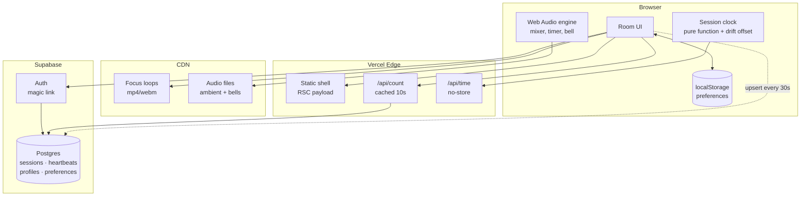

# Architecture — Meditate With Me v1

Internal document. Not for the client.

---

## 1. Constraints that drive everything

Every decision below falls out of these five. When something in this doc looks odd, check it against this list first.

| Constraint | Consequence |
|---|---|
| Budget is effectively £0 | Free tiers only. No always-on server, no queue, no cache layer we operate ourselves. |
| Global, 24/7, spiky | Traffic clusters hard at the top of each hour. Average load is meaningless; the peak is what breaks. |
| Solo dev, ~45 hours | Every moving part must justify itself. Anything we can avoid operating, we avoid. |
| Must extend to live video | The seams that matter are named in §9. Nothing else needs to be future-proofed. |
| "Same moment" is the product | Clock correctness is a feature, not an implementation detail. See §6.2. |

---

## 2. The shape of the problem

Worth stating plainly, because it determines the whole design:

**This application has almost no state.**

There is no feed, no user-generated content, no inbox, no ordering, no transactions. The only durable data in v1 is a preferences row per registered user — and most users won't register.

What looks like state is actually derived:

- The current session is a **pure function of the clock**. Nobody writes it.
- The timer is **client-local**. Nobody else needs to know about it.
- The audio mix is **client-local**. Same.
- The participant count is the one genuinely shared value, and it's approximate by nature — nobody can tell the difference between 43 and 45 people.

So this is a static site with three small dynamic edges. Design accordingly: push everything to the client and the CDN, and be suspicious of any component that implies a server holding something in memory.

---

## 3. System diagram



Note what is *absent*: no WebSocket server, no cron, no job queue, no Redis, no separate API service. If any of those appear later, something has gone wrong with the reasoning.

---

## 4. Subsystem 1 — Session resolution

### The rule

A session exists for every UTC hour whether or not a database row does. Rows are **overrides**, not the schedule.

```ts
// lib/session.ts — the entire scheduler
export function hourStart(atMs: number): Date {
  const d = new Date(atMs);
  d.setUTCMinutes(0, 0, 0);
  return d;
}

export function nextHour(atMs: number): Date {
  return new Date(hourStart(atMs).getTime() + 3_600_000);
}

export async function resolveSession(atMs: number) {
  const start = hourStart(atMs);
  const row = await db.sessions.findByHourStart(start);   // usually null
  return row ?? {
    hourStart: start,
    kind: 'ambient' as const,
    focusSlug: 'candle',
    streamUrl: null,
  };
}
```

### Why this matters

The client's "what's happening now" question is answered locally, instantly, offline, with one optional database read that is almost always a cache miss returning nothing. There is no scheduled job to fail at 3am, no backfill, no drift between what the scheduler thinks and what the clock says.

**The fallback is not a feature we build.** It is what happens when we find nothing. That is why the site cannot be empty — being empty would require code we haven't written.

---

## 5. Subsystem 2 — The participant count

This is the part I got wrong first, and it's the most interesting decision in the document.

### The obvious answer, and why it fails

Supabase Realtime has a presence API. Every client joins a channel, presence state syncs, count the keys. Elegant, and it is what the SDK is designed for.

It falls over here for a reason specific to this product. [Supabase's Realtime limits](https://supabase.com/docs/guides/realtime/limits) on the free tier:

- **200** concurrent connections
- **20** presence messages per second
- 100 messages per second overall

Presence sync is quadratic in message volume: when one client joins, every other client in the channel receives an update. With N people in the room, one join costs N messages.

Now consider the traffic shape. **Everyone arrives at the top of the hour, simultaneously.** That is not an edge case — it is the entire design of the product. Fifty people joining within the same few seconds costs on the order of fifty × fifty messages. We blow a 20/sec limit by two orders of magnitude, at precisely the moment the product is supposed to feel best.

Presence is built for small collaborative rooms — a shared document with eight cursors. Not for a global bell everyone answers at once.

### What we do instead

Treat the count as what it actually is: **a low-value, low-frequency number that is identical for every viewer.** That description is the definition of something that should be cached, not pushed.

```
client → upsert heartbeat every 30s   (write, cheap, one row)
client → GET /api/count every 15s     (read, edge-cached 10s)
```

```sql
create table heartbeats (
  anon_id    uuid        not null,
  hour_start timestamptz not null,
  last_seen  timestamptz not null default now(),
  began_at   timestamptz,              -- server-stamped at Begin only
  primary key (anon_id, hour_start)
);

create index on heartbeats (hour_start, last_seen);
```

```sql
-- the count query
select count(*) from heartbeats
where hour_start = $1
  and last_seen > now() - interval '90 seconds';
```

`began_at` is a second, nullable reading of the same row—not a start-event
log. On Begin the route stamps it and counts rows whose `began_at` is within
the preceding thirty seconds, returning one fixed “you began with N others”
sentence. The all-hour count is also returned with the live count, so the
first arrival can be framed truthfully as the first person to light the hour.

Because the response is identical for every viewer, one edge cache entry with a 10-second TTL serves the entire world. **A thousand concurrent users generate roughly one origin query every ten seconds.** The same thousand users would have destroyed the presence approach.

Cleanup is a nightly `delete from heartbeats where hour_start < now() - interval '2 days'`. Rows are tiny and nobody cares about history.

The client renders these aggregate readings as a capped field of flames: up to
sixty individual flames, with an edge glow and a compact overflow indication
after that. No heartbeat ids leave the route handler. A viewer's own flame is
a client-side ring on a stable slot, so the only personalised part of the room
does not make the shared response uncacheable.

### The general lesson

Realtime transport is for data that is **personalised, high-value, and latency-sensitive**. This number is none of those. Polling a cached endpoint is not the primitive solution here — it is the correct one, and it scales roughly a hundred times further on the same free tier.

---

## 6. Subsystem 3 — Time

Two independent clocks. Keeping them separate in the code is important; conflating them is the most likely source of confusing bugs.

### 6.1 The session clock (global, shared)

Derived from UTC. Rendered in the viewer's local timezone via `Intl.DateTimeFormat`. Everyone worldwide resolves to the same session.

This settles the open question in the client's brief: **one global session per hour**, not one per volunteer's local timezone. The alternative produces up to 24 concurrent sessions, a fragmented audience, and 24× the staffing.

### 6.2 Clock drift — the bug that would quietly ruin the product

`Date.now()` reads the user's device clock, which can be minutes wrong. If someone's laptop is three minutes fast, their candle lights three minutes early and the shared moment silently isn't shared. Nobody would ever report this as a bug; they would just find the site slightly off.

Fix: measure the offset once on load, apply it everywhere.

```ts
// GET /api/time -> { now: <server epoch ms> }, Cache-Control: no-store
let offsetMs = 0;

export async function syncClock() {
  const t0 = Date.now();
  const { now } = await fetch('/api/time').then(r => r.json());
  const t1 = Date.now();
  const rtt = t1 - t0;
  offsetMs = now + rtt / 2 - t1;    // assume symmetric latency
}

export const serverNow = () => Date.now() + offsetMs;
```

Every session calculation uses `serverNow()`. Never `Date.now()` directly. Re-sync on tab focus, since laptops sleep.

### 6.3 The personal timer (local, private)

Independent of the session, and five to sixty minutes in five-minute steps. Someone can sit for five minutes starting at :37, or for an hour starting at :50 and carry straight through two candles.

The session no longer occupies part of its hour — it fills the whole one, and nothing gates the start. See §16.

Never count with `setInterval` — browsers throttle background tabs to roughly one tick per minute, and meditating with the tab hidden is the normal case, not the exception. Store the target, derive the remainder:

```ts
const endsAt = performance.now() + minutes * 60_000;
const remaining = () => Math.max(0, endsAt - performance.now());
```

`performance.now()` is monotonic — immune to clock adjustments mid-session, unlike `Date.now()`.

**The bell must be scheduled on the audio clock, not a JS timer**, or it fires late in a background tab:

```ts
bellSource.start(ctx.currentTime + remaining() / 1000);
```

This is the single most important line in the timer. A meditation app whose bell arrives ninety seconds late has failed at its one job.

---

## 7. Subsystem 4 — Audio

One `AudioContext`. One gain node per track. Buffers decoded once and looped natively.

```
              ┌─ rain ──── gain ──┐
AudioContext ─┼─ wind ──── gain ──┼─ master gain ─→ destination
              ├─ waterfall  gain ──┤
              └─ bell ──── gain ──┘
```

```ts
function makeTrack(ctx: AudioContext, buffer: AudioBuffer, master: GainNode) {
  const src = ctx.createBufferSource();
  const gain = ctx.createGain();
  src.buffer = buffer;
  src.loop = true;
  gain.gain.value = 0;
  src.connect(gain).connect(master);
  src.start();                          // runs silently until faded up
  return (v: number) =>
    gain.gain.linearRampToValueAtTime(v, ctx.currentTime + 0.15);
}
```

All tracks start immediately at zero gain and stay running. Fading is cheaper and glitch-free compared to starting and stopping sources, and it keeps every loop phase-locked so the mix never drifts apart.

### Constraints worth knowing before you write it

- **An `AudioContext` cannot start without a user gesture.** Autoplay policy. Turn this into the design rather than fighting it: one deliberate **Begin** button that lights the candle and starts the audio together. The constraint becomes the ritual.
- **iOS suspends the context when the screen locks.** Not solvable in a web app. Accept it, and note it for whenever the mobile app conversation happens.
- **Decode all buffers up front**, behind the Begin button, so no track arrives late.
- Loops need to be **seamless at the sample level**. This is an asset-quality problem, not a code problem — a loop with a click at the seam will be audible on repeat and no amount of crossfading fully hides it.

---

## 8. Subsystem 5 — Identity and preferences

### localStorage is primary, the database is a sync target

```
guest         → preferences live in localStorage, full functionality
signs up      → localStorage pushed to Postgres on first login
returning     → DB row wins, hydrates localStorage
logged out    → falls back to localStorage, nothing breaks
```

This ordering is deliberate and it is what makes step 7 of the build genuinely cuttable. The account layer is a **sync mechanism bolted onto a working app**, not a foundation the app sits on. If week three disappears into coursework, we ship without it and nothing is missing except cross-device sync.

Cuttable is enforced, not just intended: `components/useAuth.ts`, `components/useSyncPreferences.ts` and `components/SignIn.tsx` plus one block in `Room.tsx` are the entire feature. Delete them and the room is unchanged. `usePreferences` has no idea accounts exist.

### The rule when local and server disagree

**The server wins if it has a row; local is pushed up only when it doesn't.**

The build spec says "on first login, push whatever's in localStorage up", which is right for the first device and wrong for the second. Signing in on a phone would otherwise push that phone's untouched defaults over the settings you actually chose on your laptop. The cost of the rule as implemented is that a guest tweak made on a device you *later* sign in on is discarded — a smaller harm than losing settings you deliberately saved, but a real one.

### Implicit flow, not PKCE

Magic links only. No password means no reset flow, which is where most auth bugs live.

PKCE keeps its verifier in the localStorage of the browser that requested the link, so requesting on a laptop and opening the mail on a phone fails. That is the normal case here, not an edge case. Implicit costs us server-side sessions, which this app does not use: the room is a client component and preferences are guarded by RLS against the user's own JWT. If a server component ever needs to know who is watching, this becomes `@supabase/ssr` and a callback route.

There is no callback route. The link returns to the site origin and `detectSessionInUrl` takes the token out of the fragment.

**`lib/supabase.ts` returns one browser client, not a new one per call.** Two clients share a localStorage key and race each other refreshing the same token.

### Schema

As migrated. `0001` created these tables and nothing wrote to them for three build steps, which hid three defects until `0003`:

```sql
create table profiles (
  id           uuid primary key references auth.users(id) on delete cascade,
  display_name text,
  created_at   timestamptz not null default now()
);

create table preferences (
  user_id       uuid primary key references profiles(id) on delete cascade,
  timer_minutes int  not null default 10
                check (timer_minutes between 5 and 60 and timer_minutes % 5 = 0),
  until_bell    boolean not null default false,
  end_bell      text not null default 'singing-bowl'
                check (end_bell in ('singing-bowl','gong','struck-bell')),
  focus_slug    text not null default 'candle',
  sound_mix     jsonb not null default '{}'::jsonb,   -- {"rain":0.4,"wind":0.15}
  show_count    boolean not null default true,
  updated_at    timestamptz not null default now()   -- maintained by trigger
);

alter table preferences enable row level security;

create policy "own preferences" on preferences
  for all
  using      (auth.uid() = user_id)
  with check (auth.uid() = user_id);

-- Signing up creates only the auth.users row. Without this, the first
-- preferences insert fails on the profiles foreign key — for every user.
create trigger on_auth_user_created
  after insert on auth.users
  for each row execute function public.handle_new_user();
```

What `0003` had to fix, all of it invisible while the tables were empty:

1. **`timer_minutes between 1 and 45`** was left over from the 45-minute session. The slider is 1–60, so picking the hour — the value the presets deliberately put on offer — would have been rejected by the database. (0003 replaced it with a 5–60 multiple-of-five check; `0005_timer_stops.sql` then replaced *that* with an explicit `in` list when the one-minute stop came back. The constraint has now chased the slider twice, which is the argument for keeping it a literal list that can be compared to `TIMER_STOPS` by eye.)
2. **`end_bell` was unconstrained text.** `BellKind` is a union in TypeScript precisely so a bad value cannot reach the audio graph; that guarantee stopped at the database, which would have stored anything and synced it to every device.
3. **Nothing created a profile row,** so the foreign key above would have failed on every user's first sync.
4. `updated_at` never updated — it held the creation time forever, which is worse than not having the column.

`timer_minutes` and `end_bell` duplicate constraints that also live in TypeScript (`lib/timer.ts`, `lib/types.ts`). That duplication is intentional — the database is the last line and cannot import a type — but it means **changing the bells or the slider bounds is a two-file change**, and `0003` exists because somebody forgot that once already.

`until_bell` is deliberately separate from `timer_minutes`: it is a shared
absolute target converted once into a monotonic deadline at Begin, not a
sentinel duration. Arrivals inside five minutes of the hour are offered the
following bell, so no one is refused or quietly given a three-minute sit.

### The practice log

One row per sitting, in `sittings`. Same ordering as everything else: localStorage primary, database as sync target — **a guest gets their full history and their streak without an account**, and signing in is what carries it between devices. Requiring a login to answer "how consistent have I been" would put a toll on the one screen meant to encourage somebody.

Syncing is a **union, not a merge**. A sitting is a fact that happened, so there is no conflict to resolve and no last-write-wins rule to get wrong. Ids are generated on the client and are the primary key, which makes pushing idempotent: the same sitting sent twice collides and does nothing rather than doubling a streak. Verified — the same id posted twice leaves one row.

Three decisions worth not re-litigating:

- **Days are local, sessions are UTC.** The candle must be the same candle for everyone on earth at once. A streak is the opposite kind of fact: entirely yours, and "today" means where you are standing. Day arithmetic uses calendar fields, never `- 86400000` — subtracting a day in milliseconds lands on the same local day twice a year in DST countries, a bug that appears in October and cannot be reproduced in April. There is a test that walks back 400 days asserting it never repeats one.
- **An empty today does not break a streak.** If you sat yesterday and it is now nine in the morning, the streak stands; you have not used today yet. Otherwise every streak visibly collapses to zero overnight, every night, which punishes people for sleeping.
- **Minutes sat, not minutes intended.** Someone who set an hour and stopped at twenty sat for twenty. Recording the intention would make the totals a wish list. Under sixty seconds records nothing — that was a mis-tap.

The display is deliberately not a scoreboard: no goal, no target, nothing turns red, and the personal best is hidden until it is genuinely longer than the current run. A meditation practice whose progress screen makes you feel you are failing at meditation has been made worse by it.

`sittings` is the most sensitive table here. A preference reveals that you like a gong; this reveals when you were awake, how often, and for how long. Its RLS was tested the same way as `preferences` — all six attacks refused, including writing into another user's history and reassigning your own row to them.

### Validation happens in one place

`lib/preferences.ts` `normalize()` is the only thing that decides what a valid preference is. Both sources go through it: localStorage, which a user can hand-edit in devtools, and the `preferences` table, which syncs to every device someone owns. Validating in two places means one path drifts, and the failures are quiet — a bad bell does nothing at all until a sitting ends.

**On that policy, since RLS is new to you:** `using` governs which rows a user can *see* and *delete*. `with check` governs what they're allowed to *write*. Omit the second and a user can update a row and set `user_id` to someone else's id, silently taking over their record. Write both, every time. Test it by logging in as one user and trying to read another's row — if it returns data, the policy is wrong.

**That test has been run**, against two real users and a real JWT obtained through the actual magic-link flow, not against the types:

| Attack with user A's token | Result |
|---|---|
| `select *` from preferences | only A's row |
| update B's row | 0 rows |
| insert a row owned by B | `42501` RLS violation |
| **set A's own `user_id` to B** | `42501` — this is the one `with check` catches |
| delete B's row | 0 rows |
| read `heartbeats` | `[]` — RLS on, no policy at all |

Re-run it after any change to the policy. The fourth row is the one that passes when `with check` is missing.

`sessions` and `heartbeats` are readable by everyone and writable only by the service role. Heartbeat writes go through a route handler, not from the browser directly, so nobody can inflate the count from the console.

---

## 9. The v2 seam

The whole point of this design. Adding live video should touch three files.

| Component | v1 | v2 change |
|---|---|---|
| `resolveSession()` | always returns `ambient` | returns a `live` row when one exists — **no change to the function** |
| Room UI | renders `<FocusLoop>` | branches on `session.kind` to render `<LiveStream>` |
| Count endpoint | heartbeat query | unchanged |
| Clock | unchanged | unchanged |
| Audio | unchanged | mixes stream audio into the existing master gain |
| Scheduling | none | a booking table writing `sessions` rows — additive |

Nothing above requires touching the session logic, the clock, the count, or the audio graph. The `kind` column and the `stream_url`/`lighter_id` columns already exist in v1 and sit unused. That unused column is the seam, and it costs nothing now.

---

## 10. Failure modes

Everything degrades to "you can still meditate."

| Failure | Behaviour | Acceptable? |
|---|---|---|
| Supabase down | Session still resolves (pure function). Count hides. Timer, audio, candle all work. | Yes — core product survives |
| `/api/count` fails | Count hides silently. No error toast. | Yes |
| `/api/time` fails | Fall back to `Date.now()`, offset 0. Possible small drift. | Yes |
| Audio file 404s | That track is hidden from the mixer. Others play. | Yes |
| Focus loop 404s | Static fallback image. | Yes |
| Auth down | Guests unaffected. Sign-in shows a plain message. | Yes |

**Design rule: nothing in this app should ever show an error screen.** Every failure hides a control or silently degrades. Somebody sitting down to meditate should never be shown a stack trace or a red banner.

---

## 11. Where this breaks at scale

Worth knowing the cliffs before hitting them.

| Concurrent users | Status |
|---|---|
| < 200 | Comfortable on free tiers throughout. |
| 200 – 2,000 | Fine. Count endpoint is edge-cached so origin load is flat. Heartbeat writes become the load: 2,000 users ≈ 67 writes/sec. Supabase Pro at $25/mo handles it. |
| 2,000 – 20,000 | Heartbeat writes need batching — buffer client-side, or move the counter to Redis/Upstash with a periodic flush. Postgres row-per-user stops being the right shape. |
| 20,000+ | Count becomes a statistical estimate rather than an exact number. Nobody will notice, and by this point the live video bill is the actual problem, not this. |

The heartbeat table is the first thing to break, and it is a contained problem with obvious fixes. That is the right kind of scaling risk to accept.

---

## 12. Repo layout

```
meditatewithme/
├── app/
│   ├── page.tsx                 # the room — one page
│   ├── layout.tsx
│   └── api/
│       ├── time/route.ts        # server clock, no-store
│       ├── count/route.ts       # cached 10s
│       └── heartbeat/route.ts   # upsert, service role
├── components/
│   ├── Room.tsx                 # state machine host
│   ├── FocusLoop.tsx            # <- v2 branches here
│   ├── Timer.tsx
│   ├── SoundMixer.tsx
│   └── ParticipantCount.tsx
├── lib/
│   ├── session.ts               # hourStart, resolveSession
│   ├── clock.ts                 # syncClock, serverNow
│   ├── audio.ts                 # AudioContext graph
│   ├── prefs.ts                 # localStorage <-> DB
│   └── supabase.ts
├── supabase/migrations/
├── context/                     # standing project knowledge
├── plans/                       # active plans
└── docs/                        # finished writing
```

`lib/` holds no React and no I/O beyond explicit fetches — it should be testable with plain functions. `session.ts` and `clock.ts` in particular are pure enough to unit test properly, and they are the two places a bug would be least visible in manual testing.

---

## 13. Decision log

| # | Decision | Rejected alternative | Why |
|---|---|---|---|
| 1 | Sessions computed from the clock | Pre-generated rows via cron | Nothing to fail at 3am; no drift; missing row *is* the fallback |
| 2 | Polled, edge-cached count | Supabase Realtime presence | Presence is O(N) messages per join and everyone joins at once — see §5 |
| 3 | localStorage primary | Database primary, guest read-only | Makes the account layer cuttable; guests get full functionality |
| 4 | Web Audio graph | Multiple `<audio>` elements | Independent gain, smooth ramps, phase-locked loops |
| 5 | Server-time offset | Trust `Date.now()` | A wrong device clock silently destroys the shared moment |
| 6 | `performance.now()` for the timer | `Date.now()` deltas | Monotonic — unaffected by a clock adjustment mid-session |
| 7 | Bell on the audio clock | `setTimeout` | Background tabs throttle timers; a late bell is a product failure |
| 8 | Cached focus loops | Streamed video | Cache-once vs metered-per-viewer — the entire cost argument |
| 9 | One global session, UTC | Per-timezone sessions | 24 parallel sessions fragments the audience and multiplies staffing |

---

## 14. Open technical questions

Two of the four are closed. They were filed as "needs Jonny" and they did not —
they needed a decision, and holding them open was costing more than getting one
wrong would have.

1. **~~What happens when a personal timer ends mid-session?~~ Settled: the sound
   fades, the candle stays, and the room moves to a `finished` state.** Returning
   to idle punishes somebody for finishing — it clears the screen at the one
   moment they are least ready to be handed a fresh set of controls. `Afterwards`
   is what that state renders, and it offers going again rather than assuming it.
2. **~~Should the count include people who haven't pressed Begin?~~ Settled:
   everyone on the page counts.** Waiting is participating, and a number that
   only moved after Begin would be smaller than the room genuinely is at the top
   of the hour. It is honest because the wording is "here", not "meditating" —
   see the note above `PresenceLine` in `Room.tsx`. The forgotten-tab problem is
   handled by the visibility API rather than by narrowing who counts.
3. **Anonymous id lifetime.** A `localStorage` uuid per browser means one person
   on two devices counts twice. Acceptable, and the alternative is worse.
4. **Do we record any analytics at all?** If nothing third-party and nothing that
   identifies people, the cookie banner question largely disappears. Strong
   reason to keep it that way. *Still genuinely open — it is a question for the
   privacy notice in step 08, and the answer that needs no banner is "none".*

---

## 15. Deployment

| | |
|---|---|
| Host | Vercel, project `meditatewithme` under `10zinglunn-afks-projects` |
| URL | https://meditatewithme.vercel.app |
| Source | GitHub `10zinglunn-afk/meditatewithme`, auto-deploying on push |
| Custom domain | Not attached — Jonny owns it, DNS not yet pointed |

### Branches

`main` is production and deploys on push; `dev` is where work happens and
deploys to a preview URL. The split exists because a commit on `main` is a
release whether or not anyone intended one.

The two branches differ at `app/page.tsx` on purpose: `main` serves the holding
page, `dev` serves the room. Merging `dev` into `main` is therefore the launch,
and should never be a side effect of some other change.

### Why Vercel specifically

Not a default. §5's whole argument is that the count survives a simultaneous
global join because one edge-cached response serves everyone — that mechanism
*is* the `s-maxage` / `stale-while-revalidate` pair set in `app/api/count/route.ts`,
and it only works on a CDN that honours them. Verified in production: repeat
requests return `x-vercel-cache: HIT`, and a fresh heartbeat surfaces one cache
generation later via `STALE`, exactly as designed.

Cloudflare Workers is the credible alternative — cheaper at real scale — but
Next.js App Router needs the OpenNext adapter there and the caching above would
need reworking. Not worth it at this traffic.

### Environment variables

Set in Vercel for Production, Development, and Preview **scoped to the `dev`
branch**.

That scoping is a workaround, not a preference. CLI v52 advertises `--yes` for
preview-all-branches and then demands a git branch anyway, so the all-branches
form is unusable until the CLI is upgraded. Naming `dev` explicitly is accepted
and covers the branch we actually deploy.

The consequence to remember: **a new branch with a different name will not reach
Supabase.** Its preview will build and then fail at every database call. Either
add the three variables for that branch too, or upgrade the CLI and set them for
all preview branches at once.

`SUPABASE_SERVICE_ROLE_KEY` is server-only and must stay that way. Verified
against the live bundle: the key appears in none of the seven client chunks nor
in the HTML. Re-run that check if `serviceClient()` ever gains a new caller.

Re-verified after `lib/supabase.ts` gained the auth configuration. The check is
only meaningful if you also confirm the search *would* have found something —
grep for the publishable key in the same pass; it must be present in
`.next/static`. A negative result from a broken grep looks identical to a pass.

### Auth redirect URLs — a launch trap

**Supabase must be told which URLs a magic link may return to**
(Dashboard → Authentication → URL Configuration). This is not in the repo and no
migration can set it.

The failure is silent and therefore nasty: if `emailRedirectTo` is not on the
allow list, Supabase does not error — it redirects to the project's **Site URL**
instead. A new project's Site URL is `http://localhost:3000`, so unless this is
changed, **every magic link sent from production will land the user on their own
machine's localhost** and appear to do nothing.

Needed before accounts work anywhere but a dev machine:

- Site URL → the production domain
- Redirect URLs → `http://localhost:3000`, the `meditatewithme.vercel.app`
  domain, and a wildcard for preview deployments
  (`https://meditatewithme-*.vercel.app`)

Worth checking this the same day the custom domain is pointed, since the Site URL
has to change again then.

### Plan limits

The account is on Hobby (free), which is intended for non-commercial projects.
Donations would likely push this to Pro. Not a blocker now, but it lands on
Jonny's bill eventually — and per the payment message, hosting is meant to sit
in his name, not Tenzing's. Worth settling before the domain is attached, since
moving a project after DNS is pointed is the annoying order to do it in.

---

## 16. The candle, and why nothing is gated

The original model ran a 45-minute session with a 15-minute interlude, and the
room withheld Begin during the interlude. Two things were wrong with it.

The first is arithmetic: for a quarter of every hour, a meditation site told
people who had arrived wanting to meditate to come back later.

The second is that it made the hour mean the wrong thing. A countdown only
carries meaning if something happens at :00 that cannot happen at :23 — and the
only thing that happened was a button unlocking. That is friction wearing the
costume of ritual. Worse, the session and the personal timer quietly undercut
each other: if you may join at :23 and sit for seven minutes, you are not
synchronised with anybody, so the countdown was measuring nothing.

### What replaced it

**A candle is lit at the top of every hour and burns down across it.** Nothing
is gated; you sit whenever you like.

The shared thing is the candle's *state*. `candleBurn(now)` is a pure function
of the clock, so two people in different timezones opening the site in the same
second see the same height of wax. That is real synchrony, and it costs no
coordination — no cron, no socket, no event to miss.

It also communicates lateness honestly. Arrive at :50 and you are handed a
stub. You can see you came late, which is a far gentler thing than a locked
button, and it preserves the reason to show up at the top of the hour without
punishing anyone who cannot.

A sitting may run through :00. It is not interrupted — a new candle is simply
lit under it, which needs no code at all, because the burn is derived rather
than stored.

### Consequences in the code

- `SESSION_MS === HOUR_MS`. There is no interlude.
- `sessionPhase` and the `SessionPhase` type are gone. They encoded a design
  that no longer exists, and a phase that always returns `'active'` is worse
  than no phase at all.
- The personal timer is 1–60 minutes over thirteen explicit stops — 1, then
  every five minutes to the hour. Nobody sitting down to meditate has an opinion
  about seventeen minutes versus eighteen.
- The stops are a list (`TIMER_STOPS`), not a min/max/step, because the jump
  from one minute to five is not a uniform step and no `step` value can describe
  it. The slider's value is an index into that list, which is why it carries an
  `aria-valuetext` — the raw number means nothing to a screen reader.
- `clampMinutes` snaps to the nearest stop, with ties going to the longer sit.
  Three minutes is equidistant from one and five; rounding down would cut the
  sit by two thirds to save two minutes.
- The one-minute stop is deliberate. It is the sit somebody takes when they are
  not sure they want to sit at all, which describes most first visits — and it
  is what the proposal the client holds actually promises.

### What is still assumed rather than known

The candle is CSS, and its burn is linear. A real candle does not burn linearly
and the licensed video loop will not either — when that asset lands, the mapping
from `candleBurn` to what is on screen may need a curve rather than a straight
line. The interface does not change.
