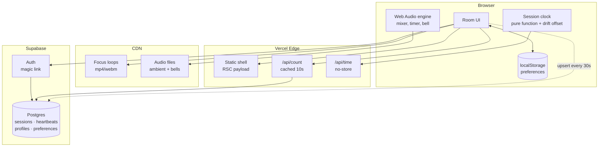

# Architecture — Meditate With Me v1

Internal document. Not for the client.

---

## 1. Constraints that drive everything

Every decision below falls out of these five. When something in this doc looks odd, check it against this list first.

| Constraint | Consequence |
|---|---|
| Budget is effectively £0 | Free tiers only. No always-on server, no queue, no cache layer we operate ourselves. |
| Global, 24/7, spiky | Traffic clusters hard at the top of each hour. Average load is meaningless; the peak is what breaks. |
| Solo dev, ~45 hours | Every moving part must justify itself. Anything we can avoid operating, we avoid. |
| Must extend to live video | The seams that matter are named in §9. Nothing else needs to be future-proofed. |
| "Same moment" is the product | Clock correctness is a feature, not an implementation detail. See §6.2. |

### The room is always dark

The room uses its dark palette regardless of the visitor's system preference.
The candle is the shared focus and its glow, wax shading and surrounding field
were designed as light inside a dark room; switching the page to a light canvas
changes that relationship rather than merely changing a theme. Keeping one
runtime palette also avoids a mid-sitting appearance change when a device's
scheduled light/dark setting rolls over. The light values remain in `@theme` as
build-time colour definitions, but `:root` deliberately overrides them at
runtime and the document advertises only a dark browser colour scheme.

---

## 2. The shape of the problem

Worth stating plainly, because it determines the whole design:

**This application has almost no state.**

There is no feed, no user-generated content, no inbox, no ordering, no transactions. The only durable data in v1 is a preferences row per registered user — and most users won't register.

What looks like state is actually derived:

- The current session is a **pure function of the clock**. Nobody writes it.
- The timer is **client-local**. Nobody else needs to know about it.
- The audio mix is **client-local**. Same.
- The participant count is the one genuinely shared value, and it's approximate by nature — nobody can tell the difference between 43 and 45 people.

So this is a static site with three small dynamic edges. Design accordingly: push everything to the client and the CDN, and be suspicious of any component that implies a server holding something in memory.

---

## 3. System diagram



Note what is *absent*: no WebSocket server, no cron, no job queue, no Redis, no separate API service. If any of those appear later, something has gone wrong with the reasoning.

---

## 4. Subsystem 1 — Session resolution

### The rule

A session exists for every UTC hour whether or not a database row does. Rows are **overrides**, not the schedule.

```ts
// lib/session.ts — the entire scheduler
export function hourStart(atMs: number): Date {
  const d = new Date(atMs);
  d.setUTCMinutes(0, 0, 0);
  return d;
}

export function nextHour(atMs: number): Date {
  return new Date(hourStart(atMs).getTime() + 3_600_000);
}

export async function resolveSession(atMs: number) {
  const start = hourStart(atMs);
  const row = await db.sessions.findByHourStart(start);   // usually null
  return row ?? {
    hourStart: start,
    kind: 'ambient' as const,
    focusSlug: 'candle',
    streamUrl: null,
  };
}
```

### Why this matters

The client's "what's happening now" question is answered locally, instantly, offline, with one optional database read that is almost always a cache miss returning nothing. There is no scheduled job to fail at 3am, no backfill, no drift between what the scheduler thinks and what the clock says.

**The fallback is not a feature we build.** It is what happens when we find nothing. That is why the site cannot be empty — being empty would require code we haven't written.

---

## 5. Subsystem 2 — The participant count

This is the part I got wrong first, and it's the most interesting decision in the document.

### The obvious answer, and why it fails

Supabase Realtime has a presence API. Every client joins a channel, presence state syncs, count the keys. Elegant, and it is what the SDK is designed for.

It falls over here for a reason specific to this product. [Supabase's Realtime limits](https://supabase.com/docs/guides/realtime/limits) on the free tier:

- **200** concurrent connections
- **20** presence messages per second
- 100 messages per second overall

Presence sync is quadratic in message volume: when one client joins, every other client in the channel receives an update. With N people in the room, one join costs N messages.

Now consider the traffic shape. **Everyone arrives at the top of the hour, simultaneously.** That is not an edge case — it is the entire design of the product. Fifty people joining within the same few seconds costs on the order of fifty × fifty messages. We blow a 20/sec limit by two orders of magnitude, at precisely the moment the product is supposed to feel best.

Presence is built for small collaborative rooms — a shared document with eight cursors. Not for a global bell everyone answers at once.

### What we do instead

Treat the count as what it actually is: **a low-value, low-frequency number that is identical for every viewer.** That description is the definition of something that should be cached, not pushed.

```
client → upsert heartbeat every 30s   (write, cheap, one row)
client → GET /api/count every 15s     (read, edge-cached 10s)
```

```sql
create table heartbeats (
  anon_id    uuid        not null,
  hour_start timestamptz not null,
  last_seen  timestamptz not null default now(),
  began_at   timestamptz,              -- server-stamped at Begin only
  primary key (anon_id, hour_start)
);

create index on heartbeats (hour_start, last_seen);
```

```sql
-- the count query
select count(*) from heartbeats
where hour_start = $1
  and last_seen > now() - interval '90 seconds';
```

`began_at` is a second, nullable reading of the same row—not a start-event
log. On Begin the route stamps it and counts rows whose `began_at` is within
the preceding thirty seconds, returning one fixed “you began with N others”
sentence. The all-hour count is also returned with the live count, so the
first arrival can be framed truthfully as the first person to light the hour.

Because the response is identical for every viewer, one edge cache entry with a 10-second TTL serves the entire world. **A thousand concurrent users generate roughly one origin query every ten seconds.** The same thousand users would have destroyed the presence approach.

Cleanup is a nightly `delete from heartbeats where hour_start < now() - interval '2 days'`. Rows are tiny and nobody cares about history.

The client renders these aggregate readings as a capped field of flames: up to
sixty individual flames, with an edge glow and a compact overflow indication
after that. No heartbeat ids leave the route handler. A viewer's own flame is
a client-side ring on a stable slot, so the only personalised part of the room
does not make the shared response uncacheable.

### The general lesson

Realtime transport is for data that is **personalised, high-value, and latency-sensitive**. This number is none of those. Polling a cached endpoint is not the primitive solution here — it is the correct one, and it scales roughly a hundred times further on the same free tier.

---

## 6. Subsystem 3 — Time

Two independent clocks. Keeping them separate in the code is important; conflating them is the most likely source of confusing bugs.

### 6.1 The session clock (global, shared)

Derived from UTC. Rendered in the viewer's local timezone via `Intl.DateTimeFormat`. Everyone worldwide resolves to the same session.

This settles the open question in the client's brief: **one global session per hour**, not one per volunteer's local timezone. The alternative produces up to 24 concurrent sessions, a fragmented audience, and 24× the staffing.

### 6.2 Clock drift — the bug that would quietly ruin the product

`Date.now()` reads the user's device clock, which can be minutes wrong. If someone's laptop is three minutes fast, their candle lights three minutes early and the shared moment silently isn't shared. Nobody would ever report this as a bug; they would just find the site slightly off.

Fix: measure the offset once on load, apply it everywhere.

```ts
// GET /api/time -> { now: <server epoch ms> }, Cache-Control: no-store
let offsetMs = 0;

export async function syncClock() {
  const t0 = Date.now();
  const { now } = await fetch('/api/time').then(r => r.json());
  const t1 = Date.now();
  const rtt = t1 - t0;
  offsetMs = now + rtt / 2 - t1;    // assume symmetric latency
}

export const serverNow = () => Date.now() + offsetMs;
```

Every session calculation uses `serverNow()`. Never `Date.now()` directly. Re-sync on tab focus, since laptops sleep.

### 6.3 The personal timer (local, private)

Independent of the session, and five to sixty minutes in five-minute steps. Someone can sit for five minutes starting at :37, or for an hour starting at :50 and carry straight through two candles.

The session no longer occupies part of its hour — it fills the whole one, and nothing gates the start. See §16.

Never count with `setInterval` — browsers throttle background tabs to roughly one tick per minute, and meditating with the tab hidden is the normal case, not the exception. Store the target, derive the remainder:

```ts
const endsAt = performance.now() + minutes * 60_000;
const remaining = () => Math.max(0, endsAt - performance.now());
```

`performance.now()` is monotonic — immune to clock adjustments mid-session, unlike `Date.now()`.

**The bell must be scheduled on the audio clock, not a JS timer**, or it fires late in a background tab:

```ts
bellSource.start(ctx.currentTime + remaining() / 1000);
```

This is the single most important line in the timer. A meditation app whose bell arrives ninety seconds late has failed at its one job.

---

## 7. Subsystem 4 — Audio

One `AudioContext`. One gain node per track. Buffers decoded once and looped natively.

```
              ┌─ rain ──── gain ──┐
AudioContext ─┼─ wind ──── gain ──┼─ master gain ─→ destination
              ├─ waterfall  gain ──┤
              └─ bell ──── gain ──┘
```

```ts
function makeTrack(ctx: AudioContext, buffer: AudioBuffer, master: GainNode) {
  const src = ctx.createBufferSource();
  const gain = ctx.createGain();
  src.buffer = buffer;
  src.loop = true;
  gain.gain.value = 0;
  src.connect(gain).connect(master);
  src.start();                          // runs silently until faded up
  return (v: number) =>
    gain.gain.linearRampToValueAtTime(v, ctx.currentTime + 0.15);
}
```

All tracks start immediately at zero gain and stay running. Fading is cheaper and glitch-free compared to starting and stopping sources, and it keeps every loop phase-locked so the mix never drifts apart.

### Constraints worth knowing before you write it

- **An `AudioContext` cannot start without a user gesture.** Autoplay policy. Turn this into the design rather than fighting it: one deliberate **Begin** button that lights the candle and starts the audio together. The constraint becomes the ritual.
- **iOS suspends the context when the screen locks.** Not solvable in a web app. Accept it, and note it for whenever the mobile app conversation happens.
- **Decode all buffers up front**, behind the Begin button, so no track arrives late.
- Loops need to be **seamless at the sample level**. This is an asset-quality problem, not a code problem — a loop with a click at the seam will be audible on repeat and no amount of crossfading fully hides it.

---

## 8. Subsystem 5 — Identity and preferences

### localStorage is primary, the database is a sync target

```
guest         → preferences live in localStorage, full functionality
signs up      → localStorage pushed to Postgres on first login
returning     → DB row wins, hydrates localStorage
logged out    → falls back to localStorage, nothing breaks
```

This ordering is deliberate and it is what makes step 7 of the build genuinely cuttable. The account layer is a **sync mechanism bolted onto a working app**, not a foundation the app sits on. If week three disappears into coursework, we ship without it and nothing is missing except cross-device sync.

Cuttable is enforced, not just intended: `components/useAuth.ts`, `components/useSyncPreferences.ts` and `components/SignIn.tsx` plus one block in `Room.tsx` are the entire feature. Delete them and the room is unchanged. `usePreferences` has no idea accounts exist.

### The rule when local and server disagree

**The server wins if it has a row; local is pushed up only when it doesn't.**

The build spec says "on first login, push whatever's in localStorage up", which is right for the first device and wrong for the second. Signing in on a phone would otherwise push that phone's untouched defaults over the settings you actually chose on your laptop. The cost of the rule as implemented is that a guest tweak made on a device you *later* sign in on is discarded — a smaller harm than losing settings you deliberately saved, but a real one.

### Implicit flow, not PKCE

Magic links only. No password means no reset flow, which is where most auth bugs live.

PKCE keeps its verifier in the localStorage of the browser that requested the link, so requesting on a laptop and opening the mail on a phone fails. That is the normal case here, not an edge case. Implicit costs us server-side sessions, which this app does not use: the room is a client component and preferences are guarded by RLS against the user's own JWT. If a server component ever needs to know who is watching, this becomes `@supabase/ssr` and a callback route.

There is no callback route. The link returns to the site origin and `detectSessionInUrl` takes the token out of the fragment.

**`lib/supabase.ts` returns one browser client, not a new one per call.** Two clients share a localStorage key and race each other refreshing the same token.

### Schema

As migrated. `0001` created these tables and nothing wrote to them for three build steps, which hid three defects until `0003`:

```sql
create table profiles (
  id           uuid primary key references auth.users(id) on delete cascade,
  display_name text,
  created_at   timestamptz not null default now()
);

create table preferences (
  user_id       uuid primary key references profiles(id) on delete cascade,
  timer_minutes int  not null default 10
                check (timer_minutes between 5 and 60 and timer_minutes % 5 = 0),
  until_bell    boolean not null default false,
  end_bell      text not null default 'singing-bowl'
                check (end_bell in ('singing-bowl','gong','struck-bell')),
  focus_slug    text not null default 'candle',
  sound_mix     jsonb not null default '{}'::jsonb,   -- {"rain":0.4,"wind":0.15}
  show_count    boolean not null default true,
  updated_at    timestamptz not null default now()   -- maintained by trigger
);

alter table preferences enable row level security;

create policy "own preferences" on preferences
  for all
  using      (auth.uid() = user_id)
  with check (auth.uid() = user_id);

-- Signing up creates only the auth.users row. Without this, the first
-- preferences insert fails on the profiles foreign key — for every user.
create trigger on_auth_user_created
  after insert on auth.users
  for each row execute function public.handle_new_user();
```

What `0003` had to fix, all of it invisible while the tables were empty:

1. **`timer_minutes between 1 and 45`** was left over from the 45-minute session. The slider is 1–60, so picking the hour — the value the presets deliberately put on offer — would have been rejected by the database. (0003 replaced it with a 5–60 multiple-of-five check; `0005_timer_stops.sql` then replaced *that* with an explicit `in` list when the one-minute stop came back. The constraint has now chased the slider twice, which is the argument for keeping it a literal list that can be compared to `TIMER_STOPS` by eye.)
2. **`end_bell` was unconstrained text.** `BellKind` is a union in TypeScript precisely so a bad value cannot reach the audio graph; that guarantee stopped at the database, which would have stored anything and synced it to every device.
3. **Nothing created a profile row,** so the foreign key above would have failed on every user's first sync.
4. `updated_at` never updated — it held the creation time forever, which is worse than not having the column.

`timer_minutes` and `end_bell` duplicate constraints that also live in TypeScript (`lib/timer.ts`, `lib/types.ts`). That duplication is intentional — the database is the last line and cannot import a type — but it means **changing the bells or the slider bounds is a two-file change**, and `0003` exists because somebody forgot that once already.

`until_bell` is deliberately separate from `timer_minutes`: it is a shared
absolute target converted once into a monotonic deadline at Begin, not a
sentinel duration. Arrivals inside five minutes of the hour are offered the
following bell, so no one is refused or quietly given a three-minute sit.

### The practice log

One row per sitting, in `sittings`. Same ordering as everything else: localStorage primary, database as sync target — **a guest gets their full history and their streak without an account**, and signing in is what carries it between devices. Requiring a login to answer "how consistent have I been" would put a toll on the one screen meant to encourage somebody.

Syncing is a **union, not a merge**. A sitting is a fact that happened, so there is no conflict to resolve and no last-write-wins rule to get wrong. Ids are generated on the client and are the primary key, which makes pushing idempotent: the same sitting sent twice collides and does nothing rather than doubling a streak. Verified — the same id posted twice leaves one row.

Three decisions worth not re-litigating:

- **Days are local, sessions are UTC.** The candle must be the same candle for everyone on earth at once. A streak is the opposite kind of fact: entirely yours, and "today" means where you are standing. Day arithmetic uses calendar fields, never `- 86400000` — subtracting a day in milliseconds lands on the same local day twice a year in DST countries, a bug that appears in October and cannot be reproduced in April. There is a test that walks back 400 days asserting it never repeats one.
- **An empty today does not break a streak.** If you sat yesterday and it is now nine in the morning, the streak stands; you have not used today yet. Otherwise every streak visibly collapses to zero overnight, every night, which punishes people for sleeping.
- **Minutes sat, not minutes intended.** Someone who set an hour and stopped at twenty sat for twenty. Recording the intention would make the totals a wish list. Under sixty seconds records nothing — that was a mis-tap.

The display is deliberately not a scoreboard: no goal, no target, nothing turns red, and the personal best is hidden until it is genuinely longer than the current run. A meditation practice whose progress screen makes you feel you are failing at meditation has been made worse by it.

`sittings` is the most sensitive table here. A preference reveals that you like a gong; this reveals when you were awake, how often, and for how long. Its RLS was tested the same way as `preferences` — all six attacks refused, including writing into another user's history and reassigning your own row to them.

### Validation happens in one place

`lib/preferences.ts` `normalize()` is the only thing that decides what a valid preference is. Both sources go through it: localStorage, which a user can hand-edit in devtools, and the `preferences` table, which syncs to every device someone owns. Validating in two places means one path drifts, and the failures are quiet — a bad bell does nothing at all until a sitting ends.

**On that policy, since RLS is new to you:** `using` governs which rows a user can *see* and *delete*. `with check` governs what they're allowed to *write*. Omit the second and a user can update a row and set `user_id` to someone else's id, silently taking over their record. Write both, every time. Test it by logging in as one user and trying to read another's row — if it returns data, the policy is wrong.

**That test has been run**, against two real users and a real JWT obtained through the actual magic-link flow, not against the types:

| Attack with user A's token | Result |
|---|---|
| `select *` from preferences | only A's row |
| update B's row | 0 rows |
| insert a row owned by B | `42501` RLS violation |
| **set A's own `user_id` to B** | `42501` — this is the one `with check` catches |
| delete B's row | 0 rows |
| read `heartbeats` | `[]` — RLS on, no policy at all |

Re-run it after any change to the policy. The fourth row is the one that passes when `with check` is missing.

`sessions` and `heartbeats` are readable by everyone and writable only by the service role. Heartbeat writes go through a route handler, not from the browser directly, so nobody can inflate the count from the console.

---

## 9. The v2 seam

The whole point of this design. Adding live video should touch three files.

| Component | v1 | v2 change |
|---|---|---|
| `resolveSession()` | always returns `ambient` | returns a `live` row when one exists — **no change to the function** |
| Room UI | renders `<FocusLoop>` | branches on `session.kind` to render `<LiveStream>` |
| Count endpoint | heartbeat query | unchanged |
| Clock | unchanged | unchanged |
| Audio | unchanged | mixes stream audio into the existing master gain |
| Scheduling | none | a booking table writing `sessions` rows — additive |

Nothing above requires touching the session logic, the clock, the count, or the audio graph. The `kind` column and the `stream_url`/`lighter_id` columns already exist in v1 and sit unused. That unused column is the seam, and it costs nothing now.

---

## 10. Failure modes

Everything degrades to "you can still meditate."

| Failure | Behaviour | Acceptable? |
|---|---|---|
| Supabase down | Session still resolves (pure function). Count hides. Timer, audio, candle all work. | Yes — core product survives |
| `/api/count` fails | Count hides silently. No error toast. | Yes |
| `/api/time` fails | Fall back to `Date.now()`, offset 0. Possible small drift. | Yes |
| Audio file 404s | That track is hidden from the mixer. Others play. | Yes |
| Focus loop 404s | Static fallback image. | Yes |
| Auth down | Guests unaffected. Sign-in shows a plain message. | Yes |

**Design rule: nothing in this app should ever show an error screen.** Every failure hides a control or silently degrades. Somebody sitting down to meditate should never be shown a stack trace or a red banner.

---

## 11. Where this breaks at scale

Worth knowing the cliffs before hitting them.

| Concurrent users | Status |
|---|---|
| < 200 | Comfortable on free tiers throughout. |
| 200 – 2,000 | Fine. Count endpoint is edge-cached so origin load is flat. Heartbeat writes become the load: 2,000 users ≈ 67 writes/sec. Supabase Pro at $25/mo handles it. |
| 2,000 – 20,000 | Heartbeat writes need batching — buffer client-side, or move the counter to Redis/Upstash with a periodic flush. Postgres row-per-user stops being the right shape. |
| 20,000+ | Count becomes a statistical estimate rather than an exact number. Nobody will notice, and by this point the live video bill is the actual problem, not this. |

The heartbeat table is the first thing to break, and it is a contained problem with obvious fixes. That is the right kind of scaling risk to accept.

---

## 12. Repo layout

```
meditatewithme/
├── app/
│   ├── page.tsx                 # the room — one page
│   ├── layout.tsx
│   └── api/
│       ├── time/route.ts        # server clock, no-store
│       ├── count/route.ts       # cached 10s
│       └── heartbeat/route.ts   # upsert, service role
├── components/
│   ├── Room.tsx                 # state machine host
│   ├── FocusLoop.tsx            # <- v2 branches here
│   ├── Timer.tsx
│   ├── SoundMixer.tsx
│   └── ParticipantCount.tsx
├── lib/
│   ├── session.ts               # hourStart, resolveSession
│   ├── clock.ts                 # syncClock, serverNow
│   ├── audio.ts                 # AudioContext graph
│   ├── prefs.ts                 # localStorage <-> DB
│   └── supabase.ts
├── supabase/migrations/
├── context/                     # standing project knowledge
├── plans/                       # active plans
└── docs/                        # finished writing
```

`lib/` holds no React and no I/O beyond explicit fetches — it should be testable with plain functions. `session.ts` and `clock.ts` in particular are pure enough to unit test properly, and they are the two places a bug would be least visible in manual testing.

---

## 13. Decision log

| # | Decision | Rejected alternative | Why |
|---|---|---|---|
| 1 | Sessions computed from the clock | Pre-generated rows via cron | Nothing to fail at 3am; no drift; missing row *is* the fallback |
| 2 | Polled, edge-cached count | Supabase Realtime presence | Presence is O(N) messages per join and everyone joins at once — see §5 |
| 3 | localStorage primary | Database primary, guest read-only | Makes the account layer cuttable; guests get full functionality |
| 4 | Web Audio graph | Multiple `<audio>` elements | Independent gain, smooth ramps, phase-locked loops |
| 5 | Server-time offset | Trust `Date.now()` | A wrong device clock silently destroys the shared moment |
| 6 | `performance.now()` for the timer | `Date.now()` deltas | Monotonic — unaffected by a clock adjustment mid-session |
| 7 | Bell on the audio clock | `setTimeout` | Background tabs throttle timers; a late bell is a product failure |
| 8 | Cached focus loops | Streamed video | Cache-once vs metered-per-viewer — the entire cost argument |
| 9 | One global session, UTC | Per-timezone sessions | 24 parallel sessions fragments the audience and multiplies staffing |

---

## 14. Open technical questions

Two of the four are closed. They were filed as "needs Jonny" and they did not —
they needed a decision, and holding them open was costing more than getting one
wrong would have.

1. **~~What happens when a personal timer ends mid-session?~~ Settled: the sound
   fades, the candle stays, and the room moves to a `finished` state.** Returning
   to idle punishes somebody for finishing — it clears the screen at the one
   moment they are least ready to be handed a fresh set of controls. `Afterwards`
   is what that state renders, and it offers going again rather than assuming it.
2. **~~Should the count include people who haven't pressed Begin?~~ Settled:
   everyone on the page counts.** Waiting is participating, and a number that
   only moved after Begin would be smaller than the room genuinely is at the top
   of the hour. It is honest because the wording is "here", not "meditating" —
   see the note above `PresenceLine` in `Room.tsx`. The forgotten-tab problem is
   handled by the visibility API rather than by narrowing who counts.
3. **Anonymous id lifetime.** A `localStorage` uuid per browser means one person
   on two devices counts twice. Acceptable, and the alternative is worse.
4. **Do we record any analytics at all?** If nothing third-party and nothing that
   identifies people, the cookie banner question largely disappears. Strong
   reason to keep it that way. *Still genuinely open — it is a question for the
   privacy notice in step 08, and the answer that needs no banner is "none".*

---

## 15. Deployment

| | |
|---|---|
| Host | Vercel, project `meditatewithme` under `10zinglunn-afks-projects` |
| URL | https://meditatewithme.vercel.app |
| Source | GitHub `10zinglunn-afk/meditatewithme`, auto-deploying on push |
| Custom domain | Not attached — Jonny owns it, DNS not yet pointed |

### Branches

`main` is production and deploys on push; `dev` is where work happens and
deploys to a preview URL. The split exists because a commit on `main` is a
release whether or not anyone intended one.

The two branches differ at `app/page.tsx` on purpose: `main` serves the holding
page, `dev` serves the room. Merging `dev` into `main` is therefore the launch,
and should never be a side effect of some other change.

### Why Vercel specifically

Not a default. §5's whole argument is that the count survives a simultaneous
global join because one edge-cached response serves everyone — that mechanism
*is* the `s-maxage` / `stale-while-revalidate` pair set in `app/api/count/route.ts`,
and it only works on a CDN that honours them. Verified in production: repeat
requests return `x-vercel-cache: HIT`, and a fresh heartbeat surfaces one cache
generation later via `STALE`, exactly as designed.

Cloudflare Workers is the credible alternative — cheaper at real scale — but
Next.js App Router needs the OpenNext adapter there and the caching above would
need reworking. Not worth it at this traffic.

### Environment variables

Set in Vercel for Production, Development, and Preview **scoped to the `dev`
branch**.

That scoping is a workaround, not a preference. CLI v52 advertises `--yes` for
preview-all-branches and then demands a git branch anyway, so the all-branches
form is unusable until the CLI is upgraded. Naming `dev` explicitly is accepted
and covers the branch we actually deploy.

The consequence to remember: **a new branch with a different name will not reach
Supabase.** Its preview will build and then fail at every database call. Either
add the three variables for that branch too, or upgrade the CLI and set them for
all preview branches at once.

`SUPABASE_SERVICE_ROLE_KEY` is server-only and must stay that way. Verified
against the live bundle: the key appears in none of the seven client chunks nor
in the HTML. Re-run that check if `serviceClient()` ever gains a new caller.

Re-verified after `lib/supabase.ts` gained the auth configuration. The check is
only meaningful if you also confirm the search *would* have found something —
grep for the publishable key in the same pass; it must be present in
`.next/static`. A negative result from a broken grep looks identical to a pass.

### Auth redirect URLs — a launch trap

**Supabase must be told which URLs a magic link may return to**
(Dashboard → Authentication → URL Configuration). This is not in the repo and no
migration can set it.

The failure is silent and therefore nasty: if `emailRedirectTo` is not on the
allow list, Supabase does not error — it redirects to the project's **Site URL**
instead. A new project's Site URL is `http://localhost:3000`, so unless this is
changed, **every magic link sent from production will land the user on their own
machine's localhost** and appear to do nothing.

Needed before accounts work anywhere but a dev machine:

- Site URL → the canonical production origin. Use
  `https://meditatewithme.vercel.app` until the custom domain is attached, then
  change it to the custom-domain origin.
- Redirect URLs → `http://localhost:3000/**`,
  `https://meditatewithme.vercel.app/**`, and the Vercel team-scoped preview
  wildcard `https://*-10zinglunn-afks-projects.vercel.app/**`. Add the exact
  custom-domain origin (with `/**`) when DNS is live.

Worth checking this the same day the custom domain is pointed, since the Site URL
has to change again then.

### Auth email delivery — a second launch trap

The hosted default SMTP service is suitable only for testing: it delivers Auth
mail to pre-authorized team addresses, not ordinary visitors. Before publicly
offering accounts, configure and verify a custom SMTP sender in Supabase
Dashboard → Authentication → SMTP. Do not customise email templates unless the
project's plan supports it; if a custom template is used with `emailRedirectTo`,
its link must use `{{ .RedirectTo }}` rather than ignoring the requested return
origin.

The app deliberately asks `signInWithOtp` to return to `window.location.origin`.
That makes local, preview, and production links land back on the exact page the
person requested from; the security boundary is the allow-list above, not a
hard-coded deployment URL. Test with a real non-team inbox on the preview and
again after production DNS is attached.

### Plan limits

The account is on Hobby (free), which is intended for non-commercial projects.
Donations would likely push this to Pro. Not a blocker now, but it lands on
Jonny's bill eventually — and per the payment message, hosting is meant to sit
in his name, not Tenzing's. Worth settling before the domain is attached, since
moving a project after DNS is pointed is the annoying order to do it in.

---

## 16. The candle, and why nothing is gated

The original model ran a 45-minute session with a 15-minute interlude, and the
room withheld Begin during the interlude. Two things were wrong with it.

The first is arithmetic: for a quarter of every hour, a meditation site told
people who had arrived wanting to meditate to come back later.

The second is that it made the hour mean the wrong thing. A countdown only
carries meaning if something happens at :00 that cannot happen at :23 — and the
only thing that happened was a button unlocking. That is friction wearing the
costume of ritual. Worse, the session and the personal timer quietly undercut
each other: if you may join at :23 and sit for seven minutes, you are not
synchronised with anybody, so the countdown was measuring nothing.

### What replaced it

**A candle is lit at the top of every hour and burns down across it.** Nothing
is gated; you sit whenever you like.

The shared thing is the candle's *state*. `candleBurn(now)` is a pure function
of the clock, so two people in different timezones opening the site in the same
second see the same height of wax. That is real synchrony, and it costs no
coordination — no cron, no socket, no event to miss.

It also communicates lateness honestly. Arrive at :50 and you are handed a
stub. You can see you came late, which is a far gentler thing than a locked
button, and it preserves the reason to show up at the top of the hour without
punishing anyone who cannot.

A sitting may run through :00. It is not interrupted — a new candle is simply
lit under it, which needs no code at all, because the burn is derived rather
than stored.

### Consequences in the code

- `SESSION_MS === HOUR_MS`. There is no interlude.
- `sessionPhase` and the `SessionPhase` type are gone. They encoded a design
  that no longer exists, and a phase that always returns `'active'` is worse
  than no phase at all.
- The personal timer is 1–60 minutes over thirteen explicit stops — 1, then
  every five minutes to the hour. Nobody sitting down to meditate has an opinion
  about seventeen minutes versus eighteen.
- The stops are a list (`TIMER_STOPS`), not a min/max/step, because the jump
  from one minute to five is not a uniform step and no `step` value can describe
  it. The slider's value is an index into that list, which is why it carries an
  `aria-valuetext` — the raw number means nothing to a screen reader.
- `clampMinutes` snaps to the nearest stop, with ties going to the longer sit.
  Three minutes is equidistant from one and five; rounding down would cut the
  sit by two thirds to save two minutes.
- The one-minute stop is deliberate. It is the sit somebody takes when they are
  not sure they want to sit at all, which describes most first visits — and it
  is what the proposal the client holds actually promises.

### The candle is a photograph

It was CSS — gradients shaped into a flame, with `candleBurn` spent on the
height of the wax. It is now `components/CandleScene.tsx`: a photograph of a
room in `public/room-base.png`, with a sprite flame warped on a canvas above
it, and a camera that racks between six `phase`s as the page changes.

A photograph cannot shorten, so the burn is spent on the flame instead — it
loses scale and glow across the hour rather than height. Somebody arriving at
:50 still gets a visibly older candle; they no longer get a stub. `candleBurn`
itself is unchanged and still linear, and the note it always carried still
stands: a real candle does not burn linearly, so the mapping from `candleBurn`
to what is on screen may want a curve rather than a straight line.

### The landing is a photograph with one word on it

`Begin.` is the only thing on the room. Not the only interactive thing — the
only thing. The title, the tagline, the hour and the three quiet links have all
gone, either behind that word or after the sitting, because a picture with
anything else on it stops being a picture. It fades in over 2.6s as the opening
camera move settles, rather than being there when the lights come up.

The account offer, the practice log and the room toggle now live in the
**ending**, which is where they mean something: you have just added to your
practice, so that is when to offer to show it to you and to keep it. The
trade-off is real and worth knowing — **a first-time visitor cannot sign in
before their first sitting.** That was judged the right price for a landing with
one word on it; if it ever isn't, the fix is one quiet line, not the row of
three that used to be there.

Pressing it does not start a sitting. It opens the questions: the camera settles
back (`open`), and `SessionSetup` asks one thing per screen with a `Next` under
it and the answers so far folded into a line above. The last screen carries the
start. There is no "you have done this before, skip it" path — three screens
opening on your own saved answers is a few seconds, and it is the only moment
the product has to ask a returning visitor whether today is a ten-minute day.

**The word and the button are different objects, and that is the point.**
`Begin.` is display type set into a photograph — the room inviting you in, and a
border round it would make it a sticker on a picture. What starts a sitting is
`Start`, a bordered control at the foot of the last question, sitting exactly
where `Next` sat on the two screens before it. It used to be `Begin.` in both
places, which read as the flow having failed to go anywhere, and set as display
type at the end of a form it read as a heading that happened to be clickable —
people went looking for the real button underneath it.

Two things there are easy to get wrong:

- **The audio unlock happens on the landing's `Begin.`, not at the end.**
  Autoplay policy only starts an AudioContext inside a gesture, and the sound
  screen offers to play five beds so somebody can hear what they are choosing.
  Unlocking at the end would make every one of those play buttons the first
  gesture on a context that was never unlocked.
- **Every screen has a way out, in the same place.** A back arrow at the top
  left: from the first question it leaves the flow, from any other it steps back
  one. It used to be a `Not now` link on the first screen only, which meant the
  way out moved depending on how far in you were — and a flow you can enter but
  not leave is a trap.

### The sitting is a ring, and the ring is the room

The personal timer is a circle (`SittingRing`). The arc is your time draining
clockwise from twelve; the dots around it are the candles lit this hour, one
each, yours at twelve with a faint halo round it. They are on the same object
because they are the same fact: this is the hour, and this is who is in it.

That is what the circle is for. A number counting down says how long is left and
nothing else, so everything about sitting *together* had to be said somewhere
else — a line of text, or a scatter of flames in a corner nobody looks at with
their eyes shut. Both are a second thing on a screen that should have one thing
on it. `PresenceField` is therefore no longer rendered during a sitting; it
stays on the landing, where there is no ring and it is the only sign anybody
else is here.

Four decisions in there are worth not undoing:

- **The dots are spread evenly, not dropped into fixed slots.** Fixed slots are
  cheaper and completely wrong at the counts this will see: three people in
  sixty slots is not a quiet room, it is a broken one. Spread evenly, one person
  is a mark at the top, two are opposite, three are a triangle — every count is
  composed, because every count is the only arrangement of itself. The cost is
  that arrivals move everybody, paid for with a 2s ease on each dot's angle, so
  the ring opens up to make room rather than snapping.
- **They sit just outside the arc, not on it.** On it they are invisible for
  most of a sitting — the arc is ember, the dots are ember, and the arc covers
  the whole ring until the time starts running out. You would see the room
  appear only as your sitting ended, which is exactly backwards. The clearance
  is 8 viewBox units and no more: it is dead space on every screen where nobody
  else is in the room, and it comes straight off the diameter of the circle.
- **Lit, not live.** `litCount` behind how many dots there are, `count` behind
  which of them are at full strength; the rest sit at 0.38. Somebody who sat the
  first ten minutes and closed the tab still lit a candle, and it does not go out
  because they left. Same distinction `PresenceField` has always drawn.
- **The arc drains rather than fills.** Everything else in this room does: the
  candle burns down, the hour runs out. A filling arc would be the only thing on
  screen measuring what has been spent.

**The ring is sized against the band, not in pixels**, and that is what keeps
`useFitToBand` out of it:

```
width: clamp(150px, calc(var(--flame-top, 39vh) - 96px), 230px)
```

96px is what the presence caption and the margins underneath need. A fixed pixel
ring is either too small on a tall window or too tall for a short one, and the
scaler can only fix the second case — by shrinking the whole screen, timer and
all. Asking for what is left instead means the measured scale is 1.00 on both a
1280×800 laptop and a phone: the ring is as big as the room allows, and the type
under it is at its real size.

Everything inside the ring, the numerals included, is in viewBox units — the
`mm:ss` is SVG `<text>`, not an absolutely-positioned `<p>` over the top. A
fixed `text-3xl` in a box that grows with the band would be the one thing that
did not grow with it, which reads as a large circle with a small clock in it.

**`Sound` and `End this sitting` are at the foot of the frame, not in the band.**
They were under the ring, and before that stacked under it costing 152px of a
272px band — which is how the sitting screen once ended up scaled to 0.6, with a
timer the size of a caption. Out of the band entirely they cost the ring
nothing, they are where a hand already is on a phone, and the strip above the
flame is left to the clock and the room. That reserve of 96 rather than 132 is
what they gave back.

They can live down there because they are `LIFTED` — see **The page is one
frame** below for why a button may sit on the photograph when a sentence may
not.

The mixer still unfolds in the band, and when it does the camera goes to `open`
and the band becomes the whole frame. The one case where the band is full-frame
*and* the foot row is on screen, so the measured box takes `pb-24` to clear it.

Measured band heights, which all of the above is sized against (`--flame-top`,
from cover-fitting a 3:2 photo — note it is *taller* on a phone than on a 720p
laptop, because the crop is different):

| Viewport | Band | Ring | Sitting scale | Ending scale |
|---|---|---|---|---|
| 1280×720 | 272 | 176 | 1.00 | 0.79 |
| 1280×800 | 309 | 213 | 1.00 | 0.93 |
| 375×812 | 317 | 221 | 1.00 | 0.91 |
| 414×896 | 350 | 230 | 1.00 | 1.00 |

The long-term intent for presence, recorded here so the dots are understood as a
first step rather than the destination: floating lanterns, or the bank of small
candles in a church, one lit as each person arrives.

### The ending is thirty seconds long

The bell is not the end of a sitting, it is the start of coming back from one.
For thirty seconds after it: the bowl is still ringing (`decay` is 18–22s, up
from 6–12), the ambient mix is still receding (`fadeOut(14)`), and the camera is
still travelling — `returning` is identical to `finished` in every value except
`ms`, which is 30000. Because the targets match, the changeover at the end moves
nothing.

**Ten seconds of coming back, then a thing to read, then a thing to choose.**
`reveal` in `Room` counts 0–2 and `ending(n)` keys each block to a stage:

| At | Stage | What is on screen |
|---|---|---|
| 0–10s | 0 | `Come back.` and a number going down |
| 10.0s | 1 | `12 minutes.` at display size, and the stat table |
| 13.5s | 2 | every control, and the account offer at the foot |

**The ten seconds are the point, not a delay.** A meditation has no OK button,
and landing straight on a stat block and two choices is being handed a receipt
while the bowl is still sounding. The chosen bell rings across all of it — decay
is 18–22s — and the ambient mix is still receding underneath (`fadeOut(14)`).
The countdown is shown so it reads as a held beat rather than as a page that has
failed to load; it is small and quiet for the opposite reason, because a large
ticking digit is the one thing here that could feel like being timed. It is
`role="status"` announced once, not a live region — a screen reader counting out
loud at somebody with their eyes shut is the wrong end of the same idea.

**Then reading, then selections, and the shape of the screen says which.** The
facts are a table with no lines in it — label left, value right, one per row, in
a column of fixed width — and every control is underneath it and every control
is bordered. Before this the ending was four sentences of prose stacked down the
middle, each a different length, none aligned to anything, with two buttons in
among them; nothing about it distinguished what you were being told from what
you were being offered.

Rows appear only when they say something: a streak of one is "you sat today",
which the display line above already said, and one sitting altogether is that
same sitting counted twice. The minutes stay out of the table and above it,
because a row labelled "Sat for" is not the same as being told.

Two things about it are load-bearing. The minutes are `text-5xl`: the band is
272px on a 1280×720 laptop and `useFitToBand` scales the block to about 0.79, so
at `text-3xl` the one number anybody came back for landed at body size. And the
company count is read **once, at the bell**, and carried on the `finished`
activity — `litCount` polls every fifteen seconds and "10 others" is not allowed
to become "9" while somebody is reading it. Null means the count was
unavailable, and then the row is absent: a meditation site does not invent
company.

**The account offer is at the foot of the frame, on its own.** Separated from
the ending by the whole height of the photograph, which is the point —
everything in the band is about the sitting you just did, and this is the one
thing on screen that is about the product. Mixed in among the stats it read as
another line of the receipt. It is one `LIFTED` button saying `Sign in`; what an
account is *for* is on the form that opens, next to the field asking for the
address, rather than in front of somebody who has not decided to look yet.

The masthead is gone from the ending. The name of the place and the line
explaining the candle cost 74px of that 272px band — about a sixth of the scale
everything else is read at — to introduce the site to somebody who has just
finished using it. The one part that was load-bearing, when the next candle is
lit, is a quiet line under the buttons.

Everything is mounted from the first frame of its stage and only opacity moves,
so nothing reflows mid-fade. `reveal` is in the `useFitToBand` key because stage
0 and stage 1 are genuinely different heights.

Bell previews are struck at a third of the real tail. Auditioning three bells
should not leave three bowls ringing over each other for a minute.

Sound is auditioned, not guessed at. Each bed has its own play/pause, and that
is the same number as its fader — a track you can hear is a track that is up —
so there is no second piece of state to disagree with what you are hearing.
Pausing remembers where the fader was so play puts it back.

### The page is one frame, and it does not scroll

`app/page.tsx` is `h-dvh overflow-hidden`. That is the whole composition
decision and everything below follows from it.

The room is a photograph, and a photograph you have to scroll is a different
object. It is also unbuildable: the picture is `fixed` and the copy is not, so
the moment the page scrolls the two come apart and nothing can be composed
against anything. So the frame is exactly one viewport and everything has to
fit inside it.

**Text goes in the band above the flame, and nowhere else.** `CandleScene`
measures where the flame lands when it cover-fits the photograph and publishes
it as `--flame-top`; `Room` sizes the band from that. The band is roughly 39% of
the viewport height, because that is where the flame sits in a 3:2 image — a
number with no relationship at all to the height type is sized against, which
is why it is measured rather than guessed at in CSS.

Below the band is a lit wax cylinder in a dish. There is no reliable dark
region down there: at 1280×800 a strip in the bottom-left corner measures
5.15:1, but widen it 80px and it is 4.46, raise it 44px and it is 2.66, and at
375 wide the photograph is cropped to the candle so the strip does not exist at
all. Two links measured 3.98 and 2.19 there.

**Two kinds of thing may live down there anyway, and neither is a sentence.**

- The **presence field**, because it is flames and a glow with no text in it and
  nothing to clear 4.5:1 against.
- A **`LIFTED` button** — `Sound` and `End this sitting` during a sitting, the
  account offer after one. The rule above is about *type*: a sentence you have
  to scrim in order to read is a panel pasted onto a picture, which is what the
  veil was and why it went. A button is a different object. It is allowed a
  surface, because a surface is what tells you it is a button, and once it has
  one its contrast is measured against that surface rather than against whatever
  the photograph is doing behind it.

  The fill is `#1c1410` at **65%**, and both halves of that are load-bearing.
  Warm, because at a neutral near-black it read as a chip of something else laid
  on a warm brown photograph — the button announced that it did not belong to
  the picture. Not opaque, so the room's own colour comes through it and it
  reads as a shadow in the scene with a word in it. Measured, white text on it:

  | Behind the button | On the bare photo | On the button |
  |---|---|---|
  | sitting, wall | 15.9 | 17.4 |
  | sitting, lit wax | 2.2 | 8.6 |
  | finished, wax | 1.8 | 7.8 |
  | finished, brightest the photo goes | 1.3 | 6.6 |

  65% is therefore bounded by the last row and not by taste — lightening it
  further is what starts failing on the dish.

  The discipline that keeps this from becoming the veil again: it applies to
  controls only, it is a button-sized surface and never a block-sized one, and
  nothing that is merely *read* is ever allowed one.

**The copy is scaled to fit the band** (`useFitToBand`). Not a preference —
nothing else survives every viewport and every combination of what happens to
be on screen. Four things about it are load-bearing and easy to undo by
accident:

- The measured element is **absolutely centred**, not flex-centred: a scale on a
  negatively-offset flex child does not land where its transform-origin says it
  should, and the masthead was measured cut in half.
- Its **padding is inside the measured box**, because a transform does not
  participate in layout and would otherwise overflow straight through padding
  set on the band.
- It measures in **`useLayoutEffect`**, not `useEffect`. With `useEffect` the
  browser paints once at the previous screen's scale and corrects a frame later,
  which is a visible snap on every screen change — the "glitch" on opening a
  question or the mixer was exactly this.
- It re-measures on an explicit **`screen` key**, not only on `ResizeObserver`.
  RO callbacks are delivered during the browser's rendering step, which does not
  run for a hidden page; leaving the screen change to the observer alone let the
  sound question render with the bell question's offset — 127px of lift where it
  needed 70.

While a question is open the copy is **lifted off centre** by a third of the
measured slack, so the question sits near the top of the frame and is read
first. A fraction of the slack rather than a fixed percentage: when the copy was
tall enough to need scaling there is no slack, so there is nothing to lift and
nothing can be pushed off the top.

**A question being asked is the one time the copy may leave the band.** `open`
racks the camera to blur 4.8, dims it, and — this is the part a vignette cannot
do — stops the whole frame down flat, middle included. A vignette is
transparent at its centre by construction, so the one thing it can never darken
is the flame, which is exactly what a question asked in the middle of the frame
is read against. The mixer and the practice log use the same phase for the same
reason.

### Contrast, once the background is a photograph

**AA is still not optional, and `scripts/contrast.mjs` no longer proves it.**
That script checks palette pairs against flat colours; the room is not a flat
colour. Every pair it knows about passed while `Begin` was being read against
lit wax at 1.6:1.

Checking it means compositing the real stack — photograph, camera transform and
filters, glow, the live flame canvas screen-blended, vignette, top gradient,
stop — into an offscreen canvas and sampling under each element's box. Two
traps in doing that: Tailwind's opacity modifiers compile to `color-mix`, which
`getComputedStyle` returns as `oklab(...)` or `color(srgb ...)` and not
`rgba()`; and in a hidden tab CSS transitions do not advance and `rAF` never
fires, so anything measured mid-move is a measurement artefact and not a bug.

The current build clears 4.5:1 on every element in all six phases and on all
three setup screens, measured at 375×812, 1280×640, 1280×800, 1440×900 and
1280×860.

**Dim the flame before you dim the room.** The flame is drawn separately and
screen-blended over the photograph, so nothing done to the picture touches it —
it stays a hard white core exactly where a question gets asked. With it at full
brightness the frame had to be stopped down 0.75 to make `Gong` legible, which
threw the room away; `flame: 0.3` on the `open` camera fixes the same pixel at
`stop: 0.65` and leaves the photograph visible. Softening the blur costs no
contrast at all — `stop` and `flame` carry it, not the focus.

`--color-ink-3` was raised for this (`#87847f` → `#9a9792`) because it is used
in about twenty places and the fix belonged in the palette, not at the call
sites. It is close to the point where the third text tier stops being
distinguishable from `ink-2`; if the photograph is ever re-graded brighter,
retiring the tier for the room is the honest move rather than raising it again.
`opacity-*` on quiet text is now avoided outright — over a photograph it
composites toward whatever is behind it rather than away from it.

**The open trade-off.** The landing needs about 389px of copy and the band is
309px at 1280×800, 235px at 1280×640. The fit scale is therefore 0.79 and 0.60
respectively: legible, and small. Two knobs, both design decisions rather than
bugs — `PHOTO_FOCUS_Y` (0 would anchor the crop to the top of the photograph
and buy about 100px of band on short windows, at the cost of the dish), or
carrying less on the landing.
